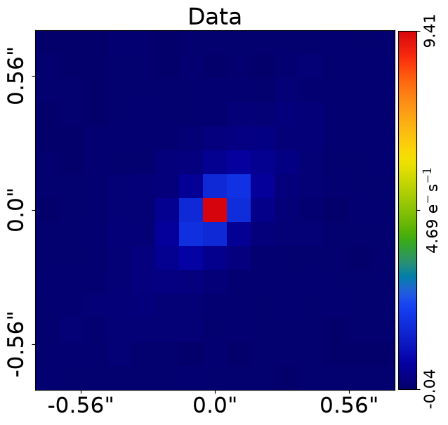
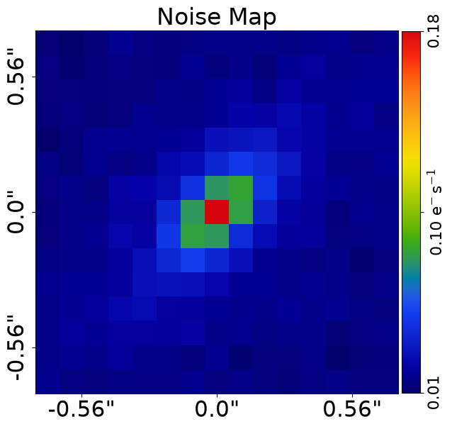
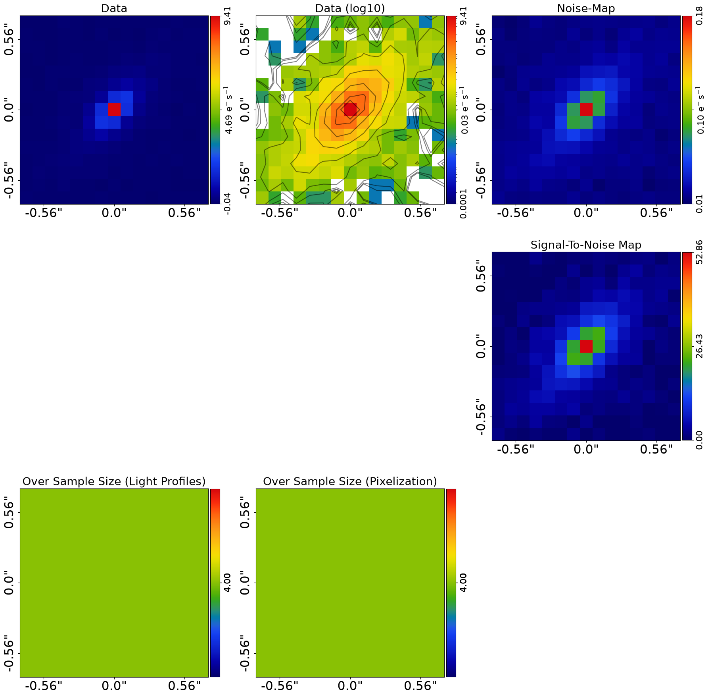
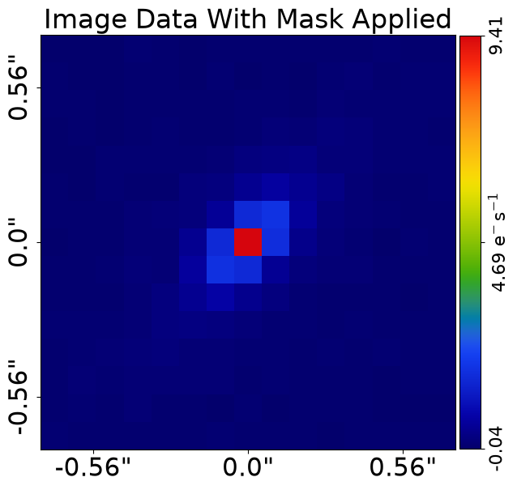
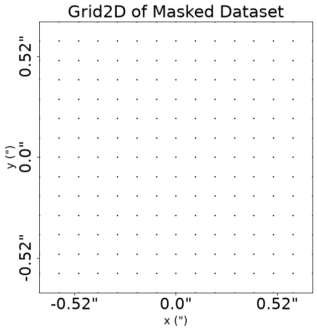
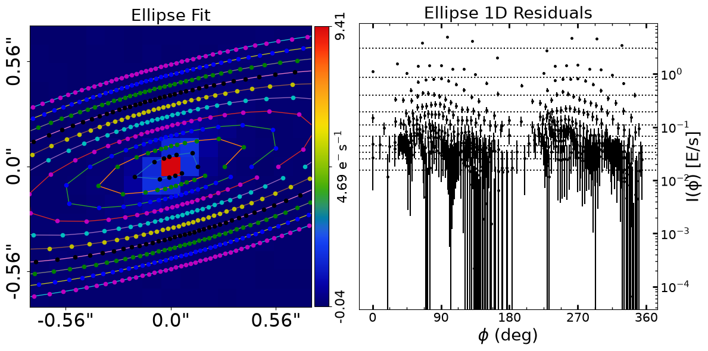
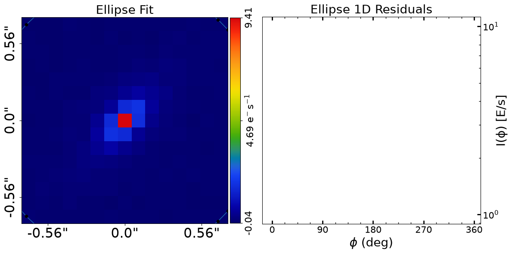

> ✏️ **This page is auto-generated from [`scripts/ellipse/fit.py`](../../scripts/ellipse/fit.py) — do not edit it directly.**
> It shows the example fully executed, with its real output images.
> Run it yourself via the [Python script](../../scripts/ellipse/fit.py) or the [Jupyter notebook](../../notebooks/ellipse/fit.ipynb).

Fits
====

This guide shows how to fit data using ellipse fitting and the `FitEllipse` object, including visualizing and
interpreting its results.

__Units__

In this example, all quantities are **PyAutoGalaxy**'s internal unit coordinates, with spatial coordinates in
arc seconds, luminosities in electrons per second and mass quantities (e.g. convergence) are dimensionless.

The guide `guides/units_and_cosmology.ipynb` illustrates how to convert these quantities to physical units like
kiloparsecs, magnitudes and solar masses.

__Data Structures__

Quantities inspected in this example script use **PyAutoGalaxy** bespoke data structures for storing arrays, grids,
vectors and other 1D and 2D quantities. These use the `slim` and `native` API to toggle between representing the
data in 1D numpy arrays or high dimension numpy arrays.

This tutorial will only use the `slim` properties which show results in 1D numpy arrays of
shape [total_unmasked_pixels]. This is a slimmed-down representation of the data in 1D that contains only the
unmasked data points

These are documented fully in the `autogalaxy_workspace/*/guides/data_structures.ipynb` guide.

__Contents__

- **Loading Data:** Loading the imaging dataset from FITS files for ellipse fitting.
- **Dataset Auto-Simulation:** Automatically simulating data if it does not exist.
- **Mask:** Applying a circular mask to the dataset.
- **Ellipse Interpolation:** Interpolating data and noise-map values onto ellipse coordinates.
- **Ellipse Fitting:** Computing model data, residuals and chi-squared for an ellipse fit.
- **FitEllipse:** Using the FitEllipse object to perform and inspect the ellipse fit.
- **Multiple Ellipses:** Fitting multiple ellipses of increasing size to trace the galaxy.
- **Bad Fit:** Demonstrating how a poor ellipse model produces residuals.
- **Fit Quantities:** Inspecting model data, residual maps and chi-squared maps.
- **Figures of Merit:** Computing chi-squared and log likelihood values.


```python

from autoconf import setup_notebook; setup_notebook()

import numpy as np
from pathlib import Path
import autogalaxy as ag
import autogalaxy.plot as aplt
```

    Working Directory has been set to `autogalaxy_workspace`


__Loading Data__

We we begin by loading the galaxy dataset `simple` from .fits files, which is the dataset we will use to demonstrate 
ellipse fitting.

This uses the `Imaging` object used in other examples.

Ellipse fitting does not use the Point Spread Function (PSF) of the dataset, so we do not need to load it.


```python
dataset_name = "ellipse"
dataset_path = Path("dataset") / "imaging" / dataset_name
```

__Dataset Auto-Simulation__

If the dataset does not already exist on your system, it will be created by running the corresponding
simulator script. This ensures that all example scripts can be run without manually simulating data first.


```python
if not dataset_path.exists():
    import subprocess
    import sys

    subprocess.run(
        [sys.executable, "scripts/ellipse/simulator.py"],
        check=True,
    )


dataset = ag.Imaging.from_fits(
    data_path=dataset_path / "data.fits",
    noise_map_path=dataset_path / "noise_map.fits",
    pixel_scales=0.1,
)
```

We can use the `Imaging` to plot the image and noise-map of the dataset.


```python
aplt.plot_array(array=dataset.data, title="Data")
aplt.plot_array(array=dataset.noise_map, title="Noise Map")
```


    

    


    

    


We can also plot a subplot which shows all these properties simultaneously.


```python
aplt.subplot_imaging_dataset(dataset=dataset)
```


    

    


__Mask__

We now mask the data, so that regions where there is no signal (e.g. the edges) are omitted from the fit.

We use a `Mask2D` object, which for this example is a 3.0" circular mask.


```python
mask = ag.Mask2D.circular(
    shape_native=dataset.shape_native, pixel_scales=dataset.pixel_scales, radius=3.0
)
```

We now combine the imaging dataset with the mask.


```python
dataset = dataset.apply_mask(mask=mask)
```

    2026-07-10 19:13:07,048 - autoarray.dataset.imaging.dataset - INFO - IMAGING - Data masked, contains a total of 225 image-pixels


We now plot the image with the mask applied, where the image automatically zooms around the mask to make the galaxy
appear bigger.


```python
aplt.plot_array(array=dataset.data, title="Image Data With Mask Applied")
```


    

    


The mask is also used to compute a `Grid2D`, where the (y,x) arc-second coordinates are only computed in unmasked
pixels within the masks' circle.

As shown in the previous overview example, this grid will be used to perform galaxying calculations when fitting the
data below.


```python
aplt.plot_grid(grid=dataset.grid, title="Grid2D of Masked Dataset")
```


    

    


__Ellipse Interpolation__

Ellipse fitting performs interpolation calculations which map each data and noise-map value of the dataset
to coordinates on each ellipse we fit to the data.

Interpolation is performed using the `DatasetInterp` object, which is created by simply inputting the dataset.
The object stores in memory the interpolation weights and mappings, ensuring they are performed efficiently.

This object is not passed to the `FitEllipse` object below, but is instead created inside of it to perform the
interpolation. It is included in this example simply so that you are aware that this interpolation is performed.


```python
interp = ag.DatasetInterp(dataset=dataset)
```

To perform the interpolation we create an `Ellipse` object. 


```python
ellipse = ag.Ellipse(centre=(0.0, 0.0), ell_comps=(0.0, 0.0), major_axis=1.0)
```

The ellipse has an attribute `points_from_major_axis` which is a subset of (y,x) coordinates on the ellipse that are
equally spaced along the major-axis. 

The number of points is automatically computed based on the resolution of the data and the size of the ellipse's 
major-axis. 

This value is chosen to ensure that the number of points computed matches the number of pixels in the data
which the ellipse interpolates over. If the ellipse is bigger, the number of points increases in order to
ensure that the ellipse uses more of the data's pixels.

To determine the number of pixels the ellipse's circular radius in units of pixels is required. This is
why `pixel_scale` is an input parameter of this function and other functions in this class.


```python
points_from_major_axis = ellipse.points_from_major_axis_from(
    pixel_scale=dataset.pixel_scales[0]
)

print("Points on Major Axis of Ellipse:")
print(points_from_major_axis)
```

    Points on Major Axis of Ellipse:
    [[-0.          1.        ]
     [-0.102821    0.99469988]
     [-0.20455207  0.97885569]
     [-0.30411483  0.95263538]
     [-0.40045391  0.9163169 ]
     [-0.49254807  0.87028524]
     [-0.5794211   0.81502834]
     [-0.66015212  0.75113193]
     [-0.73388537  0.67927334]
    ... [33 lines of output truncated] ...
     [ 0.92632397 -0.37672789]
     [ 0.96014987 -0.27948563]
     [ 0.98379795 -0.17928076]
     [ 0.99701753 -0.07717546]
     [ 0.99966847  0.02574791]
     [ 0.99172267  0.12839836]
     [ 0.97326437  0.22968774]
     [ 0.94448923  0.32854238]
     [ 0.90570226  0.42391439]
     [ 0.85731463  0.5147928 ]
     [ 0.79983924  0.60021428]
     [ 0.73388537  0.67927334]
     [ 0.66015212  0.75113193]
     [ 0.5794211   0.81502834]
     [ 0.49254807  0.87028524]
     [ 0.40045391  0.9163169 ]
     [ 0.30411483  0.95263538]
     [ 0.20455207  0.97885569]
     [ 0.102821    0.99469988]]


These are the points which are passed into the `DatasetInterp` object to perform the interpolation.

The output of the code below is therefore the data values of the dataset interpolated to these (y,x) coordinates on
the ellipse.


```python
data_interp = interp.data_interp(points_from_major_axis)

print("Data Values Interpolated to Ellipse:")
print(data_interp)
```

    Data Values Interpolated to Ellipse:
    [0. 0. 0. 0. 0. 0. 0. 0. 0. 0. 0. 0. 0. 0. 0. 0. 0. 0. 0. 0. 0. 0. 0. 0.
     0. 0. 0. 0. 0. 0. 0. 0. 0. 0. 0. 0. 0. 0. 0. 0. 0. 0. 0. 0. 0. 0. 0. 0.
     0. 0. 0. 0. 0. 0. 0. 0. 0. 0. 0. 0. 0.]


The same interpolation is performed on the noise-map of the dataset, for example to compute the chi-squared map.


```python
noise_map_interp = interp.noise_map_interp(points_from_major_axis)

print("Noise Values Interpolated to Ellipse:")
print(noise_map_interp)
```

    Noise Values Interpolated to Ellipse:
    [0. 0. 0. 0. 0. 0. 0. 0. 0. 0. 0. 0. 0. 0. 0. 0. 0. 0. 0. 0. 0. 0. 0. 0.
     0. 0. 0. 0. 0. 0. 0. 0. 0. 0. 0. 0. 0. 0. 0. 0. 0. 0. 0. 0. 0. 0. 0. 0.
     0. 0. 0. 0. 0. 0. 0. 0. 0. 0. 0. 0. 0.]


__Ellipse Fitting__

Ellipse fitting behaves differently to light-profile fitting. In light-profile fitting, a model-image of
the data is created and subtracted from the data pixel-by-pixel to create a residual-map, which is plotted in 2D
in order to show where the model fit the data poorly.

For ellipse fitting, it may be unclear what the `model_data` is, as a model image of the data is not created. 

However, the `model_data` has actually been computed in the interpolation above. The `model_data` is simply the 
data values interpolated to the ellipse's coordinates.


```python
model_data = data_interp

print("Model Data Values:")
print(model_data)
```

    Model Data Values:
    [0. 0. 0. 0. 0. 0. 0. 0. 0. 0. 0. 0. 0. 0. 0. 0. 0. 0. 0. 0. 0. 0. 0. 0.
     0. 0. 0. 0. 0. 0. 0. 0. 0. 0. 0. 0. 0. 0. 0. 0. 0. 0. 0. 0. 0. 0. 0. 0.
     0. 0. 0. 0. 0. 0. 0. 0. 0. 0. 0. 0. 0.]


If this is the model data, what is the residual map?

The residual map is each value in the model data minus the mean of the model data. This is because the goodness-of-fit
of an ellipse is quantified by how well the data values trace round the ellipse. A good fit means that all values
on the ellipse are close to the mean of the data and a bad fit means they are not.

The goal of the ellipse fitting is therefore to find the ellipses that trace round the data with values that are
as close to one another as possible.


```python
residual_map = data_interp - np.mean(data_interp)

print("Residuals:")
print(residual_map)
```

    Residuals:
    [0. 0. 0. 0. 0. 0. 0. 0. 0. 0. 0. 0. 0. 0. 0. 0. 0. 0. 0. 0. 0. 0. 0. 0.
     0. 0. 0. 0. 0. 0. 0. 0. 0. 0. 0. 0. 0. 0. 0. 0. 0. 0. 0. 0. 0. 0. 0. 0.
     0. 0. 0. 0. 0. 0. 0. 0. 0. 0. 0. 0. 0.]


The `normalized_residual_map` and `chi_squared_map` follow the same definition as in light-profile fitting, where:

- Normalized Residuals = (Residual Map) / Noise Map
- Chi-Squared = ((Residuals) / (Noise)) ** 2.0

Where the noise-map is the noise values interpolated to the ellipse.


```python
normalized_residual_map = residual_map / noise_map_interp

print("Normalized Residuals:")
print(normalized_residual_map)

chi_squared_map = (residual_map / noise_map_interp) ** 2.0

print("Chi-Squareds:")
print(chi_squared_map)
```

    Normalized Residuals:
    [nan nan nan nan nan nan nan nan nan nan nan nan nan nan nan nan nan nan
     nan nan nan nan nan nan nan nan nan nan nan nan nan nan nan nan nan nan
     nan nan nan nan nan nan nan nan nan nan nan nan nan nan nan nan nan nan
     nan nan nan nan nan nan nan]
    Chi-Squareds:
    [nan nan nan nan nan nan nan nan nan nan nan nan nan nan nan nan nan nan
     nan nan nan nan nan nan nan nan nan nan nan nan nan nan nan nan nan nan
     nan nan nan nan nan nan nan nan nan nan nan nan nan nan nan nan nan nan
     nan nan nan nan nan nan nan]


Finally, the log likelihood of the fit is computed as:

 - log likelihood = -2.0 * (chi-squared)
 
Note that, unlike light profile fitting, the log likelihood does not include the noise normalization term. This is
because the noise normalization term varies numerically when the data is interpolated to the ellipse, making it
unstable to include in the log likelihood.


```python
log_likelihood = -2.0 * np.sum(chi_squared_map)

print("Log Likelihood:")
print(log_likelihood)
```

    Log Likelihood:
    nan


__FitEllipse__

We now use a `FitEllipse` object to fit the ellipse to the dataset, which performs all the calculations we have
discussed above and contains all the quantities we have inspected as attributes.


```python
fit = ag.FitEllipse(dataset=dataset, ellipse=ellipse)

print("Data Values Interpolated to Ellipse:")
print(fit.data_interp)
print("Noise Values Interpolated to Ellipse:")
print(fit.noise_map_interp)
print("Model Data Values:")
print(fit.model_data)
print("Residuals:")
print(fit.residual_map)
print("Normalized Residuals:")
print(fit.normalized_residual_map)
print("Chi-Squareds:")
print(fit.chi_squared_map)
print("Log Likelihood:")
print(fit.log_likelihood)
```

    Data Values Interpolated to Ellipse:
    ArrayIrregular([0., 0., 0., 0., 0., 0., 0., 0., 0., 0., 0., 0., 0., 0., 0., 0., 0.,
           0., 0., 0., 0., 0., 0., 0., 0., 0., 0., 0., 0., 0., 0., 0., 0., 0.,
           0., 0., 0., 0., 0., 0., 0., 0., 0., 0., 0., 0., 0., 0., 0., 0., 0.,
           0., 0., 0., 0., 0., 0., 0., 0., 0., 0.])
    Noise Values Interpolated to Ellipse:
    ArrayIrregular([0., 0., 0., 0., 0., 0., 0., 0., 0., 0., 0., 0., 0., 0., 0., 0., 0.,
           0., 0., 0., 0., 0., 0., 0., 0., 0., 0., 0., 0., 0., 0., 0., 0., 0.,
           0., 0., 0., 0., 0., 0., 0., 0., 0., 0., 0., 0., 0., 0., 0., 0., 0.,
           0., 0., 0., 0., 0., 0., 0., 0., 0., 0.])
    Model Data Values:
    ArrayIrregular([0., 0., 0., 0., 0., 0., 0., 0., 0., 0., 0., 0., 0., 0., 0., 0., 0.,
           0., 0., 0., 0., 0., 0., 0., 0., 0., 0., 0., 0., 0., 0., 0., 0., 0.,
           0., 0., 0., 0., 0., 0., 0., 0., 0., 0., 0., 0., 0., 0., 0., 0., 0.,
           0., 0., 0., 0., 0., 0., 0., 0., 0., 0.])
    Residuals:
    ArrayIrregular([0., 0., 0., 0., 0., 0., 0., 0., 0., 0., 0., 0., 0., 0., 0., 0., 0.,
           0., 0., 0., 0., 0., 0., 0., 0., 0., 0., 0., 0., 0., 0., 0., 0., 0.,
           0., 0., 0., 0., 0., 0., 0., 0., 0., 0., 0., 0., 0., 0., 0., 0., 0.,
           0., 0., 0., 0., 0., 0., 0., 0., 0., 0.])
    Normalized Residuals:
    ArrayIrregular([nan, nan, nan, nan, nan, nan, nan, nan, nan, nan, nan, nan, nan,
           nan, nan, nan, nan, nan, nan, nan, nan, nan, nan, nan, nan, nan,
           nan, nan, nan, nan, nan, nan, nan, nan, nan, nan, nan, nan, nan,
           nan, nan, nan, nan, nan, nan, nan, nan, nan, nan, nan, nan, nan,
           nan, nan, nan, nan, nan, nan, nan, nan, nan])
    Chi-Squareds:
    ArrayIrregular([nan, nan, nan, nan, nan, nan, nan, nan, nan, nan, nan, nan, nan,
           nan, nan, nan, nan, nan, nan, nan, nan, nan, nan, nan, nan, nan,
           nan, nan, nan, nan, nan, nan, nan, nan, nan, nan, nan, nan, nan,
           nan, nan, nan, nan, nan, nan, nan, nan, nan, nan, nan, nan, nan,
           nan, nan, nan, nan, nan, nan, nan, nan, nan])
    Log Likelihood:


    -0.0


The `FitEllipse` object can be visualized using `aplt.subplot_fit_ellipse`, which plots the data with the
fitted ellipse contours overlaid alongside the 1D residuals as a function of position angle.

A good fit indicates that the ellipse traces round the data well, which is close for the example below but not perfect.


```python
aplt.subplot_fit_ellipse(fit_list=[fit])
```


    

    


__Multiple Ellipses__

It is rare to use only one ellipse to fit a galaxy, as the goal of ellipse fitting is to find the collection
of ellipses that best trace round the data.

For example, one model might consist ellipses, which all have the same `centre` and `ell_comps` but have different
`major_axis` values, meaning they grow in size.

We can therefore create multiple ellipses and fit them to the data, for example by creating a list of `FitEllipse`
objects.


```python
major_axis_list = [0.2, 0.4, 0.6, 0.8, 1.0, 1.2, 1.4, 1.6, 1.8, 2.0]

ellipse_list = [
    ag.Ellipse(centre=(0.0, 0.0), ell_comps=(0.3, 0.5), major_axis=major_axis)
    for major_axis in major_axis_list
]

fit_list = [ag.FitEllipse(dataset=dataset, ellipse=ellipse) for ellipse in ellipse_list]

print("Log Likelihoods of Multiple Ellipses:")
print([fit.log_likelihood for fit in fit_list])

print("Overall Log Likelihood:")
print(sum([fit.log_likelihood for fit in fit_list]))
```

    Log Likelihoods of Multiple Ellipses:
    [np.float64(-2562.1782141595045), np.float64(-2150.657174985079), np.float64(-1542.9342644515573), np.float64(-inf), np.float64(-inf), np.float64(-inf), np.float64(-inf), np.float64(-inf), np.float64(-inf), np.float64(-inf)]
    Overall Log Likelihood:
    -inf


A subplot can be plotted which contains all of the above quantities, showing the ellipse contours on the data
and the 1D residuals as a function of position angle.


```python
aplt.subplot_fit_ellipse(fit_list=fit_list)
```


    

    


__Bad Fit__

A bad ellipse fit will occur when the ellipse model does not trace the data well, for example because the input
angle does not align with the galaxy's elliptical shape.

We can produce such a fit by inputting an ellipse with an angle that is not aligned with the galaxy's elliptical shape.


```python
ellipse = ag.Ellipse(centre=(0.0, 0.0), ell_comps=(0.0, 0.0), major_axis=1.0)
```

A new fit using this plane shows residuals, normalized residuals and chi-squared which are non-zero.


```python
fit = ag.FitEllipse(dataset=dataset, ellipse=ellipse)

aplt.subplot_fit_ellipse(fit_list=[fit])
```


    

    


We also note that its likelihood decreases.


```python
print(fit.log_likelihood)
```

    -0.0


__Fit Quantities__

The maximum log likelihood fit contains many 1D and 2D arrays showing the fit.


```python
print(fit.model_data)
```

    ArrayIrregular([0., 0., 0., 0., 0., 0., 0., 0., 0., 0., 0., 0., 0., 0., 0., 0., 0.,
           0., 0., 0., 0., 0., 0., 0., 0., 0., 0., 0., 0., 0., 0., 0., 0., 0.,
           0., 0., 0., 0., 0., 0., 0., 0., 0., 0., 0., 0., 0., 0., 0., 0., 0.,
           0., 0., 0., 0., 0., 0., 0., 0., 0., 0.])


There are numerous ndarrays showing the goodness of fit:

 - `residual_map`: Residuals = (Data - Model_Data).
 - `normalized_residual_map`: Normalized_Residual = (Data - Model_Data) / Noise
 - `chi_squared_map`: Chi_Squared = ((Residuals) / (Noise)) ** 2.0 = ((Data - Model)**2.0)/(Variances)


```python
print(fit.residual_map)
print(fit.normalized_residual_map)
print(fit.chi_squared_map)
```

    ArrayIrregular([0., 0., 0., 0., 0., 0., 0., 0., 0., 0., 0., 0., 0., 0., 0., 0., 0.,
           0., 0., 0., 0., 0., 0., 0., 0., 0., 0., 0., 0., 0., 0., 0., 0., 0.,
           0., 0., 0., 0., 0., 0., 0., 0., 0., 0., 0., 0., 0., 0., 0., 0., 0.,
           0., 0., 0., 0., 0., 0., 0., 0., 0., 0.])
    ArrayIrregular([nan, nan, nan, nan, nan, nan, nan, nan, nan, nan, nan, nan, nan,
           nan, nan, nan, nan, nan, nan, nan, nan, nan, nan, nan, nan, nan,
           nan, nan, nan, nan, nan, nan, nan, nan, nan, nan, nan, nan, nan,
           nan, nan, nan, nan, nan, nan, nan, nan, nan, nan, nan, nan, nan,
           nan, nan, nan, nan, nan, nan, nan, nan, nan])
    ArrayIrregular([nan, nan, nan, nan, nan, nan, nan, nan, nan, nan, nan, nan, nan,
           nan, nan, nan, nan, nan, nan, nan, nan, nan, nan, nan, nan, nan,
           nan, nan, nan, nan, nan, nan, nan, nan, nan, nan, nan, nan, nan,
           nan, nan, nan, nan, nan, nan, nan, nan, nan, nan, nan, nan, nan,
           nan, nan, nan, nan, nan, nan, nan, nan, nan])


__Figures of Merit__

There are single valued floats which quantify the goodness of fit:

 - `chi_squared`: The sum of the `chi_squared_map`.
 - `log_likelihood`: The log likelihood value of the fit where [LogLikelihood] = -2.0 * chi_squared.


```python
print(fit.chi_squared)
print(fit.log_likelihood)
```

    0.0
    -0.0


Fin.


```python

```
