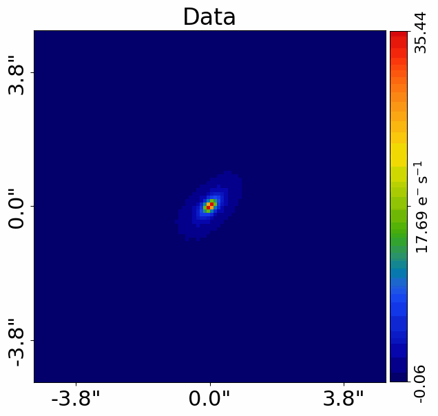
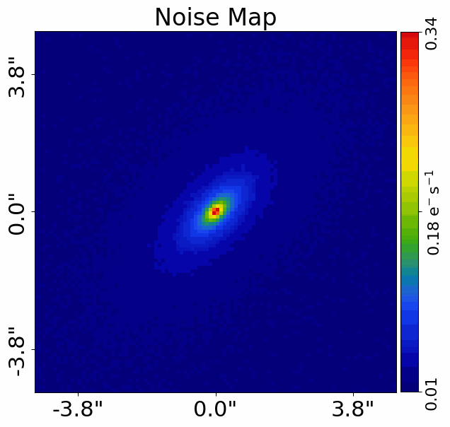
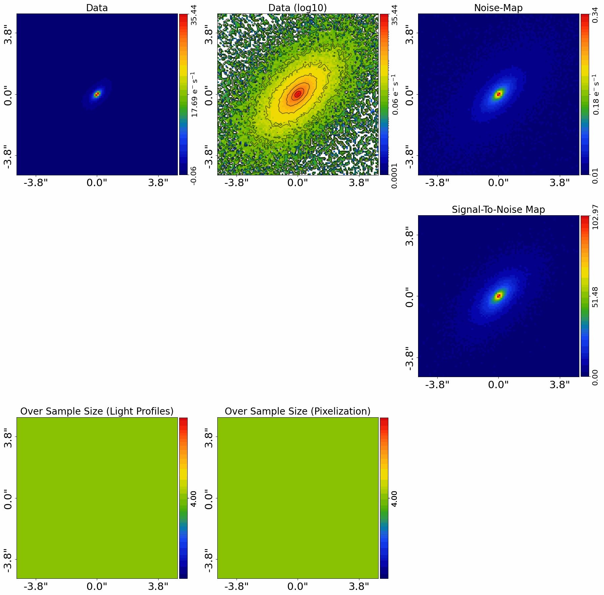
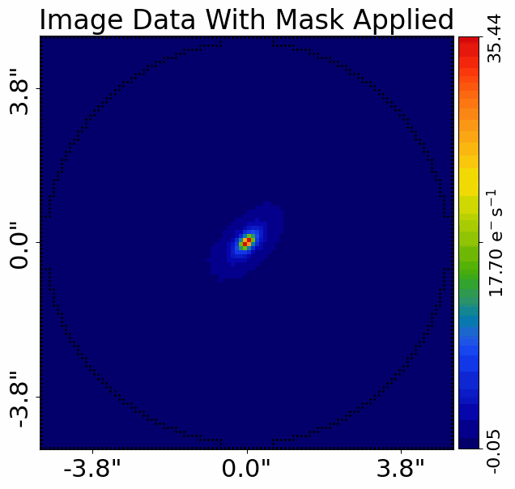
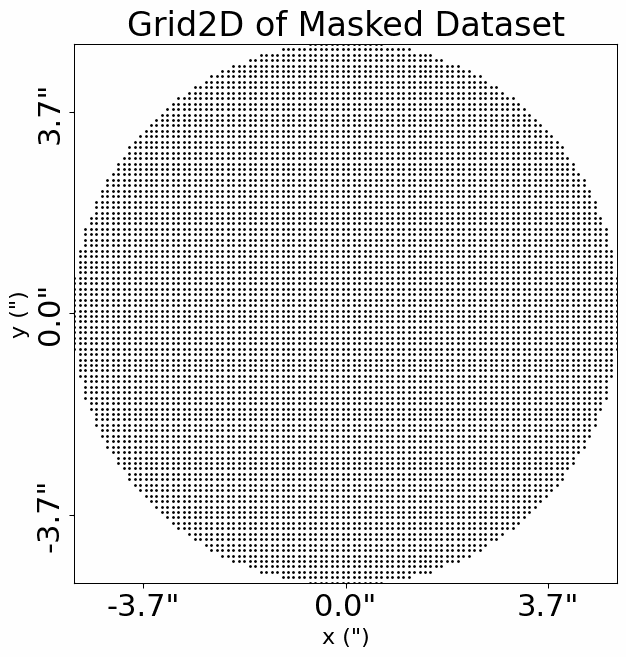
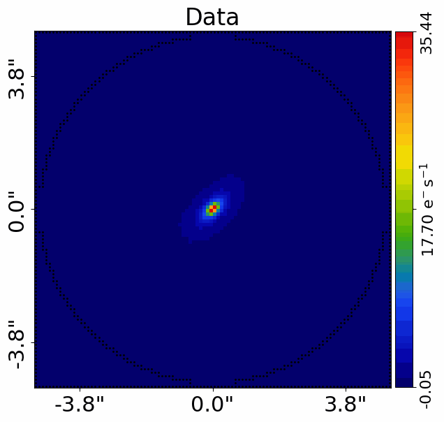
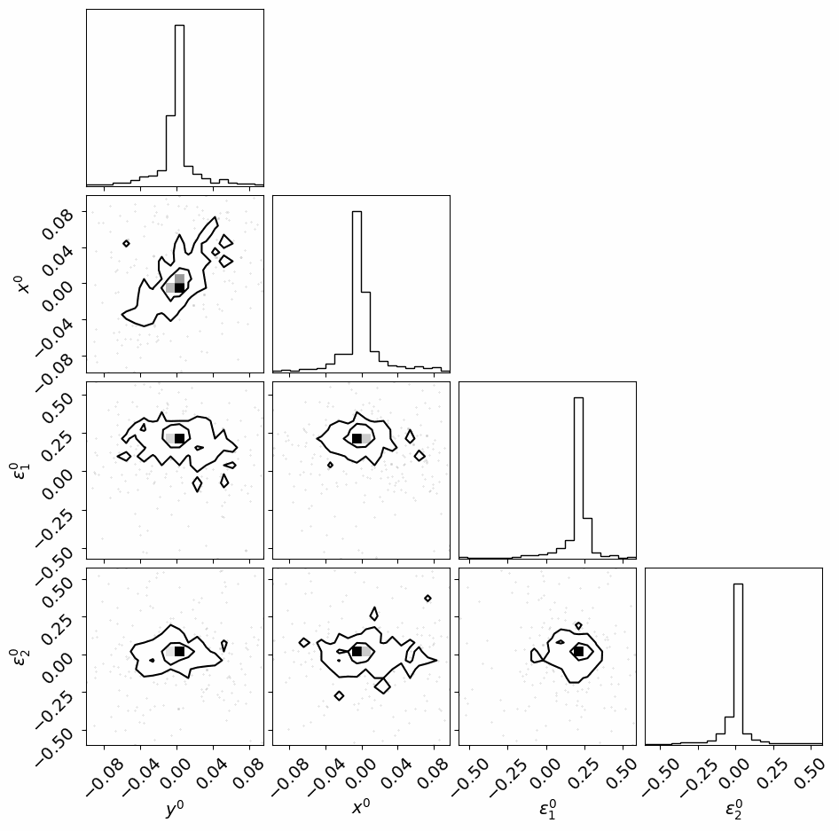

> ✏️ **This page is auto-generated from [`scripts/ellipse/modeling.py`](../../scripts/ellipse/modeling.py) — do not edit it directly.**
> It shows the example fully executed, with its real output images.
> Run it yourself via the [Python script](../../scripts/ellipse/modeling.py) or the [Jupyter notebook](../../notebooks/ellipse/modeling.ipynb).

Modeling
========

This guide shows how to perform ellipse fitting modeling on data using a non-linear search, including visualizing and
interpreting its results.

__Fit__

The non-linear search in this example calls a `log_likelihood_function` using the `Analysis` class many times, in
order to determine ellipse parameters and therefore overall distribution of ellipses that best-fit the data.

The `log_likelihood_function` and how the ellipses are used to fit the data are described in the `fit.py` script,
which you should read first in order to better understand how ellipse fitting works.

__Units__

In this example, all quantities are **PyAutoGalaxy**'s internal unit coordinates, with spatial coordinates in
arc seconds, luminosities in electrons per second and mass quantities (e.g. convergence) are dimensionless.

The guide `guides/units/cosmology.ipynb` illustrates how to convert these quantities to physical units like
kiloparsecs, magnitudes and solar masses.

__Data Structures__

Quantities inspected in this example script use **PyAutoGalaxy** bespoke data structures for storing arrays, grids,
vectors and other 1D and 2D quantities. These use the `slim` and `native` API to toggle between representing the
data in 1D numpy arrays or high dimension numpy arrays.

This tutorial will only use the `slim` properties which show results in 1D numpy arrays of
shape [total_unmasked_pixels]. This is a slimmed-down representation of the data in 1D that contains only the
unmasked data points

These are documented fully in the `autogalaxy_workspace/*/guides/data_structures.ipynb` guide.

__Contents__

- **Loading Data:** Loading the imaging dataset from FITS files for ellipse fitting.
- **Dataset Auto-Simulation:** Automatically simulating data if it does not exist.
- **Mask:** Applying a circular mask to the dataset.
- **Model Composition:** Composing an ellipse model with free centre and elliptical components.
- **Search:** Configuring the Dynesty non-linear search for ellipse fitting.
- **Live Visual Update:** Push the quick-update image to a live display surface.
- **Analysis:** Setting up the AnalysisEllipse object for the model fit.
- **Run Times:** Estimating the computational cost of the ellipse model fit.
- **Model-Fit:** Running the non-linear search to fit the ellipse to data.
- **Output Folder Layout:** Description of the structure of the `output` folder where results are written.
- **Result:** Inspecting the result object and maximum likelihood ellipse parameters.
- **Multiple Ellipses:** Fitting many ellipses of increasing size to trace the full galaxy.
- **Final Fit:** Combining all ellipses into a single final fit.
- **Masking:** Applying an extra galaxies mask and repeating the ellipse fitting.
- **Data Preparation:** Pointers to data preparation scripts for your own data.
- **HowToGalaxy:** Pointers to the HowToGalaxy lecture series for light profile modeling.


```python

from autogalaxy import setup_notebook; setup_notebook()

import numpy as np
from pathlib import Path
import autofit as af
import autofit.plot as aplt_af
import autogalaxy as ag
import autogalaxy.plot as aplt
```

    .../PyAutoNerves/autonerves/workspace.py:31: UserWarning: Cannot verify the workspace at autogalaxy_workspace/scripts/ellipse is compatible with the installed library version (2026.8.17.1): no `version.minimum_library_version` or `version.workspace_version` key in config/general.yaml and no version.txt at the workspace root.
    
    If you cloned the workspace from `main` rather than a release tag, set `version.workspace_version_check: False` in config/general.yaml to silence this warning. The `main` branch updates more frequently than library releases, so version mismatches are expected and not actionable for `main`-branch users.
    
    You can also set the environment variable PYAUTO_SKIP_WORKSPACE_VERSION_CHECK=1 to disable temporarily.
      warnings.warn(message)
    Working Directory has been set to `autogalaxy_workspace`


__Loading Data__

We we begin by loading the galaxy dataset `simple` from .fits files, which is the dataset we will use to demonstrate 
ellipse fitting.

This uses the `Imaging` object used in other examples.

Ellipse fitting does not use the Point Spread Function (PSF) of the dataset, so we do not need to load it.


```python
dataset_name = "ellipse"
dataset_path = Path("dataset") / "imaging" / dataset_name
```

__Dataset Auto-Simulation__

If the dataset does not already exist on your system, it will be created by running the corresponding
simulator script. This ensures that all example scripts can be run without manually simulating data first.


```python
if ag.util.dataset.should_simulate(str(dataset_path)):
    import subprocess
    import sys

    subprocess.run(
        [sys.executable, "scripts/ellipse/simulator.py"],
        check=True,
    )


dataset = ag.Imaging.from_fits(
    data_path=dataset_path / "data.fits",
    noise_map_path=dataset_path / "noise_map.fits",
    pixel_scales=0.1,
)
```

We can use the `Imaging` to plot the image and noise-map of the dataset.


```python
aplt.plot_array(array=dataset.data, title="Data")
aplt.plot_array(array=dataset.noise_map, title="Noise Map")
```


    

    


    

    


We can also plot a subplot which shows all these properties simultaneously.


```python
aplt.subplot_imaging_dataset(dataset=dataset)
```


    

    


__Mask__

We now mask the data, so that regions where there is no signal (e.g. the edges) are omitted from the fit.

We use a `Mask2D` object, which for this example is 4.0" circular mask.

For ellipse fitting, the mask radius defines the region of the image that the ellipses are fitted over. We therefore
define the `mask_radius` as a variable which is used below to define the sizes of the ellipses in the model fitting.


```python
mask_radius = 5.0

mask = ag.Mask2D.circular(
    shape_native=dataset.shape_native,
    pixel_scales=dataset.pixel_scales,
    radius=mask_radius,
)
```

We now combine the imaging dataset with the mask.


```python
dataset = dataset.apply_mask(mask=mask)
```

    2026-08-20 13:39:22,950 - autoarray.dataset.imaging.dataset - INFO - IMAGING - Data masked, contains a total of 7860 image-pixels


We now plot the image with the mask applied, where the image automatically zooms around the mask to make the galaxy
appear bigger.


```python
aplt.plot_array(array=dataset.data, title="Image Data With Mask Applied")
```


    

    


The mask is also used to compute a `Grid2D`, where the (y,x) arc-second coordinates are only computed in unmasked
pixels within the masks' circle.

As shown in the previous overview example, this grid will be used to perform galaxying calculations when fitting the
data below.


```python
aplt.plot_grid(grid=dataset.grid, title="Grid2D of Masked Dataset")
```


    

    


__Model Composition__

The API below for composing a model uses the `Model` and `Collection` objects, which are imported from the 
parent project **PyAutoFit** 

The API is fairly self explanatory and is straight forward to extend, for example adding more ellipses
to the galaxy.

Ellipse fitting fits ellispes of increasing size to the data, one after another, with the properties of each ellipse
as a function of size being the main results of the model-fit.

We therefore compose a model consistent of a single ellise to demonstrate this fitting process, and then towards
the end of the script we will extend the model to fit multiple ellipses.

The model is composed of 1 ellipses as follows:

1) The ellipse has a fixed sizes that is input manually. When multiple ellipses are fitted, this size will 
   incrementally grow in size in order to cover the entire galaxy.

2) The centre and elliptical components of the ellipse are free, meaning that the model has N=4 free parameters.

The model composition below uses a list even though there is one ellipse, as this format allows us to fit
multiple ellipses in the model-fit at once, albeit its rare we would want to do this.

__Model Cookbook__

A full description of model composition is provided by the model cookbook: 

https://pyautogalaxy.readthedocs.io/en/latest/general/model_cookbook.html

__Coordinates__

The model fitting default settings assume that the galaxy centre is near the coordinates (0.0", 0.0"). 

If for your dataset the galaxy is not centred at (0.0", 0.0"), we recommend that you either: 

 - Reduce your data so that the centre is (`autogalaxy_workspace/*/imaging/data_preparation`). 
 - Manually override the model priors (`autogalaxy_workspace/*/guides/modeling/cookbook.py`).


```python
ellipse = af.Model(ag.Ellipse)

ellipse.centre.centre_0 = af.UniformPrior(lower_limit=-0.1, upper_limit=0.1)
ellipse.centre.centre_1 = af.UniformPrior(lower_limit=-0.1, upper_limit=0.1)

ellipse.ell_comps.ell_comps_0 = af.UniformPrior(lower_limit=-0.6, upper_limit=0.6)
ellipse.ell_comps.ell_comps_1 = af.UniformPrior(lower_limit=-0.6, upper_limit=0.6)

ellipse.major_axis = 0.3

model = af.Collection(ellipses=[ellipse])
```

    


The `info` attribute shows the model in a readable format.

[The `info` below may not display optimally on your computer screen, for example the whitespace between parameter
names on the left and parameter priors on the right may lead them to appear across multiple lines. This is a
common issue in Jupyter notebooks.

The`info_whitespace_length` parameter in the file `config/general.yaml` in the [output] section can be changed to 
increase or decrease the amount of whitespace (The Jupyter notebook kernel will need to be reset for this change to 
appear in a notebook).]


```python
print(model.info)
```

    Total Free Parameters = 4
    
    model                                                                           Collection (N=4)
        ellipses                                                                    Collection (N=4)
            0                                                                       Ellipse (N=4)
    
    ellipses
        0
            centre
                centre_0                                                            UniformPrior [4], lower_limit = -0.1, upper_limit = 0.1
                centre_1                                                            UniformPrior [5], lower_limit = -0.1, upper_limit = 0.1
            ell_comps
                ell_comps_0                                                         UniformPrior [6], lower_limit = -0.6, upper_limit = 0.6
                ell_comps_1                                                         UniformPrior [7], lower_limit = -0.6, upper_limit = 0.6
            major_axis                                                              0.3


__Search__

The model is fitted to the data using a non-linear search. 

This example uses the nested sampling algorithm  Dynesty (https://dynesty.readthedocs.io/en/stable/), which extensive 
testing has revealed gives the most accurate and efficient modeling results for ellipse fitting.

Dynesty has one main setting that trades-off accuracy and computational run-time, the number of `live_points`. 
A higher number of live points gives a more accurate result, but increases the run-time. A lower value may give 
less reliable modeling (e.g. the fit may infer a local maxima), but is faster. 

The suitable value depends on the model complexity whereby models with more parameters require more live points. 
The default value of 200 is sufficient for the vast majority of ellipse fitting problems. Lower values often given 
reliable results though, and speed up the run-times. 

__Unique Identifier__

In the path above, the `unique_identifier` appears as a collection of characters, where this identifier is generated 
based on the model, search and dataset that are used in the fit.

An identical combination of model and search generates the same identifier, meaning that rerunning the script will use 
the existing results to resume the model-fit. In contrast, if you change the model or search, a new unique identifier 
will be generated, ensuring that the model-fit results are output into a separate folder.

We additionally want the unique identifier to be specific to the dataset fitted, so that if we fit different datasets
with the same model and search results are output to a different folder. We achieve this below by passing 
the `dataset_name` to the search's `unique_tag`.

__Parallel Script__

Depending on the operating system (e.g. Linux, Mac, Windows), Python version, if you are running a Jupyter notebook 
and other factors, this script may not run a successful parallel fit (e.g. running the script 
with `number_of_cores` > 1 will produce an error). It is also common for Jupyter notebooks to not run in parallel 
correctly, requiring a Python script to be run, often from a command line terminal.

To fix these issues, the Python script needs to be adapted to use an `if __name__ == "__main__":` API, as this allows
the Python `multiprocessing` module to allocate threads and jobs correctly. An adaptation of this example script 
is provided at `autogalaxy_workspace/*/guides/modeling/bug_fix.py`, which will hopefully run 
successfully in parallel on your computer!

Therefore if paralellization for this script doesn't work, check out the `parallel.py` example. You will need to update
all scripts you run to use the this format and API. 

__Iterations Per Update__

Every N iterations, the non-linear search outputs the current results to the folder `autogalaxy_workspace/output`,
which includes producing visualization. 

Depending on how long it takes for the model to be fitted to the data (see discussion about run times below), 
this can take up a large fraction of the run-time of the non-linear search.

For this fit, the fit is very fast, thus we set a high value of `iterations_per_quick_update=10000` to ensure these updates
so not slow down the overall speed of the model-fit.

**If the iteration per update is too low, the model-fit may be significantly slowed down by the time it takes to
output results and visualization frequently to hard-disk. If your fit is consistent displaying a log saying that it
is outputting results, try increasing this value to ensure the model-fit runs efficiently.**

__Live Visual Update__

By default the quick-update image is only written to disk. Set `live_visual_update=True` to also push it to a
live display surface:

- **Python script** — a matplotlib window opens automatically and refreshes with each quick update, so you can
  watch the fit converge without leaving your terminal.
- **Jupyter / Colab notebook** — the cell that ran `search.fit(...)` shows a single self-updating image that
  refreshes in place every `iterations_per_quick_update`.

The disk write (`fit.png`) always happens regardless of this flag. Set it to `False` (the default) if you just
want the on-disk output, or if you are running in a headless environment (e.g. an HPC cluster).


```python
search = af.DynestyStatic(
    path_prefix=Path("ellipse"),
    name=f"fit_start",
    unique_tag=dataset_name,
    sample="rwalk",
    n_live=50,
    iterations_per_quick_update=10000,
    live_visual_update=False,  # Set True to open a live matplotlib window (script) or refresh a Jupyter cell (notebook).
)
```

__Analysis__

We next create an `AnalysisEllipse` object, which can be given many inputs customizing how the model is fitted to the 
data (in this example they are omitted for simplicity).

Internally, this object defines the `log_likelihood_function` used by the non-linear search to fit the model to 
the `Imaging` dataset. 

It is not vital that you as a user understand the details of how the `log_likelihood_function` fits a model to 
data, but interested readers can find a step-by-step guide of the likelihood 
function at ``autogalaxy_workspace/*/imaging/likelihood_function`

__JAX__

PyAutoLens uses JAX under the hood for fast GPU/CPU acceleration. However, ellipse fitting does not support JAX
acceleration, so we disable it here by passing `use_jax=False`.


```python
analysis = ag.AnalysisEllipse(dataset=dataset, use_jax=False)
```

__Run Times__

Modeling can be a computationally expensive process. When fitting complex models to high resolution datasets 
run times can be of order hours, days, weeks or even months.

Run times are dictated by two factors:

 - The log likelihood evaluation time: the time it takes for a single `instance` of the model to be fitted to 
   the dataset such that a log likelihood is returned.

 - The number of iterations (e.g. log likelihood evaluations) performed by the non-linear search: more complex
   models require more iterations to converge to a solution.

For this analysis, the log likelihood evaluation time is ~0.04 seconds, which is extremely fast for modeling. For higher resolution datasets ellipse
fitting can slow down to a likelihood evaluation time of order 0.5 - 1.0 second, which is still reasonably fast.

To estimate the expected overall run time of the model-fit we multiply the log likelihood evaluation time by an 
estimate of the number of iterations the non-linear search will perform. 

Estimating this quantity is more tricky, as it varies depending on the model complexity (e.g. number of parameters)
and the properties of the dataset and model being fitted.

For this example, we conservatively estimate that the non-linear search will perform ~10000 iterations per free 
parameter in the model. This is an upper limit, with models typically converging in far fewer iterations.

If you perform the fit over multiple CPUs, you can divide the run time by the number of cores to get an estimate of
the time it will take to fit the model. Parallelization with Nautilus scales well, it speeds up the model-fit by the 
`number_of_cores` for N < 8 CPUs and roughly `0.5*number_of_cores` for N > 8 CPUs. This scaling continues 
for N> 50 CPUs, meaning that with super computing facilities you can always achieve fast run times!

__Model-Fit__

We can now begin the model-fit by passing the model and analysis object to the search, which performs a non-linear
search to find which models fit the data with the highest likelihood.

Checkout the output folder for live outputs of the results of the fit, including on-the-fly visualization of the best 
fit model!

**Run Time Error:** On certain operating systems (e.g. Windows, Linux) and Python versions, the code below may produce 
an error. If this occurs, see the `autolens_workspace/guides/modeling/bug_fix` example for a fix.


```python
result = search.fit(model=model, analysis=analysis)
```

    2026-08-20 13:39:24,411 - autofit.non_linear.search.abstract_search - INFO - Starting non-linear search with 1 cores.
    2026-08-20 13:39:24,412 - autofit.non_linear.search.abstract_search - INFO - On-the-fly updates of the maximum likelihood model every 10000 iterations.
    2026-08-20 13:39:24,431 - fit_start - INFO - The output path of this fit is autogalaxy_workspace/output/ellipse/ellipse/fit_start/666d899be5fedd67c27ffa326ccd7875
    2026-08-20 13:39:24,432 - fit_start - INFO - Outputting pre-fit files (e.g. model.info, visualization).
    2026-08-20 13:39:26,315 - fit_start - INFO - Starting new Dynesty non-linear search (no previous samples found).
    2026-08-20 13:39:26,445 - autofit.non_linear.initializer - INFO - Generating initial samples of model using JAX LH Function cores
    2026-08-20 13:39:28,412 - autofit.non_linear.initializer - INFO - Initial samples generated, starting non-linear search
    1087it [00:00, 22925.11it/s, +50 | bound: 114 | nc: 1 | ncall: 6460 | eff(%): 17.738 | loglstar:   -inf <  1.937 <    inf | logz: -16.984 +/-  0.576 | dlogz:  0.001 >  0.059]2026-08-20 13:40:28,676 - fit_start - INFO - Fit Running: Updating results (see output folder).
    
    2026-08-20 13:40:28,815 - autofit.non_linear.samples.samples - INFO - Samples with weight less than 1e-10 removed from samples.csv.
    2026-08-20 13:40:28,834 - autofit.non_linear.search.updater - INFO - Creating latent samples by drawing 100 from the PDF.
    2026-08-20 13:40:35,574 - fit_start - INFO - Removing search internal folder.
    2026-08-20 13:40:35,576 - fit_start - INFO - Removing all files except for .zip file
    2026-08-20 13:40:35,868 - fit_start - INFO - Search complete, returning result


__Output Folder Layout__

Now the fit is running you should checkout the `autogalaxy_workspace/output` folder. This is where results are
written to hard-disk in human-readable formats — `.json`, `.csv`, `.fits`, `.png` and plain text.

As the fit progresses, results are written on the fly using the highest likelihood model found by the
non-linear search so far. This means you can inspect the model-fit as it runs, without waiting for the
non-linear search to terminate.

Each completed fit lives at a path like::

    output/imaging/<dataset_name>/modeling/<unique_hash>/
        files/                         <- JSON + CSV: loadable Python objects
            ellipse.json               <- max log likelihood Ellipse(s)
            model.json                 <- fitted af.Collection model
            samples.csv                <- full Nautilus samples
            samples_summary.json       <- max log likelihood parameter values + errors
            samples_info.json          <- metadata about the samples
            search.json                <- non-linear search configuration
            settings.json              <- search settings
            covariance.csv             <- parameter covariance matrix
        image/                         <- FITS + PNG: ellipse-fit products
            dataset.fits               <- data and noise-map
            fit.fits                   <- ellipse traces over the image, residuals along each ellipse
            dataset.png, fit.png       <- visualisations
        model.info                     <- human-readable model summary
        model.results                  <- human-readable fit summary
        search.summary                 <- search run summary
        search_internal/               <- internal files used to resume / visualise the search
        metadata                       <- run metadata

The `<unique_hash>` is a 32-character identifier derived from the model, search and dataset, so re-running the
same configuration resumes from the existing fit automatically.

__Result__

The search returns a result object, which whose `info` attribute shows the result in a readable format.

[Above, we discussed that the `info_whitespace_length` parameter in the config files could b changed to make 
the `model.info` attribute display optimally on your computer. This attribute also controls the whitespace of the
`result.info` attribute.]


```python
print(result.info)
```

    Bayesian Evidence                                                               -16.98392973
    Maximum Log Likelihood                                                          1.93735842
    
    model                                                                           Collection (N=4)
        ellipses                                                                    Collection (N=4)
            0                                                                       Ellipse (N=4)
    
    Maximum Log Likelihood Model:
    
    ellipses
    ... [18 lines of output truncated] ...
                ell_comps_1                                                         0.0097 (-0.0024, 0.0215)
    
    
    Summary (1.0 sigma limits):
    
    ellipses
        0
            centre
                centre_0                                                            -0.0005 (-0.0017, 0.0008)
                centre_1                                                            -0.0009 (-0.0023, 0.0001)
            ell_comps
                ell_comps_0                                                         0.2320 (0.2278, 0.2357)
                ell_comps_1                                                         0.0097 (0.0056, 0.0137)
    
    instances
    
    ellipses
        0
            major_axis                                                              0.3


The `Result` object also contains:

 - The model corresponding to the maximum log likelihood solution in parameter space.
 - The corresponding maximum log likelihood `Ellipse` and `FitEllipse` objects.


```python
instance = result.max_log_likelihood_instance

print("Max Log Likelihood Model:")
print(instance)

print(f"First Ellipse Centre: {instance.ellipses[0].centre}")
print(f"First Ellipse Elliptical Components: {instance.ellipses[0].ell_comps}")
print(f"First Ellipse Major Axis: {instance.ellipses[0].major_axis}")
print(f"First Ellipse Axis Ratio: {instance.ellipses[0].axis_ratio}")
print(f"First Ellipse Angle: {instance.ellipses[0].angle}")

for i, ellipse in enumerate(result.max_log_likelihood_instance.ellipses):
    print(f"Ellipse {i} Minor Axis: {ellipse.minor_axis}")
```

    Max Log Likelihood Model:
    <autofit.mapper.model.ModelInstance object at 0x7f0fdbd0e900>
    First Ellipse Centre: (-0.00081284301439, -0.00082900049674)
    First Ellipse Elliptical Components: (0.23353648863857, 0.009497811008)
    First Ellipse Major Axis: 0.3
    First Ellipse Axis Ratio: <bound method EllProfile.axis_ratio of Ellipse
    centre: (-0.00081284301439, -0.00082900049674)
    ell_comps: (0.23353648863857, 0.009497811008)
    major_axis: 0.3
    id: 1>
    First Ellipse Angle: <bound method EllProfile.angle of Ellipse
    centre: (-0.00081284301439, -0.00082900049674)
    ell_comps: (0.23353648863857, 0.009497811008)
    major_axis: 0.3
    id: 1>
    Ellipse 0 Minor Axis: 0.18633025180334975


The maximum log likelihood fit is also available via the result, which can visualize the fit.


```python
aplt.plot_array(array=dataset.data, title="Data")
```


    

    


The result contains the full posterior information of our non-linear search, including all parameter samples, 
log likelihood values and tools to compute the errors on the model. 

There are built in visualization tools for plotting this.

The plot is labeled with short hand parameter names (e.g. `sersic_index` is mapped to the short hand 
parameter `n`). These mappings ate specified in the `config/notation.yaml` file and can be customized by users.

The superscripts of labels correspond to the name each component was given in the model (e.g. for the `Isothermal`
mass its name `mass` defined when making the `Model` above is used).


```python
aplt_af.corner_cornerpy(samples=result.samples)
```

    2026-08-20 13:40:36,258 - arviz - INFO - Found 'auto' as default backend, checking available backends
    2026-08-20 13:40:36,259 - arviz - INFO - Matplotlib is available, defining as default backend
    2026-08-20 13:40:36,273 - arviz - INFO - arviz_base 1.0.0 available, exposing its functions as part of the `arviz` namespace
    2026-08-20 13:40:36,478 - arviz - INFO - arviz_stats 1.0.0 available, exposing its functions as part of the `arviz` namespace
    2026-08-20 13:40:36,533 - arviz - INFO - arviz_plots 1.0.0 available, exposing its functions as part of the `arviz` namespace
    2026-08-20 13:40:36,722 - root - WARNING - Too few points to create valid contours
    2026-08-20 13:40:36,766 - root - WARNING - Too few points to create valid contours
    2026-08-20 13:40:36,794 - root - WARNING - Too few points to create valid contours
    2026-08-20 13:40:36,834 - root - WARNING - Too few points to create valid contours
    2026-08-20 13:40:36,863 - root - WARNING - Too few points to create valid contours
    2026-08-20 13:40:36,892 - root - WARNING - Too few points to create valid contours


    

    


__Multiple Ellipses__


```python
number_of_ellipses = 10

major_axis_list = np.linspace(0.3, mask_radius * 0.9, number_of_ellipses)

total_ellipses = len(major_axis_list)

result_list = []

for i in range(len(major_axis_list)):
    ellipse = af.Model(ag.Ellipse)

    ellipse.centre.centre_0 = result.instance.ellipses[0].centre[0]
    ellipse.centre.centre_1 = result.instance.ellipses[0].centre[1]

    ellipse.ell_comps.ell_comps_0 = af.UniformPrior(lower_limit=-0.6, upper_limit=0.6)
    ellipse.ell_comps.ell_comps_1 = af.UniformPrior(lower_limit=-0.6, upper_limit=0.6)

    ellipse.major_axis = major_axis_list[i]

    model = af.Collection(ellipses=[ellipse])

    search = af.DynestyStatic(
        path_prefix=Path("ellipse"),
        name=f"fit_{i}",
        unique_tag=dataset_name,
        sample="rwalk",
        n_live=50,
        number_of_cores=4,
        iterations_per_quick_update=10000,
        live_visual_update=False,  # Set True to open a live matplotlib window (script) or refresh a Jupyter cell (notebook).
    )

    analysis = ag.AnalysisEllipse(dataset=dataset, use_jax=False)

    result = search.fit(model=model, analysis=analysis)

    result_list.append(result)

```

    
    2026-08-20 13:40:37,265 - autofit.non_linear.search.abstract_search - INFO - Starting non-linear search with 4 cores.
    2026-08-20 13:40:37,266 - autofit.non_linear.search.abstract_search - INFO - On-the-fly updates of the maximum likelihood model every 10000 iterations.
    2026-08-20 13:40:37,276 - fit_0 - INFO - The output path of this fit is autogalaxy_workspace/output/ellipse/ellipse/fit_0/7a130e403b404a9055b3cd9f15290a5e
    2026-08-20 13:40:37,277 - fit_0 - INFO - Outputting pre-fit files (e.g. model.info, visualization).
    2026-08-20 13:40:38,534 - fit_0 - INFO - Starting new Dynesty non-linear search (no previous samples found).
    2026-08-20 13:40:38,571 - autofit.non_linear.parallel.sneaky - INFO - Creating pool with 4 processes
    2026-08-20 13:40:38,584 - process 0 - INFO - created
    2026-08-20 13:40:38,587 - process 1 - INFO - created
    2026-08-20 13:40:38,589 - process 2 - INFO - created
    ... [173 lines of output truncated] ...
    2026-08-20 13:44:29,818 - autofit.non_linear.search.abstract_search - INFO - Starting non-linear search with 4 cores.
    2026-08-20 13:44:29,819 - autofit.non_linear.search.abstract_search - INFO - On-the-fly updates of the maximum likelihood model every 10000 iterations.
    2026-08-20 13:44:29,830 - fit_9 - INFO - The output path of this fit is autogalaxy_workspace/output/ellipse/ellipse/fit_9/f6d471f3fc31a0d5c49c309996c32d96
    2026-08-20 13:44:29,830 - fit_9 - INFO - Outputting pre-fit files (e.g. model.info, visualization).
    2026-08-20 13:44:30,994 - fit_9 - INFO - Starting new Dynesty non-linear search (no previous samples found).
    2026-08-20 13:44:31,060 - autofit.non_linear.parallel.sneaky - INFO - Creating pool with 4 processes
    2026-08-20 13:44:31,064 - process 0 - INFO - created
    2026-08-20 13:44:31,065 - process 1 - INFO - created
    2026-08-20 13:44:31,067 - process 2 - INFO - created
    2026-08-20 13:44:31,068 - process 3 - INFO - created
    2026-08-20 13:44:31,130 - autofit.non_linear.initializer - INFO - Generating initial samples of model using 4 cores
    2026-08-20 13:44:31,317 - autofit.non_linear.initializer - INFO - Initial samples generated, starting non-linear search
    705it [00:00, 19593.19it/s, +50 | bound: 69 | nc: 1 | ncall: 4582 | eff(%): 16.659 | loglstar:   -inf < 777.137 <    inf | logz: 765.682 +/-  0.466 | dlogz:  0.001 >  0.059]2026-08-20 13:44:52,488 - fit_9 - INFO - Fit Running: Updating results (see output folder).
    2026-08-20 13:44:52,555 - autofit.non_linear.samples.samples - INFO - Samples with weight less than 1e-10 removed from samples.csv.
    2026-08-20 13:44:52,568 - autofit.non_linear.search.updater - INFO - Creating latent samples by drawing 100 from the PDF.
    
    2026-08-20 13:44:56,550 - fit_9 - INFO - Removing search internal folder.
    2026-08-20 13:44:56,552 - fit_9 - INFO - Removing all files except for .zip file
    2026-08-20 13:44:57,358 - fit_9 - INFO - Search complete, returning result


__Final Fit__

A final fit is performed combining all ellipses.


```python
ellipses = [result.instance.ellipses[0] for result in result_list]

model = af.Collection(ellipses=ellipses)

model.dummy_0 = af.UniformPrior(lower_limit=-0.1, upper_limit=0.1)

search = af.Drawer(
    path_prefix=Path("ellipse"),
    name=f"fit_all",
    unique_tag=dataset_name,
    total_draws=1,
)

result = search.fit(model=model, analysis=analysis)
```

    2026-08-20 13:44:57,367 - autofit.non_linear.search.abstract_search - INFO - Starting non-linear search with 1 cores.
    2026-08-20 13:44:57,368 - autofit.non_linear.search.abstract_search - INFO - On-the-fly updates of the maximum likelihood model are disabled. Set `updates: iterations_per_quick_update` in config/general.yaml to a finite number of iterations to enable them.
    2026-08-20 13:44:57,378 - fit_all - INFO - The output path of this fit is autogalaxy_workspace/output/ellipse/ellipse/fit_all/be7ee50e7bd34f744c91ae2ca497863b
    2026-08-20 13:44:57,379 - fit_all - INFO - Outputting pre-fit files (e.g. model.info, visualization).
    2026-08-20 13:44:58,452 - fit_all - INFO - Performing DrawerSearch for a total of 1 points.
    2026-08-20 13:44:58,453 - autofit.non_linear.initializer - INFO - Generating initial samples of model using JAX LH Function cores
    2026-08-20 13:44:58,524 - autofit.non_linear.initializer - INFO - Initial samples generated, starting non-linear search
    2026-08-20 13:44:58,526 - fit_all - INFO - Drawer complete
    2026-08-20 13:44:58,527 - fit_all - INFO - Fit Running: Updating results (see output folder).
    2026-08-20 13:44:58,530 - autofit.non_linear.samples.samples - INFO - Samples with weight less than 1e-10 removed from samples.csv.
    2026-08-20 13:44:58,532 - autofit.non_linear.search.updater - INFO - Creating latent samples by drawing 100 from the PDF.
    2026-08-20 13:44:58,532 - autofit.non_linear.search.updater - INFO - Drawing via PDF not available for this search, using all samples above the samples weight threshold instead.
    2026-08-20 13:45:03,804 - fit_all - INFO - Removing search internal folder.
    2026-08-20 13:45:03,805 - fit_all - INFO - Removing all files except for .zip file
    2026-08-20 13:45:05,547 - fit_all - INFO - Search complete, returning result


__Masking__


```python
dataset = dataset.apply_mask(mask=mask)


number_of_ellipses = 10

major_axis_list = np.linspace(0.3, mask_radius * 0.9, number_of_ellipses)

total_ellipses = len(major_axis_list)

result_list = []

for i in range(len(major_axis_list)):
    ellipse = af.Model(ag.Ellipse)

    ellipse.centre.centre_0 = result.instance.ellipses[0].centre[0]
    ellipse.centre.centre_1 = result.instance.ellipses[0].centre[1]

    ellipse.ell_comps.ell_comps_0 = af.UniformPrior(lower_limit=-0.6, upper_limit=0.6)
    ellipse.ell_comps.ell_comps_1 = af.UniformPrior(lower_limit=-0.6, upper_limit=0.6)

    ellipse.major_axis = major_axis_list[i]

    model = af.Collection(ellipses=[ellipse])

    search = af.DynestyStatic(
        path_prefix=Path("ellipse_mask"),
        name=f"fit_{i}",
        unique_tag=dataset_name,
        sample="rwalk",
        n_live=50,
        number_of_cores=4,
        iterations_per_quick_update=10000,
        live_visual_update=False,  # Set True to open a live matplotlib window (script) or refresh a Jupyter cell (notebook).
    )

    analysis = ag.AnalysisEllipse(dataset=dataset, use_jax=False)

    result = search.fit(model=model, analysis=analysis)

    result_list.append(result)

ellipses = [result.instance.ellipses[0] for result in result_list]

model = af.Collection(ellipses=ellipses)

model.dummy_0 = af.UniformPrior(lower_limit=-0.1, upper_limit=0.1)

search = af.Drawer(
    path_prefix=Path("ellipse_mask"),
    name=f"fit_all",
    unique_tag=dataset_name,
    total_draws=1,
)

result = search.fit(model=model, analysis=analysis)
```

    2026-08-20 13:45:05,565 - autoarray.dataset.imaging.dataset - INFO - IMAGING - Data masked, contains a total of 7860 image-pixels
    
    2026-08-20 13:45:05,571 - autofit.non_linear.search.abstract_search - INFO - Starting non-linear search with 4 cores.
    2026-08-20 13:45:05,572 - autofit.non_linear.search.abstract_search - INFO - On-the-fly updates of the maximum likelihood model every 10000 iterations.
    2026-08-20 13:45:05,583 - fit_0 - INFO - The output path of this fit is autogalaxy_workspace/output/ellipse_mask/ellipse/fit_0/7a130e403b404a9055b3cd9f15290a5e
    2026-08-20 13:45:05,584 - fit_0 - INFO - Outputting pre-fit files (e.g. model.info, visualization).
    2026-08-20 13:45:06,656 - fit_0 - INFO - Starting new Dynesty non-linear search (no previous samples found).
    2026-08-20 13:45:06,731 - autofit.non_linear.parallel.sneaky - INFO - Creating pool with 4 processes
    2026-08-20 13:45:06,735 - process 0 - INFO - created
    2026-08-20 13:45:06,738 - process 1 - INFO - created
    ... [189 lines of output truncated] ...
    
    2026-08-20 13:48:58,473 - fit_9 - INFO - Removing search internal folder.
    2026-08-20 13:48:58,474 - fit_9 - INFO - Removing all files except for .zip file
    2026-08-20 13:48:59,275 - fit_9 - INFO - Search complete, returning result
    2026-08-20 13:48:59,278 - autofit.non_linear.search.abstract_search - INFO - Starting non-linear search with 1 cores.
    2026-08-20 13:48:59,278 - autofit.non_linear.search.abstract_search - INFO - On-the-fly updates of the maximum likelihood model are disabled. Set `updates: iterations_per_quick_update` in config/general.yaml to a finite number of iterations to enable them.
    2026-08-20 13:48:59,288 - fit_all - INFO - The output path of this fit is autogalaxy_workspace/output/ellipse_mask/ellipse/fit_all/c67449afc3a46378e5a616eea645cc48
    2026-08-20 13:48:59,288 - fit_all - INFO - Outputting pre-fit files (e.g. model.info, visualization).
    2026-08-20 13:49:00,166 - fit_all - INFO - Performing DrawerSearch for a total of 1 points.
    2026-08-20 13:49:00,167 - autofit.non_linear.initializer - INFO - Generating initial samples of model using JAX LH Function cores
    2026-08-20 13:49:00,227 - autofit.non_linear.initializer - INFO - Initial samples generated, starting non-linear search
    2026-08-20 13:49:00,228 - fit_all - INFO - Drawer complete
    2026-08-20 13:49:00,229 - fit_all - INFO - Fit Running: Updating results (see output folder).
    2026-08-20 13:49:00,231 - autofit.non_linear.samples.samples - INFO - Samples with weight less than 1e-10 removed from samples.csv.
    2026-08-20 13:49:00,232 - autofit.non_linear.search.updater - INFO - Creating latent samples by drawing 100 from the PDF.
    2026-08-20 13:49:00,233 - autofit.non_linear.search.updater - INFO - Drawing via PDF not available for this search, using all samples above the samples weight threshold instead.
    2026-08-20 13:49:04,674 - fit_all - INFO - Removing search internal folder.
    2026-08-20 13:49:04,675 - fit_all - INFO - Removing all files except for .zip file
    2026-08-20 13:49:05,482 - fit_all - INFO - Search complete, returning result


This script gives a concise overview of the ellipse fitting modeling API, fitting one the simplest models possible.
So, what next? 

__Data Preparation__

If you are looking to fit your own CCD imaging data of a galaxy, checkout  
the `autogalaxy_workspace/*/imaging/data_preparation/start_here.ipynb` script for an overview of how data should be 
prepared before being modeled.

__HowToGalaxy__

This example script above explains ellipse fitting, but there are many other ways to model a galaxy, using
light profiles which represent its surface brightness. 

This is explained in the **HowToGalaxy** Jupyter notebook lectures at https://github.com/PyAutoLabs/HowToGalaxy.

I recommend that you check them out if you are interested in more details!
