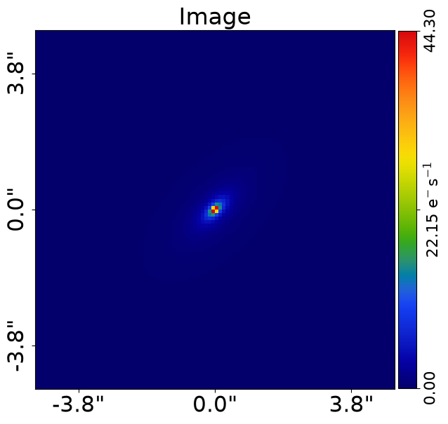
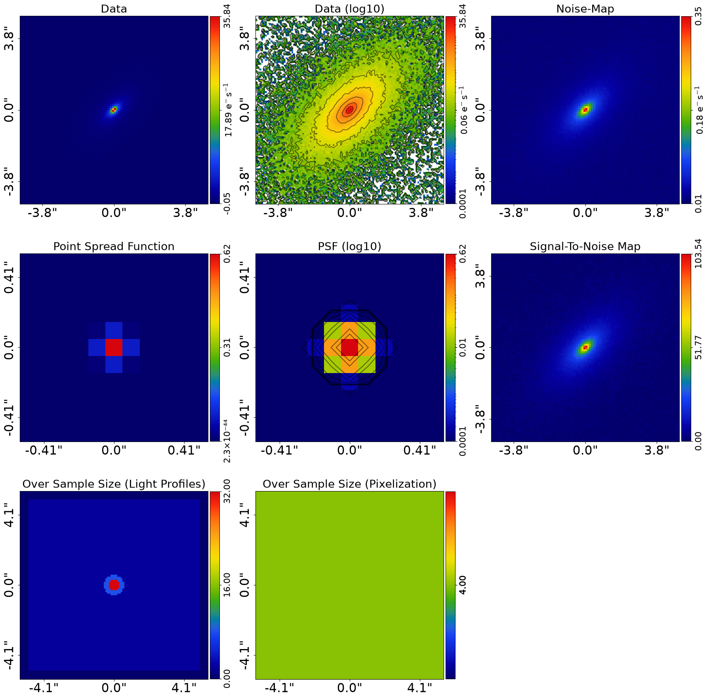

> ✏️ **This page is auto-generated from [`scripts/ellipse/simulator.py`](../../scripts/ellipse/simulator.py) — do not edit it directly.**
> It shows the example fully executed, with its real output images.
> Run it yourself via the [Python script](../../scripts/ellipse/simulator.py) or the [Jupyter notebook](../../notebooks/ellipse/simulator.ipynb).

Simulator: Ellipse
==================

Ellipse fitting is a common technique in astronomy to determine the shape of a galaxy, which fits a super
position of multiple elliptical isophotes to an image of a galaxy. This allows the ellipticity and position angle of
a galaxy to be determined.

This script simulates a very elliptical galaxy with a `Sersic` light profile, which is used to illustrate ellipse fitting
in the `autogalaxy_workspace/*/notebooks/modeling/imaging/fearure/ellipse_fitting.py` example.

This script simulates `Imaging` of a galaxy using light profiles where:

 - The galaxy's bulge is an `Sersic`.

__Contents__

- **Dataset Paths:** Setting the output path for simulated data.
- **Grid:** Creating the 2D grid for evaluating galaxy images with adaptive over-sampling.
- **Galaxies:** Setting up the galaxy with an elliptical Sersic bulge.
- **Output:** Saving the simulated dataset to FITS files.
- **Visualize:** Outputting subplot and image visualizations as PNG files.
- **Plane Output:** Saving the galaxy model as a JSON file for future reference.

__Start Here Notebook__

If any code in this script is unclear, refer to the `simulators/start_here.ipynb` notebook.


```python

from autogalaxy import setup_notebook; setup_notebook()

from pathlib import Path
import autogalaxy as ag
import autogalaxy.plot as aplt
```

    Working Directory has been set to `autogalaxy_workspace`


__Dataset Paths__

The `dataset_type` describes the type of data being simulated and `dataset_name` gives it a descriptive name. 


```python
dataset_type = "imaging"
dataset_name = "ellipse"

dataset_path = Path("dataset", dataset_type, dataset_name)
```

__Grid__

Simulate the image using a (y,x) grid with the adaptive over sampling scheme.


```python
grid = ag.Grid2D.uniform(
    shape_native=(100, 100),
    pixel_scales=0.1,
)

over_sample_size = ag.util.over_sample.over_sample_size_via_radial_bins_from(
    grid=grid,
    sub_size_list=[32, 8, 2],
    radial_list=[0.3, 0.6],
    centre_list=[(0.0, 0.0)],
)

grid = grid.apply_over_sampling(over_sample_size=over_sample_size)
```

Simulate a simple Gaussian PSF for the image.

We use a PSF with a sigma value of 0.05, which is smaller than other examples and chosen to ensure the PSF 
does not impact the results of the ellipse fitting example, as ellipse fitting does not account for the PSF convolution.


```python
psf = ag.Convolver.from_gaussian(
    convolve_over_sample_size=1,
    shape_native=(11, 11), sigma=0.05, pixel_scales=grid.pixel_scales
)
```

Create the simulator for the imaging data, which defines the exposure time, background sky, noise levels and psf.


```python
simulator = ag.SimulatorImaging(
    exposure_time=300.0,
    psf=psf,
    background_sky_level=0.1,
    add_poisson_noise_to_data=True,
)
```

__Galaxies__

Setup the galaxy with a bulge (elliptical Sersic) for this simulation.


```python
galaxy = ag.Galaxy(
    redshift=0.5,
    bulge=ag.lp.Sersic(
        centre=(0.0, 0.0),
        ell_comps=ag.convert.ell_comps_from(axis_ratio=0.5, angle=45.0),
        intensity=1.0,
        effective_radius=0.8,
        sersic_index=4.0,
    ),
)
```

Use these galaxies to generate the image for the simulated `Imaging` dataset.


```python
galaxies = ag.Galaxies(galaxies=[galaxy])
aplt.plot_array(array=galaxies.image_2d_from(grid=grid), title="Image")
```


    

    


Pass the simulator galaxies, which creates the image which is simulated as an imaging dataset.


```python
dataset = simulator.via_galaxies_from(galaxies=galaxies, grid=grid)
```

    .../PyAutoArray/autoarray/operators/convolver.py:1415: UserWarning: No blurring_image provided. Only the direct image will be convolved. This may change the correctness of the PSF convolution.
      warnings.warn(


Plot the simulated `Imaging` dataset before outputting it to fits.


```python
aplt.subplot_imaging_dataset(dataset=dataset)
```


    

    


__Output__

Output the simulated dataset to the dataset path as .fits files.


```python
aplt.fits_imaging(
    dataset=dataset,
    data_path=dataset_path / "data.fits",
    psf_path=dataset_path / "psf.fits",
    noise_map_path=dataset_path / "noise_map.fits",
    overwrite=True,
)
```

__Visualize__

Output a subplot of the simulated dataset, the image and the galaxies quantities to the dataset path as .png files.


```python
aplt.subplot_imaging_dataset(
    dataset=dataset, output_path=dataset_path, output_format="png"
)
aplt.plot_array(
    array=dataset.data, title="Data", output_path=dataset_path, output_format="png"
)

aplt.subplot_galaxies(
    galaxies=galaxies, grid=grid, output_path=dataset_path, output_format="png"
)
```

__Plane Output__

Save the `Galaxies` in the dataset folder as a .json file, ensuring the true light profiles and galaxies
are safely stored and available to check how the dataset was simulated in the future. 

This can be loaded via the method `galaxies = ag.from_json()`.


```python
ag.output_to_json(
    obj=galaxies,
    file_path=Path(dataset_path, "galaxies.json"),
)
```

The dataset can be viewed in the folder `autogalaxy_workspace/imaging/simple__sersic`.


```python

```
