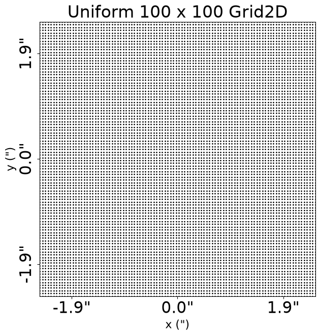

> ✏️ **This page is auto-generated from [`scripts/guides/data_structures.py`](../../scripts/guides/data_structures.py) — do not edit it directly.**
> It shows the example fully executed, with its real output images.
> Run it yourself via the [Python script](../../scripts/guides/data_structures.py) or the [Jupyter notebook](../../notebooks/guides/data_structures.ipynb).

Data Structures
===============

This tutorial illustrates the data structure objects which data and results quantities are stored using, which are
extensions of NumPy arrays.

These data structures are used because for different calculations it is convenient to store the data in different
formats. For example, mapping images between 1D and 2D representations allows for more efficient PSF convolutions
to be performed internally by **PyAutoGalaxy**.

These data structures use the `slim` and `native` data representations API to make it simple to map quantities from
1D dimensions to their native dimensions.

__Contents__

- **Units:** The internal unit system used throughout this example.
- **API:** Create the three main data structures (Array2D, Grid2D, VectorYX2D) without a mask.
- **Grids:** Create and plot a uniform Grid2D of (y,x) coordinates.
- **Native:** Access the grid in its native 2D representation.
- **Slim:** Access the grid in its slimmed-down 1D representation.
- **Masked Data Structures:** How masking changes the slim and native representations.
- **Data:** Using Array2D objects to store 2D data like images and noise maps.
- **Dataset Auto-Simulation:** Auto-simulate the dataset if it does not exist.
- **Galaxies:** Computing galaxy images and inspecting their data structures.
- **Irregular Structures:** Evaluating light profiles on irregular grids of coordinates.
- **Vector Quantities:** Working with vector (y,x) quantities like deflection angles using VectorYX2D.

__Units__

In this example, all quantities are **PyAutoGalaxy**'s internal unit coordinates, with spatial coordinates in
arc seconds, luminosities in electrons per second and mass quantities (e.g. convergence) are dimensionless.

The guide `units_and_cosmology.ipynb` illustrates how to convert these quantities to physical units like
kiloparsecs, magnitudes and solar masses.


```python

from autoconf import setup_notebook; setup_notebook()

from pathlib import Path
import autogalaxy as ag
import autogalaxy.plot as aplt
```

    Working Directory has been set to `autogalaxy_workspace`


__API__

We discuss in detail why these data structures and illustrate their functionality below.

However, we first create the three data structures we'll use in this example, to set expectations for what they do.

We create three data structures:

 - `Array2D`: A 2D array of data, which is used for storing an image, a noise-map, etc. 

 - `Grid2D`: A 2D array of (y,x) coordinates, which is used for ray-tracing.

 -`VectorYX2D`: A 2D array of vector values, which is used for deflection angles, shear and other vector fields.

All data structures are defined according to a uniform grid of coordinates and therefore they have a `pixel_scales`
input defining the pixel-to-arcssecond conversion factor of its grid. 

For example, for an image stored as an `Array2D`, it has a grid where each coordinate is the centre of each image pixel
and the pixel-scale is therefore the resolution of the image.

We first create each data structure without a mask using the `no_mask` method:


```python
arr = ag.Array2D.no_mask(
    values=[[1.0, 2.0, 3.0], [4.0, 5.0, 6.0], [7.0, 8.0, 9.0]], pixel_scales=1.0
)

print(arr)

grid = ag.Grid2D.no_mask(
    values=[
        [[-1.0, -1.0], [-1.0, 0.0], [-1.0, 1.0]],
        [[0.0, -1.0], [0.0, 0.0], [0.0, 1.0]],
        [
            [1.0, -1.0],
            [1.0, 0.0],
            [1.0, 1.0],
        ],
    ],
    pixel_scales=1.0,
)

print(grid)

vector_yx = ag.VectorYX2D.no_mask(
    values=[
        [[5.0, -5.0], [5.0, 0.0], [5.0, 5.0]],
        [[0.0, -5.0], [0.0, 0.0], [0.0, 5.0]],
        [
            [-5.0, -5.0],
            [-5.0, 0.0],
            [-5.0, 5.0],
        ],
    ],
    pixel_scales=1.0,
)

print(vector_yx)
```

    Array2D([1., 2., 3., 4., 5., 6., 7., 8., 9.])
    Grid2D([[-1., -1.],
           [-1.,  0.],
           [-1.,  1.],
           [ 0., -1.],
           [ 0.,  0.],
           [ 0.,  1.],
           [ 1., -1.],
           [ 1.,  0.],
           [ 1.,  1.]])
    VectorYX2D([[ 5., -5.],
           [ 5.,  0.],
           [ 5.,  5.],
           [ 0., -5.],
           [ 0.,  0.],
           [ 0.,  5.],
           [-5., -5.],
           [-5.,  0.],
           [-5.,  5.]])


__Grids__

We now illustrate data structures using a `Grid2D` object, which is a set of two-dimensional $(y,x)$ coordinates
(in arc-seconds) that are used to evaluate galaxy light profiles.

These are fundamental to all calculations and drive why data structures are used in **PyAutoGalaxy**.

First, lets make a uniform 100 x 100 grid of (y,x) coordinates and plot it.


```python
grid = ag.Grid2D.uniform(shape_native=(100, 100), pixel_scales=0.05)

aplt.plot_grid(grid=grid, title="Uniform 100 x 100 Grid2D")
```


    

    


__Native__

This plot shows the grid in its `native` format, that is in 2D dimensions where the y and x coordinates are plotted
where we expect them to be on the grid.

We can print values from the grid's `native` property to confirm this:


```python
print("(y,x) pixel 0:")
print(grid.native[0, 0])
print("(y,x) pixel 1:")
print(grid.native[0, 1])
print("(y,x) pixel 2:")
print(grid.native[0, 2])
print("(y,x) pixel 100:")
print(grid.native[1, 0])
print("etc.")
```

    (y,x) pixel 0:
    [ 2.475 -2.475]
    (y,x) pixel 1:
    [ 2.475 -2.425]
    (y,x) pixel 2:
    [ 2.475 -2.375]
    (y,x) pixel 100:
    [ 2.425 -2.475]
    etc.


__Slim__

Every `Grid2D` object is accessible via two attributes, `native` and `slim`, which store the grid as NumPy ndarrays 
of two different shapes:
 
 - `native`: an ndarray of shape [total_y_image_pixels, total_x_image_pixels, 2] which is the native shape of the 
 2D grid and corresponds to the resolution of the image datasets we pair with a grid.
 
 - `slim`: an ndarray of shape [total_y_image_pixels*total_x_image_pixels, 2] which is a slimmed-down representation 
 the grid which collapses the inner two dimensions of the native ndarray to a single dimension.


```python
print("(y,x) pixel 0 (accessed via native):")
print(grid.native[0, 0])
print("(y,x) pixel 0 (accessed via slim 1D):")
print(grid.slim[0])
```

    (y,x) pixel 0 (accessed via native):
    [ 2.475 -2.475]
    (y,x) pixel 0 (accessed via slim 1D):
    [ 2.475 -2.475]


The shapes of the `Grid2D` in its `native` and `slim` formats are also available, confirming that this grid has a 
`native` resolution of (100 x 100) and a `slim` resolution of 10000 coordinates.


```python
print(grid.shape_native)
print(grid.shape_slim)
```

    (100, 100)
    10000


Neither shape above include the third index of the `Grid` which has dimensions 2 (corresponding to the y and x 
coordinates). 

This is accessible by using the standard numpy `shape` method on each grid.


```python
print(grid.native.shape)
print(grid.slim.shape)
```

    (100, 100, 2)
    (10000, 2)


We can print the entire `Grid2D` in its `slim` or `native` form. 


```python
print(grid.native)
print(grid.slim)
```

    Grid2D([[[ 2.475, -2.475],
            [ 2.475, -2.425],
            [ 2.475, -2.375],
            ...,
            [ 2.475,  2.375],
            [ 2.475,  2.425],
            [ 2.475,  2.475]],
    
           [[ 2.425, -2.475],
            [ 2.425, -2.425],
    ... [27 lines of output truncated] ...
            ...,
            [-2.425,  2.375],
            [-2.425,  2.425],
            [-2.425,  2.475]],
    
           [[-2.475, -2.475],
            [-2.475, -2.425],
            [-2.475, -2.375],
            ...,
            [-2.475,  2.375],
            [-2.475,  2.425],
            [-2.475,  2.475]]], shape=(100, 100, 2))
    Grid2D([[ 2.475, -2.475],
           [ 2.475, -2.425],
           [ 2.475, -2.375],
           ...,
           [-2.475,  2.375],
           [-2.475,  2.425],
           [-2.475,  2.475]], shape=(10000, 2))


__Masked Data Structures__

When a mask is applied to a grid or other data structure, this changes the `slim` and `native` representations as 
follows:

 - `slim`: only contains image-pixels that are not masked, removing all masked pixels from the 1D array.
 
 - `native`: retains the dimensions [total_y_image_pixels, total_x_image_pixels], but the masked pixels have values
    of 0.0 or (0.0, 0.0).

This can be seen by computing a grid via a mask and comparing the its`shape_slim` attribute to the `pixels_in_mask` of 
the mask.


```python
mask = ag.Mask2D.circular(shape_native=(100, 100), pixel_scales=0.05, radius=3.0)

grid = ag.Grid2D.from_mask(mask=mask)

print("The shape_slim and number of unmasked pixels")
print(grid.shape_slim)
print(mask.pixels_in_mask)
```

    The shape_slim and number of unmasked pixels
    9504
    9504


We can use the `slim` attribute to print unmasked values of the grid:


```python
print("First unmasked image value:")
print(grid.slim[0])
```

    First unmasked image value:
    [ 2.475 -1.675]


The `native` representation of the `Grid2D` retains the dimensions [total_y_image_pixels, total_x_image_pixels], 
however the exterior pixels have values of 0.0 indicating that they have been masked.


```python
print("Example masked pixels in the grid native representation:")
print(grid.shape_native)
print(grid.native[0, 0])
print(grid.native[2, 2])
```

    Example masked pixels in the grid native representation:
    (100, 100)
    [0. 0.]
    [0. 0.]


__Data__

Two dimensional arrays of data are stored using the `Array2D` object, which has `slim` and `native` representations
analogous to the `Grid2D` object and described as follows:

 - `slim`: an ndarray of shape [total_unmasked_pixels] which is a slimmed-down representation of the data in 1D that 
    contains only the unmasked data points (where this mask is the one used by the model-fit above).

 - `native`: an ndarray of shape [total_y_image_pixels, total_x_image_pixels], which is the native shape of the 
    masked 2D grid used to fit the model. All masked pixels are assigned a value 0.0 in the `native` array.

For example, the `data` and `noise_map` in an `Imaging` object are stored as `Array2D` objects.

We load an imaging dataset and illustrate its data structures below.   


```python
dataset_name = "sersic_x2"
dataset_path = Path("dataset") / "imaging" / dataset_name
```

__Dataset Auto-Simulation__

If the dataset does not already exist on your system, it will be created by running the corresponding
simulator script. This ensures that all example scripts can be run without manually simulating data first.


```python
if not dataset_path.exists():
    import subprocess
    import sys

    subprocess.run(
        [sys.executable, "scripts/guides/plot/simulator.py"],
        check=True,
    )


dataset = ag.Imaging.from_fits(
    data_path=dataset_path / "data.fits",
    psf_path=dataset_path / "psf.fits",
    noise_map_path=dataset_path / "noise_map.fits",
    pixel_scales=0.1,
)

data = dataset.data
```

Here is what `slim` and `native` representations of the data's first pixel look like for the `data` before masking:


```python
print("First unmasked data value:")
print(data.slim[0])
print(data.native[0, 0])
```

    First unmasked data value:
    -0.05666666666666667
    -0.05666666666666667


By default, all arrays in **PyAutoGalaxy** are stored as their `slim` 1D numpy array, meaning we don't need to use the
`slim` attribute to access the data.


```python
print(data[0])
```

    -0.05666666666666667


By applying a mask the first value in `slim` changes and the native value becomes 0.0:


```python
mask = ag.Mask2D.circular(
    shape_native=dataset.shape_native, pixel_scales=dataset.pixel_scales, radius=3.0
)

dataset = dataset.apply_mask(mask=mask)

data = dataset.data

print("First unmasked data value:")
print(data.slim[0])
print(data.native[0, 0])
```

    2026-07-10 19:16:08,092 - autoarray.dataset.imaging.dataset - INFO - IMAGING - Data masked, contains a total of 225 image-pixels


    First unmasked data value:
    -0.05666666666666667
    -0.05666666666666667


__Galaxies__

`Galaxy` objects produces many  quantities all of which use the `slim` and `native` data structures.

For example, by passing it a 2D grid of (y,x) coordinates we can return a numpy array containing its 2D image. 

Below, we use the grid that is aligned with the imaging data (e.g. where each grid coordinate is at the centre of each
image pixel) to compute the galaxy image and show its data structure.


```python
galaxy = ag.Galaxy(
    redshift=1.0,
    light=ag.lp.SersicSph(
        centre=(0.0, 0.0), intensity=0.2, effective_radius=0.2, sersic_index=1.0
    ),
)

image = galaxy.image_2d_from(grid=dataset.grid)
```

If we print the type of the `image` we note that it is an `Array2D`, which is a data structure that inherits 
from a numpy array but is extended to include specific functionality discussed below.


```python
print(type(image))
```

    <class 'autoarray.structures.arrays.uniform_2d.Array2D'>


Because the image is a numpy array, we can print its shape and see that it is 1D.


```python
print(image.shape)
```

    (225,)


__Irregular Structures__

We may want to perform calculations at specific (y,x) coordinates which are not tied to a uniform grid.

We can use an irregular 2D (y,x) grid of coordinates for this. The grid below evaluates the image at:

- y = 1.0, x = 1.0.
- y = 1.0, x = 2.0.
- y = 2.0, x = 2.0.


```python
grid_irregular = ag.Grid2DIrregular(values=[[1.0, 1.0], [1.0, 2.0], [2.0, 2.0]])

image = galaxy.image_2d_from(grid=grid_irregular)

print(image)
```

    ArrayIrregular([7.51169626e-06, 7.59325956e-09, 5.26660940e-11])


The result is stored using an `ArrayIrregular` object, which is a data structure that handles irregular arrays.


```python
print(type(image))
```

    <class 'autoarray.structures.arrays.irregular.ArrayIrregular'>


__Vector Quantities__

Many quantities are vectors. That is, they are (y,x) coordinates that have 2 values representing their
magnitudes in both the y and x directions.

The most obvious of these is the deflection angles, which are not often used for galaxy calculations but are
commonly used to perform gravitational lensing. 

To indicate that a quantities is a vector, **PyAutoGalaxy** uses the label `_yx`


```python
deflections_yx_2d = galaxy.deflections_yx_2d_from(grid=dataset.grid)
```

If we print the type of the `deflections_yx` we note that it is a `VectorYX2D`.


```python
print(type(deflections_yx_2d))
```

    <class 'autoarray.structures.vectors.uniform.VectorYX2D'>


Unlike the scalar quantities above, which were a 1D numpy array in the `slim` representation and a 2D numpy array in 
the `native` representation, vectors are 2D in `slim` and 3D in `native`.


```python
print(deflections_yx_2d.slim.shape)
print(deflections_yx_2d.native.shape)
```

    (225, 2)
    (15, 15, 2)


For vector quantities the has shape `2`, corresponding to the y and x vectors respectively.


```python
print(deflections_yx_2d.slim[0, :])
```

    [0. 0.]


The role of the terms `slim` and `native` can be thought of in the same way as for scalar quantities. 

For a scalar, the `slim` property gives every scalar value as a 1D ndarray for every unmasked pixel. For a vector we
still get an ndarray of every unmasked pixel, however each entry now contains two entries: the vector of (y,x) values.

For a `native` property these vectors are shown on an image-plane 2D grid where again each pixel
contains a (y,x) vector.

__JAX__

PyAutoGalaxy runs on either NumPy (the default) or JAX. The data
structures you've met above are *backend-polymorphic* — wrappers
around a numerical array that can be `numpy.ndarray` or `jax.Array`
depending on how the structure was constructed.

You can always reach the raw backing array via `.array`:

```python
grid = ag.Grid2D.uniform(shape_native=(100, 100), pixel_scales=0.05)
print(type(grid.array))          # numpy.ndarray on the default path
```

__When the backing becomes `jax.Array`__

Three situations switch the backing to `jax.Array`:

1. The structure comes back from a JAX-accelerated `Analysis(use_jax=True)`
   fit (`fit.residual_map.array`, `fit.model_image.array`, ...).
2. The structure comes back from a `Simulator(use_jax=True)` simulation.
3. You constructed it inside a JAX-traced function with `xp=jnp`.

The Python-level wrapper is the same `aa.Array2D` / `aa.Grid2D` in all
cases — only the underlying array type changes.

__Host transfer (the JAX → NumPy boundary)__

Most things you do convert back to NumPy transparently: plotting,
`.fits` writing, `.copy()`, `.tolist()`. Direct NumPy arithmetic
(`np.sqrt(fit.residual_map.array)`) transfers off the GPU — use
`jnp.sqrt(...)` for hot loops, don't worry about it for one-off code.

__The not-pytree rule__

If you write your own `@jax.jit` function and try to return an
`aa.Array2D` (or `aa.Grid2DIrregular`) from inside it, the JIT
boundary may fail. The workaround: return the raw `.array` from inside
the jit and rewrap on the host:

```python
@jax.jit
def my_image_fn(galaxies, grid):
    return galaxies.image_2d_from(grid=grid, xp=jnp).array   # raw jax.Array

arr = my_image_fn(galaxies, grid)
img_wrapped = ag.Array2D(values=arr, mask=grid.mask)
```

You only encounter this when *you* write the `@jax.jit` — the library
handles its own returns correctly.

For the canonical "JIT-it-yourself" deep-dive (decorator vs `jax.jit(bound_method)`,
cache-identity considerations, the `@jax.jit + xp=jnp` pairing rule),
see the autolens companion at
`autolens_workspace/scripts/guides/lens_calc.py` `__JAX__` section.
The patterns there apply equally to autogalaxy primitives — just
`Galaxy` / `Galaxies` instead of `Tracer` / `LensCalc`.

__Summary__

| You construct / receive | Backing type |
|---|---|
| `ag.Grid2D.uniform(shape_native, pixel_scales)` | `numpy.ndarray` |
| `fit = analysis.fit_from(instance)` from `AnalysisImaging(use_jax=True)` | `jax.Array` |
| `dataset = simulator.via_galaxies_from(...)` from `SimulatorImaging(use_jax=True)` | `jax.Array` |
| `galaxies.image_2d_from(grid=jnp_grid, xp=jnp)` inside your own `@jax.jit` | `jax.Array` |

`.array` is the safe accessor for the raw backing. Plotting and
`.fits` writers handle the conversion transparently.


```python

```
