> ✏️ **This page is auto-generated from [`scripts/imaging/fit.py`](../../scripts/imaging/fit.py) — do not edit it directly.**
> It shows the example fully executed, with its real output images.
> Run it yourself via the [Python script](../../scripts/imaging/fit.py) or the [Jupyter notebook](../../notebooks/imaging/fit.ipynb).

Fits
====

This guide shows how to fit data using the `FitImaging` object, including visualizing and interpreting its results.

__Units__

In this example, all quantities are **PyAutoGalaxy**'s internal unit coordinates, with spatial coordinates in
arc seconds, luminosities in electrons per second and mass quantities (e.g. convergence) are dimensionless.

The guide `guides/units_and_cosmology.ipynb` illustrates how to convert these quantities to physical units like
kiloparsecs, magnitudes and solar masses.

__Data Structures__

Quantities inspected in this example script use **PyAutoGalaxy** bespoke data structures for storing arrays, grids,
vectors and other 1D and 2D quantities. These use the `slim` and `native` API to toggle between representing the
data in 1D numpy arrays or high dimension numpy arrays.

This tutorial will only use the `slim` properties which show results in 1D numpy arrays of
shape [total_unmasked_pixels]. This is a slimmed-down representation of the data in 1D that contains only the
unmasked data points

These are documented fully in the `autogalaxy_workspace/*/guides/data_structures.ipynb` guide.

__Other Models__

This tutorial does not use a pixelized galaxy reconstruction or linear light profiles, which have their own dedicated
functionality that interfaces with the `FitImaging` object. See `imaging/features/pixelization/fit.py` for the
canonical bulge + pixelization fit example.

This is described in the dedicated example scripts `modeling/features/linear_light_profiles.py`
and `modeling/features/pixelizaiton.py`.

__Contents__

- **Loading Data:** Loading the imaging dataset from FITS files for fitting.
- **Dataset Auto-Simulation:** Automatically simulating the dataset if it does not already exist.
- **Grid:** Setting up the over-sampled grid for light profile evaluation.
- **Mask:** Applying a circular mask to the dataset.
- **Fitting:** Creating galaxies from light profiles and fitting them to the data using FitImaging.
- **Bad Fit:** Demonstrating what a poor fit looks like with offset galaxy centres.
- **Fit Quantities:** Accessing model data, residuals and chi-squared arrays from the fit.
- **Figures of Merit:** Computing chi-squared, noise normalization and log likelihood scalar values.
- **Galaxy Quantities:** Extracting individual galaxy model images and subtracted images.
- **Unmasked Quantities:** Computing unmasked blurred images of the galaxies.
- **Mask:** Using a secondary mask to estimate fit quality in specific regions.
- **Pixel Counting:** Counting pixels with poor chi-squared values to quantify residual extent.
- **Outputting Results:** Saving fit quantities to FITS files for later analysis.
- **Modeling Results:** Links to modeling result analysis in the workspace.
- **Wrap Up:** Summary of the FitImaging object and next steps.

__JAX__

This script constructs a `FitImaging` directly from galaxies and a dataset
(no Analysis / no non-linear search). The fit works on either backend —
quantities it computes (`fit.model_image`, `fit.residual_map`,
`fit.log_likelihood`, ...) return `numpy.ndarray` on the default path or
`jax.Array` if you constructed the upstream objects with `xp=jnp`.

For the standard analysis-driven modeling path — where `AnalysisImaging`
auto-enables `use_jax=True` and the search driver handles the JIT — see
`start_here.py` / `modeling.py`. For the advanced path where you wrap your
own `@jax.jit` around `FitImaging` construction, see `likelihood_function.py`'s
`__JAX__` section and the `scripts/guides/api/data_structures.py` guide.


```python

from autoconf import setup_notebook; setup_notebook()

import numpy as np
from pathlib import Path
import autofit as af
import autogalaxy as ag
import autogalaxy.plot as aplt
```

    Working Directory has been set to `autogalaxy_workspace`


__Loading Data__

We we begin by loading the galaxy dataset `simple__sersic` from .fits files, which is the dataset we will use to 
demonstrate fitting.


```python
dataset_name = "sersic_x2"
dataset_path = Path("dataset") / "imaging" / dataset_name
```

__Dataset Auto-Simulation__

If the dataset does not already exist on your system, it will be created by running the corresponding
simulator script. This ensures that all example scripts can be run without manually simulating data first.


```python
if ag.util.dataset.should_simulate(str(dataset_path)):
    import subprocess
    import sys

    subprocess.run(
        [sys.executable, "scripts/guides/plot/simulator.py"],
        check=True,
    )


dataset = ag.Imaging.from_fits(
    data_path=dataset_path / "data.fits",
    psf_path=dataset_path / "psf.fits",
    noise_map_path=dataset_path / "noise_map.fits",
    pixel_scales=0.1,
)
```

We can use the `Imaging` to plot the image, noise-map and psf of the dataset.


```python
aplt.plot_array(array=dataset.data, title="Data")
aplt.plot_array(array=dataset.noise_map, title="Noise Map")
aplt.plot_array(array=dataset.psf.kernel, title="PSF")
```


    
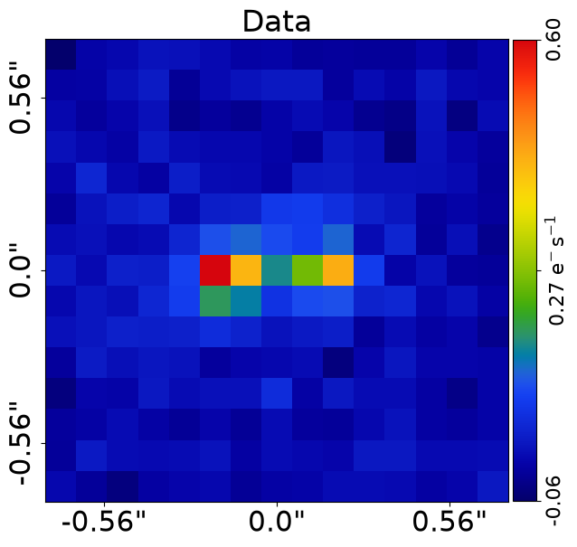
    


    
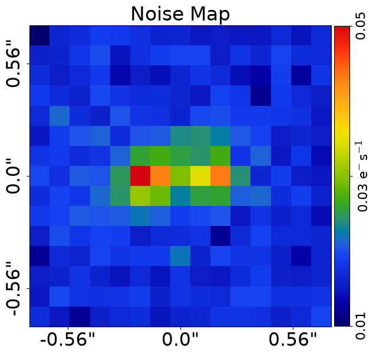
    


    
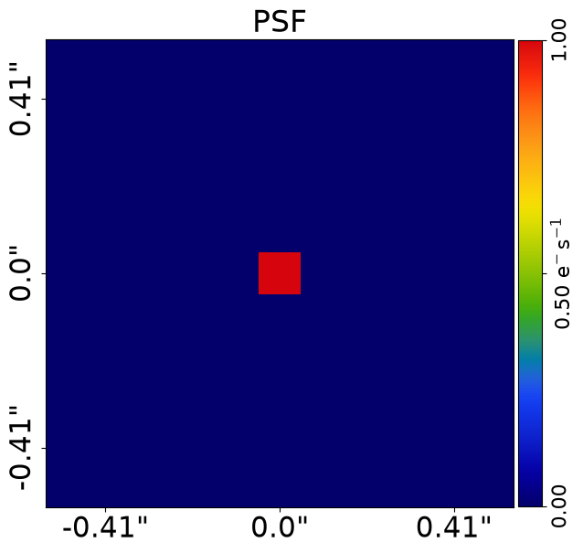
    


The `Imaging` also contains a subplot which plots all these properties simultaneously.


```python
aplt.subplot_imaging_dataset(dataset=dataset)
```


    
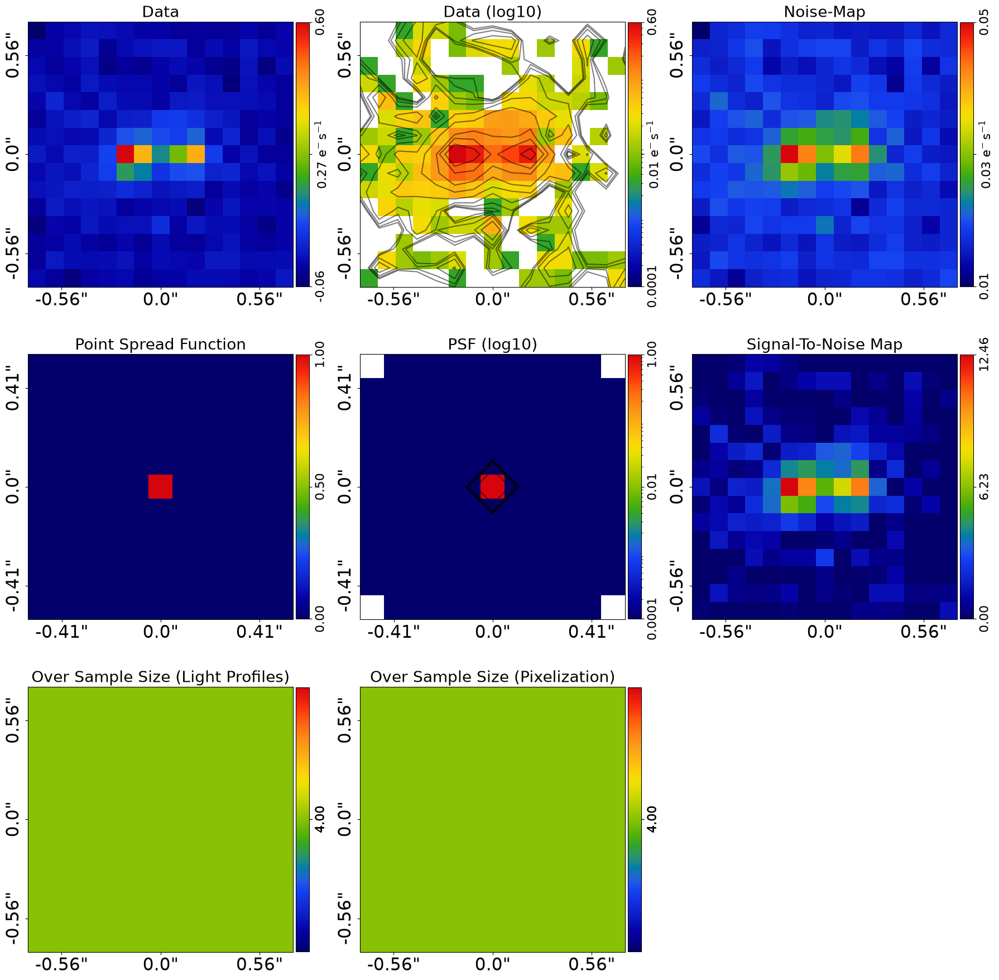
    


__Grid__

When calculating the amount of emission in each image pixel from galaxies, a two dimensional line integral of all of 
the emission within the area of that pixel should be performed. However, for complex models this can be difficult 
to analytically compute and can lead to slow run times.

Instead, a high resolution grid of (y,x) coordinates is used, where the line integral of all the flux in a pixel
is computed by summing up the flux values at these (y,x) coordinates. The code below uses the same over sampling
size in every pixel for simplicity, but adaptive over sampling can also be used, which adapts the over sampling
to the bright regions of the image but uses computationally faster lower valkues in the outer regions.


```python
dataset = dataset.apply_over_sampling(
    over_sample_size_lp=4,
)

```

__Mask__

We next mask the data, so that regions where there is no signal (e.g. the edges) are omitted from the fit.

To do this we can use a ``Mask2D`` object, which for this example we'll create as a 3.0" circle.


```python
mask = ag.Mask2D.circular(
    shape_native=dataset.shape_native, pixel_scales=dataset.pixel_scales, radius=3.0
)
```

We now combine the imaging dataset with the mask.

Here, the mask is also used to compute the `Grid2D` we used in the previous overview to compute the light profile 
emission, where this grid has the mask applied to it.


```python
dataset = dataset.apply_mask(mask=mask)

aplt.plot_grid(grid=dataset.grid, title="Grid")
```

    2026-07-10 18:19:38,216 - autoarray.dataset.imaging.dataset - INFO - IMAGING - Data masked, contains a total of 225 image-pixels


    
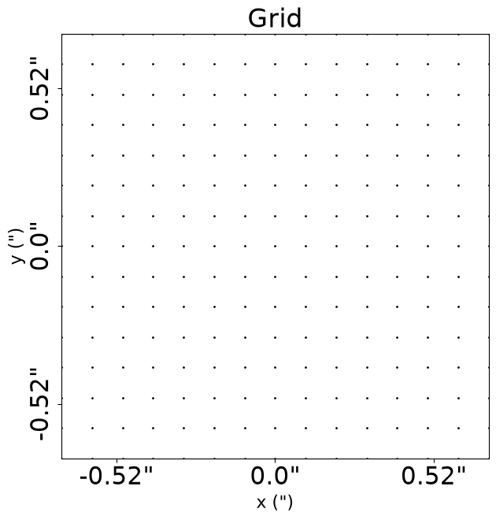
    


Here is what our image looks like with the mask applied, where PyAutoGalaxy has automatically zoomed around the mask
to make the galaxyed source appear bigger.


```python
aplt.plot_array(array=dataset.data, title="Data")
```


    

    


__Fitting__

Following the previous overview, we can make a collection of galaxies from light profiles and individual galaxy objects..

The combination of light profiles below is the same as those used to generate the simulated dataset we loaded above.

It therefore produces galaxies whose image looks exactly like the dataset. As discussed in the previous overview, 
galaxies can be extended to include additional light profiles and galaxy objects, for example if you wanted to fit data
with multiple galaxies.


```python
galaxy_0 = ag.Galaxy(
    redshift=0.5,
    bulge=ag.lp.Sersic(
        centre=(0.0, -1.0),
        ell_comps=(0.25, 0.1),
        intensity=0.1,
        effective_radius=0.8,
        sersic_index=2.5,
    ),
)

galaxy_1 = ag.Galaxy(
    redshift=0.5,
    bulge=ag.lp.Sersic(
        centre=(0.0, 1.0),
        ell_comps=(0.0, 0.1),
        intensity=0.1,
        effective_radius=0.6,
        sersic_index=3.0,
    ),
)

galaxies = ag.Galaxies(galaxies=[galaxy_0, galaxy_1])

aplt.plot_array(array=galaxies.image_2d_from(grid=dataset.grid), title="Image")
```


    
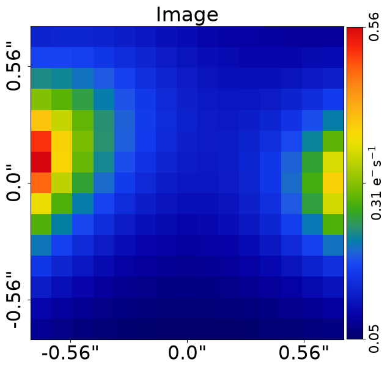
    


We now use the `FitImaging` object to fit the galaxies to the dataset. 

The fit performs the necessary tasks to create the `model_image` we fit the data with, such as blurring the
image of the galaxies with the imaging data's Point Spread Function (PSF). We can see this by comparing the galaxies 
image (which isn't PSF convolved) and the fit`s model image (which is).

[For those not familiar with Astronomy data, the PSF describes how the observed emission of the galaxy is blurred by
the telescope optics when it is observed. It mimicks this blurring effect via a 2D convolution operation].


```python
fit = ag.FitImaging(dataset=dataset, galaxies=galaxies)

aplt.plot_array(array=fit.model_data, title="Model Image")
```


    
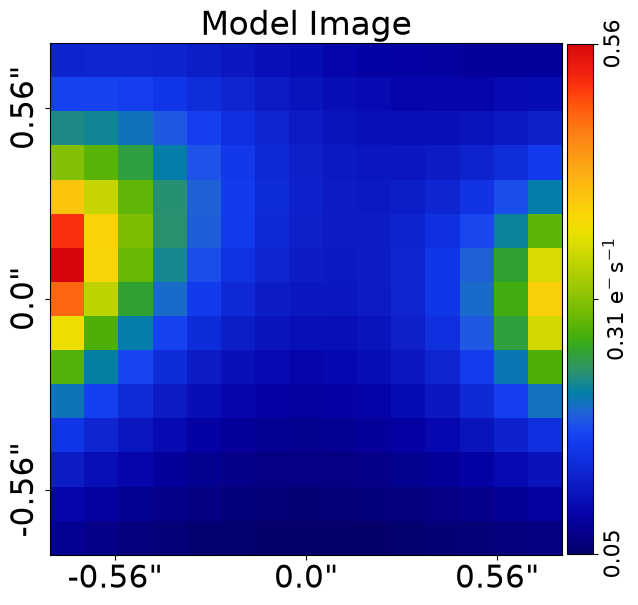
    


The fit creates the following:

 - The `residual_map`: The `model_image` subtracted from the observed dataset`s `image`.
 - The `normalized_residual_map`: The `residual_map `divided by the observed dataset's `noise_map`.
 - The `chi_squared_map`: The `normalized_residual_map` squared.

we'll plot all 3 of these, alongside a subplot containing them all, which also shows the data,
model image and individual galaxies in the fit.

For a good model where the model image and galaxies are representative of the galaxy system the
residuals, normalized residuals and chi-squared are minimized:


```python
aplt.plot_array(array=fit.residual_map, title="Residual Map")
aplt.plot_array(array=fit.normalized_residual_map, title="Normalized Residual Map")
aplt.plot_array(array=fit.chi_squared_map, title="Chi-Squared Map")
aplt.subplot_fit_imaging(fit=fit)
```


    
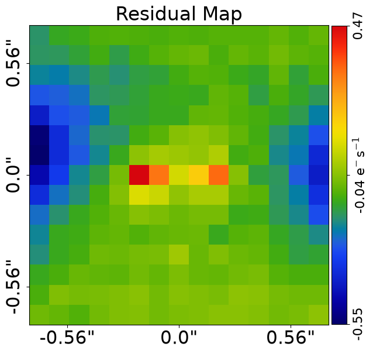
    


    
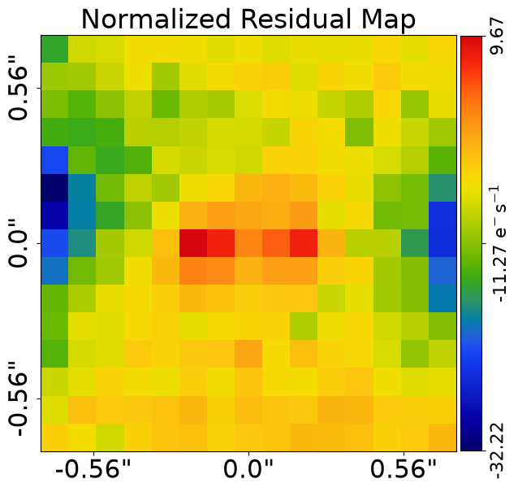
    


    
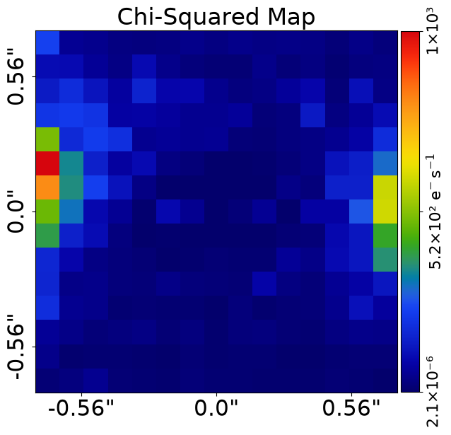
    


    
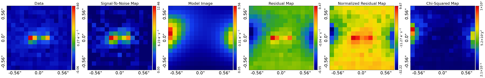
    


The overall quality of the fit is quantified with the `log_likelihood` (the **HowToGalaxy** tutorials explains how
this is computed).


```python
print(fit.log_likelihood)
```

    -8075.840307006014


__Bad Fit__

In contrast, a bad model will show features in the residual-map and chi-squared map.

We can produce such an image by using different galaxies. In the example below, we 
change the centre of the galaxies from (0.0, -1.0) to (0.0, -1.05), and from (0.0, 1.0) to (0.0, 1.05) which leads to 
residuals appearing in the centre of the fit.


```python
galaxy_0 = ag.Galaxy(
    redshift=0.5,
    bulge=ag.lp.Sersic(
        centre=(0.0, -1.05),
        ell_comps=(0.25, 0.1),
        intensity=0.1,
        effective_radius=0.8,
        sersic_index=2.5,
    ),
)

galaxy_1 = ag.Galaxy(
    redshift=0.5,
    bulge=ag.lp.Sersic(
        centre=(0.0, 1.05),
        ell_comps=(0.0, 0.1),
        intensity=0.1,
        effective_radius=0.6,
        sersic_index=3.0,
    ),
)

galaxies = ag.Galaxies(galaxies=[galaxy_0, galaxy_1])

fit_bad = ag.FitImaging(dataset=dataset, galaxies=galaxies)
```

A new fit using these galaxies shows residuals, normalized residuals and chi-squared which are non-zero.


```python
aplt.plot_array(array=fit_bad.residual_map, title="Residual Map")
aplt.plot_array(array=fit_bad.normalized_residual_map, title="Normalized Residual Map")
aplt.plot_array(array=fit_bad.chi_squared_map, title="Chi-Squared Map")
aplt.subplot_fit_imaging(fit=fit_bad)
```


    
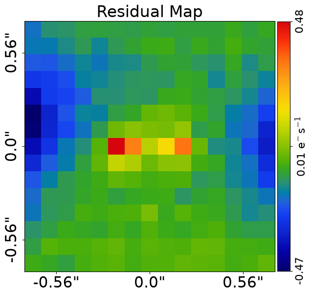
    


    
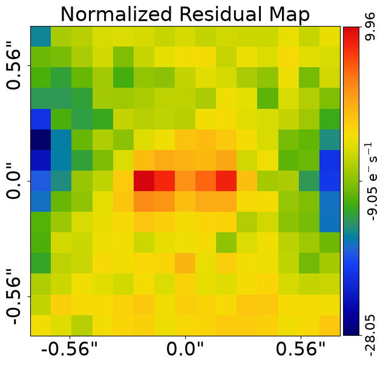
    


    
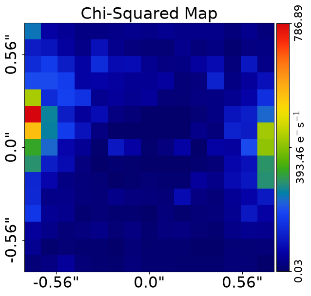
    


    
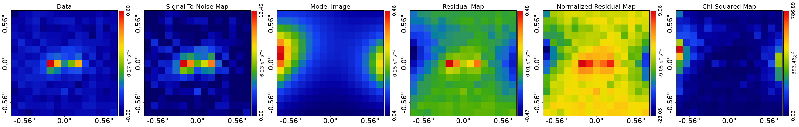
    


We also note that its likelihood decreases.


```python
print(fit.log_likelihood)
```

    -8075.840307006014


__Fit Quantities__

The maximum log likelihood fit contains many 1D and 2D arrays showing the fit.

These use the `slim` and `native` API discussed in the previous results tutorial.

There is a `model_data`, which is the image of the galaxies we inspected in the previous tutorial blurred with the 
imaging data's PSF. 

This is the image that is fitted to the data in order to compute the log likelihood and therefore quantify the 
goodness-of-fit.

If you are unclear on what `slim` means, refer to the section `Data Structure` at the top of this example.


```python
print(fit.model_data.slim)
print(fit.model_data.native)
```

    Array2D([0.128256  , 0.13139634, 0.13087722, 0.12707777, 0.12090444,
           0.11347737, 0.10583406, 0.09876389, 0.09277253, 0.08811851,
           0.08486719, 0.08293237, 0.08209768, 0.08202468, 0.08226468,
           0.16751645, 0.16837518, 0.1633176 , 0.15382245, 0.14196895,
           0.12969205, 0.11839189, 0.10889798, 0.10160383, 0.09662124,
           0.09388735, 0.09321115, 0.09426735, 0.09655587, 0.09936028,
           0.22324472, 0.2173085 , 0.20250133, 0.18300714, 0.16274429,
           0.14430377, 0.12898508, 0.11724556, 0.10911566, 0.10445755,
           0.10308359, 0.10477077, 0.10918995, 0.11575758, 0.1234385 ,
           0.30241988, 0.27887028, 0.24523067, 0.21047972, 0.17974175,
    ... [61 lines of output truncated] ...
            0.12333376, 0.1464797 , 0.18452319, 0.24722637, 0.35443802],
           [0.27378844, 0.21254671, 0.16995264, 0.14021861, 0.11963178,
            0.10587687, 0.09757165, 0.0939983 , 0.09497575, 0.10084145,
            0.11253835, 0.13182699, 0.161652  , 0.20661138, 0.27293158],
           [0.20317503, 0.16534739, 0.13720862, 0.11663152, 0.10196144,
            0.09203825, 0.08612189, 0.08382242, 0.0850594 , 0.09005298,
            0.09934109, 0.11380282, 0.13462519, 0.16302922, 0.19929536],
           [0.15384542, 0.12984404, 0.11111996, 0.09693221, 0.08657618,
            0.07949708, 0.07531476, 0.07381923, 0.07495956, 0.07883132,
            0.08565557, 0.09572735, 0.10928697, 0.12623184, 0.1455767 ],
           [0.11898241, 0.10328117, 0.09062256, 0.08077636, 0.07345557,
            0.06840226, 0.06542264, 0.06439683, 0.06527525, 0.06806436,
            0.07279722, 0.0794776 , 0.08798052, 0.0978953 , 0.10832867],
           [0.09379914, 0.08322918, 0.07451029, 0.06759566, 0.06237677,
            0.05873561, 0.05657049, 0.05580525, 0.05638711, 0.05827454,
            0.06141366, 0.06569982, 0.07092257, 0.07669963, 0.08242327],
           [0.07518144, 0.06788053, 0.06175901, 0.05683097, 0.0530617 ,
            0.05039726, 0.04878067, 0.04815801, 0.04847688, 0.04967797,
            0.05168   , 0.05435829, 0.05751928, 0.06087781, 0.06405015]])


There are numerous ndarrays showing the goodness of fit: 

 - `residual_map`: Residuals = (Data - Model_Data).
 - `normalized_residual_map`: Normalized_Residual = (Data - Model_Data) / Noise
 - `chi_squared_map`: Chi_Squared = ((Residuals) / (Noise)) ** 2.0 = ((Data - Model)**2.0)/(Variances)


```python
print(fit.residual_map.slim)
print(fit.residual_map.native)

print(fit.normalized_residual_map.slim)
print(fit.normalized_residual_map.native)

print(fit.chi_squared_map.slim)
print(fit.chi_squared_map.native)
```

    Array2D([-1.84922671e-01, -1.34729669e-01, -1.27543884e-01, -1.07077768e-01,
           -1.04237769e-01, -1.06810707e-01, -1.12500730e-01, -1.02097221e-01,
           -1.09439197e-01, -1.01451843e-01, -1.01533853e-01, -9.95990351e-02,
           -8.20976760e-02, -1.02024681e-01, -8.22646804e-02, -1.77516449e-01,
           -1.75041849e-01, -1.49984262e-01, -1.20489117e-01, -1.61968951e-01,
           -1.23025387e-01, -9.83918948e-02, -8.22313109e-02, -7.49371635e-02,
           -1.09954575e-01, -8.38873544e-02, -9.65444883e-02, -6.76006802e-02,
           -9.32225391e-02, -9.93602785e-02, -2.19911382e-01, -2.30641831e-01,
           -2.02501334e-01, -1.66340477e-01, -1.92744290e-01, -1.57637100e-01,
           -1.52318410e-01, -1.20578895e-01, -9.91156623e-02, -1.04457546e-01,
    ... [352 lines of output truncated] ...
            1.67941933e+01, 3.84340541e+01, 2.22509395e+01, 1.88085290e+01,
            1.53652176e+01, 8.45688864e+01, 2.96059577e+01, 1.99087981e+01,
            5.43718273e+01, 7.97355773e+01, 1.27422587e+02],
           [1.87880227e+02, 5.05784220e+01, 4.06537960e+01, 1.16934803e+01,
            1.59924868e+01, 1.01511263e+01, 8.84468275e+00, 3.58071000e-01,
            2.14162746e+01, 6.44483232e+00, 1.56102684e+01, 2.00432136e+01,
            4.74312736e+01, 1.14574697e+02, 6.88164735e+01],
           [6.06027336e+01, 3.88559823e+01, 1.77272639e+01, 2.45773397e+01,
            3.27522909e+01, 1.40366074e+01, 2.73638507e+01, 8.07004010e+00,
            2.13899166e+01, 2.58456467e+01, 1.40087352e+01, 8.84396091e+00,
            3.20006071e+01, 4.28254905e+01, 3.86950429e+01],
           [4.39296981e+01, 6.53849069e+00, 1.13497584e+01, 1.04409626e+01,
            7.48179760e+00, 3.75111797e+00, 1.47720989e+01, 5.72214729e+00,
            8.17171781e+00, 1.01877675e+01, 2.85952226e+00, 3.60849581e+00,
            1.16123109e+01, 1.37942317e+01, 1.43048982e+01],
           [1.49868878e+01, 2.57336201e+01, 5.17744810e+01, 1.48879305e+01,
            8.44663180e+00, 6.43068404e+00, 1.77404261e+01, 9.66132318e+00,
            8.33057937e+00, 4.29365757e+00, 4.73787917e+00, 6.39700449e+00,
            1.51961759e+01, 1.11183221e+01, 3.30992659e+00]])


__Figures of Merit__

There are single valued floats which quantify the goodness of fit:

 - `chi_squared`: The sum of the `chi_squared_map`.
 - `noise_normalization`: The normalizing noise term in the likelihood function 
    where [Noise_Term] = sum(log(2*pi*[Noise]**2.0)).
 - `log_likelihood`: The log likelihood value of the fit where [LogLikelihood] = -0.5*[Chi_Squared_Term + Noise_Term].


```python
print(fit.chi_squared)
print(fit.noise_normalization)
print(fit.log_likelihood)
```

    17513.33411451419
    -1361.653500502161
    -8075.840307006014


__Galaxy Quantities__

The `FitImaging` object has specific quantities which break down each image of each galaxy:

 - `model_images_of_galaxies_list`: Model-images of each individual galaxy, which in this example is a model image of 
 the two galaxies in the model. Both images are convolved with the imaging's PSF.
 
 - `subtracted_images_of_galaxies_list`: Subtracted images of each individual galaxy, which are the data's image with
 all other galaxy's model-images subtracted. For example, the first subtracted image has the second galaxy's model image
 subtracted and therefore is of only the right galaxy's emission.


```python
print(fit.model_images_of_galaxies_list[0].slim)
print(fit.model_images_of_galaxies_list[1].slim)

print(fit.subtracted_images_of_galaxies_list[0].slim)
print(fit.subtracted_images_of_galaxies_list[1].slim)
```

    Array2D([0.11905863, 0.12095011, 0.1189843 , 0.11350732, 0.1053884 ,
           0.09570678, 0.08545707, 0.07538707, 0.06596832, 0.05744247,
           0.04989047, 0.04329472, 0.0375849 , 0.03266764, 0.0284442 ,
           0.15761607, 0.15705953, 0.15034301, 0.13889822, 0.12474854,
           0.10976364, 0.09526904, 0.08201241, 0.07030368, 0.060181  ,
           0.0515393 , 0.0442126 , 0.03802024, 0.03279013, 0.02836868,
           0.21267849, 0.20516053, 0.18847852, 0.16675243, 0.14382152,
           0.12217935, 0.10300645, 0.08661755, 0.07287762, 0.06146828,
           0.0520287 , 0.04421937, 0.03774545, 0.03236084, 0.02786434,
           0.29125271, 0.2659637 , 0.23024153, 0.19298219, 0.15920405,
    ... [163 lines of output truncated] ...
            0.00782055,  0.01985296, -0.0224265 , -0.00214108, -0.0257992 ,
           -0.24506175, -0.17516665, -0.11349151, -0.08413087, -0.05654675,
           -0.0182075 , -0.02076391, -0.03307393, -0.01434544, -0.00068446,
           -0.04835333, -0.01705545, -0.03323656, -0.02006313, -0.04407419,
           -0.20483409, -0.11846185, -0.10805553, -0.07471976, -0.05999954,
           -0.07922344, -0.05474548, -0.04251782, -0.02868308, -0.0728535 ,
           -0.02807256, -0.00078787, -0.0208322 , -0.01807652, -0.01908701,
           -0.18267824, -0.11693745, -0.09946416, -0.05276802, -0.05603849,
           -0.03858455, -0.02985063,  0.02059868, -0.04023212, -0.00208147,
           -0.01474638, -0.01140198, -0.0285909 , -0.04954864, -0.01753083,
           -0.12174952, -0.09779987, -0.06659974, -0.07118831, -0.07453281,
           -0.04627784, -0.05944401, -0.02376882, -0.04237054, -0.04174176,
           -0.01840899,  0.0010738 , -0.02653602, -0.02783189, -0.01608784,
           -0.10056542, -0.04191353, -0.0515357 , -0.04600476, -0.03515636,
           -0.01880719, -0.04344764, -0.01891968, -0.02175363, -0.0218343 ,
            0.00760105,  0.0099654 , -0.0080088 , -0.00626722, -0.00143167,
           -0.06265073, -0.07410097, -0.08986609, -0.05326053, -0.03754566,
           -0.02929334, -0.04840367, -0.03144786, -0.02500599, -0.00900193,
           -0.00670328, -0.00805397, -0.0230065 , -0.01152076,  0.016437  ])


__Unmasked Quantities__

All of the quantities above are computed using the mask which was used to fit the data.

The `FitImaging` can also compute the unmasked blurred image of the galaxies.


```python
print(fit.unmasked_blurred_image.native)
print(fit.unmasked_blurred_image_of_galaxies_list[0].native)
print(fit.unmasked_blurred_image_of_galaxies_list[1].native)
```

    Array2D([[0.128256  , 0.13139634, 0.13087722, 0.12707777, 0.12090444,
            0.11347737, 0.10583406, 0.09876389, 0.09277253, 0.08811851,
            0.08486719, 0.08293237, 0.08209768, 0.08202468, 0.08226468],
           [0.16751645, 0.16837518, 0.1633176 , 0.15382245, 0.14196895,
            0.12969205, 0.11839189, 0.10889798, 0.10160383, 0.09662124,
            0.09388735, 0.09321115, 0.09426735, 0.09655587, 0.09936028],
           [0.22324472, 0.2173085 , 0.20250133, 0.18300714, 0.16274429,
            0.14430377, 0.12898508, 0.11724556, 0.10911566, 0.10445755,
            0.10308359, 0.10477077, 0.10918995, 0.11575758, 0.1234385 ],
           [0.30241988, 0.27887028, 0.24523067, 0.21047972, 0.17974175,
    ... [16 lines of output truncated] ...
            0.12333376, 0.1464797 , 0.18452319, 0.24722637, 0.35443802],
           [0.27378844, 0.21254671, 0.16995264, 0.14021861, 0.11963178,
            0.10587687, 0.09757165, 0.0939983 , 0.09497575, 0.10084145,
            0.11253835, 0.13182699, 0.161652  , 0.20661138, 0.27293158],
           [0.20317503, 0.16534739, 0.13720862, 0.11663152, 0.10196144,
            0.09203825, 0.08612189, 0.08382242, 0.0850594 , 0.09005298,
            0.09934109, 0.11380282, 0.13462519, 0.16302922, 0.19929536],
           [0.15384542, 0.12984404, 0.11111996, 0.09693221, 0.08657618,
            0.07949708, 0.07531476, 0.07381923, 0.07495956, 0.07883132,
            0.08565557, 0.09572735, 0.10928697, 0.12623184, 0.1455767 ],
           [0.11898241, 0.10328117, 0.09062256, 0.08077636, 0.07345557,
            0.06840226, 0.06542264, 0.06439683, 0.06527525, 0.06806436,
            0.07279722, 0.0794776 , 0.08798052, 0.0978953 , 0.10832867],
           [0.09379914, 0.08322918, 0.07451029, 0.06759566, 0.06237677,
            0.05873561, 0.05657049, 0.05580525, 0.05638711, 0.05827454,
            0.06141366, 0.06569982, 0.07092257, 0.07669963, 0.08242327],
           [0.07518144, 0.06788053, 0.06175901, 0.05683097, 0.0530617 ,
            0.05039726, 0.04878067, 0.04815801, 0.04847688, 0.04967797,
            0.05168   , 0.05435829, 0.05751928, 0.06087781, 0.06405015]])


    Array2D([[0.11905863, 0.12095011, 0.1189843 , 0.11350732, 0.1053884 ,
            0.09570678, 0.08545707, 0.07538707, 0.06596832, 0.05744247,
            0.04989047, 0.04329472, 0.0375849 , 0.03266764, 0.0284442 ],
           [0.15761607, 0.15705953, 0.15034301, 0.13889822, 0.12474854,
            0.10976364, 0.09526904, 0.08201241, 0.07030368, 0.060181  ,
            0.0515393 , 0.0442126 , 0.03802024, 0.03279013, 0.02836868],
           [0.21267849, 0.20516053, 0.18847852, 0.16675243, 0.14382152,
            0.12217935, 0.10300645, 0.08661755, 0.07287762, 0.06146828,
            0.0520287 , 0.04421937, 0.03774545, 0.03236084, 0.02786434],
           [0.29125271, 0.2659637 , 0.23024153, 0.19298219, 0.15920405,
    ... [16 lines of output truncated] ...
            0.03551279, 0.03014704, 0.02575984, 0.02214108, 0.01913253],
           [0.26172842, 0.19849998, 0.15349151, 0.12079753, 0.09654675,
            0.0782075 , 0.06409725, 0.05307393, 0.04434544, 0.03735113,
            0.03168667, 0.02705545, 0.02323656, 0.02006313, 0.01740752],
           [0.19150076, 0.15179519, 0.12138886, 0.0980531 , 0.07999954,
            0.06589011, 0.05474548, 0.04585115, 0.03868308, 0.0328535 ,
            0.02807256, 0.02412121, 0.0208322 , 0.01807652, 0.01575368],
           [0.14267824, 0.11693745, 0.09613082, 0.07943469, 0.06603849,
            0.05525121, 0.04651729, 0.03940132, 0.03356546, 0.02874814,
            0.02474638, 0.02140198, 0.0185909 , 0.01621531, 0.0141975 ],
           [0.10841619, 0.0911332 , 0.07659974, 0.06452165, 0.05453281,
            0.04627784, 0.03944401, 0.03376882, 0.0290372 , 0.02507509,
            0.02174232, 0.0189262 , 0.01653602, 0.01449856, 0.01275451],
           [0.08389876, 0.07191353, 0.0615357 , 0.05267143, 0.04515636,
            0.03880719, 0.03344764, 0.02891968, 0.02508696, 0.0218343 ,
            0.01906561, 0.01670127, 0.01467546, 0.01293389, 0.01143167],
           [0.06598407, 0.0574343 , 0.04986609, 0.04326053, 0.03754566,
            0.03262667, 0.02840367, 0.02478119, 0.02167266, 0.01900193,
            0.01670328, 0.01472064, 0.0130065 , 0.01152076, 0.01022967]])


    Array2D([[0.00919737, 0.01044622, 0.01189292, 0.01357045, 0.01551604,
            0.01777059, 0.020377  , 0.02337682, 0.02680422, 0.03067604,
            0.03497672, 0.03963764, 0.04451278, 0.04935704, 0.05382048],
           [0.00990038, 0.01131565, 0.01297459, 0.01492423, 0.01722041,
            0.01992842, 0.02312285, 0.02688557, 0.03130015, 0.03644024,
            0.04234805, 0.04899856, 0.05624711, 0.06376574, 0.0709916 ],
           [0.01056622, 0.01214797, 0.01402282, 0.01625472, 0.01892276,
            0.02212442, 0.02597863, 0.03062801, 0.03623804, 0.04298927,
            0.0510549 , 0.06055139, 0.0714445 , 0.08339674, 0.09557416],
           [0.01116717, 0.01290659, 0.01498914, 0.01749753, 0.02053769,
    ... [16 lines of output truncated] ...
            0.08782097, 0.11633266, 0.15876335, 0.22508529, 0.33530549],
           [0.01206002, 0.01404672, 0.01646114, 0.01942108, 0.02308503,
            0.02766937, 0.03347441, 0.04092438, 0.05063031, 0.06349032,
            0.08085169, 0.10477154, 0.13841544, 0.18654825, 0.25552406],
           [0.01167427, 0.01355221, 0.01581976, 0.01857842, 0.0219619 ,
            0.02614814, 0.0313764 , 0.03797127, 0.04637632, 0.05719948,
            0.07126854, 0.08968161, 0.11379299, 0.1449527 , 0.18354168],
           [0.01116717, 0.01290659, 0.01498914, 0.01749753, 0.02053769,
            0.02424586, 0.02879747, 0.03441792, 0.0413941 , 0.05008319,
            0.06090919, 0.07432537, 0.09069607, 0.11001653, 0.1313792 ],
           [0.01056622, 0.01214797, 0.01402282, 0.01625472, 0.01892276,
            0.02212442, 0.02597863, 0.03062801, 0.03623804, 0.04298927,
            0.0510549 , 0.06055139, 0.0714445 , 0.08339674, 0.09557416],
           [0.00990038, 0.01131565, 0.01297459, 0.01492423, 0.01722041,
            0.01992842, 0.02312285, 0.02688557, 0.03130015, 0.03644024,
            0.04234805, 0.04899856, 0.05624711, 0.06376574, 0.0709916 ],
           [0.00919737, 0.01044622, 0.01189292, 0.01357045, 0.01551604,
            0.01777059, 0.020377  , 0.02337682, 0.02680422, 0.03067604,
            0.03497672, 0.03963764, 0.04451278, 0.04935704, 0.05382048]])


__Mask__

We can use the `Mask2D` object to mask regions of one of the fit's maps and estimate quantities of it.

Below, we estimate the average absolute normalized residuals within a 1.0" circular mask, which would inform us of
how accurate the model fit is in the central regions of the data.


```python
mask = ag.Mask2D.circular(
    shape_native=fit.dataset.shape_native,
    pixel_scales=fit.dataset.pixel_scales,
    radius=1.0,
)

normalized_residuals = fit.normalized_residual_map.apply_mask(mask=mask)

print(np.mean(np.abs(normalized_residuals.slim.array)))
```

    7.152227283182992


__Pixel Counting__

An alternative way to quantify residuals like the galaxy light residuals is pixel counting. For example, we could sum
up the number of pixels whose chi-squared values are above 10 which indicates a poor fit to the data.

Whereas computing the mean above the average level of residuals, pixel counting informs us how spatially large the
residuals extend. 


```python
mask = ag.Mask2D.circular(
    shape_native=fit.dataset.shape_native,
    pixel_scales=fit.dataset.pixel_scales,
    radius=1.0,
)

chi_squared_map = fit.chi_squared_map.apply_mask(mask=mask)

print(np.sum(chi_squared_map.array > 10.0))
```

    184


__Outputting Results__

You may wish to output certain results to .fits files for later inspection. 

For example, one could output the galaxy subtracted image of the second galaxy to a .fits file such that
we could fit this image again with an independent modeling script.


```python
galaxy_subtracted_image_2d = fit.subtracted_images_of_galaxies_list[1]
aplt.fits_array(
    array=galaxy_subtracted_image_2d,
    file_path=Path(dataset_path, "galaxy_subtracted_data.fits"),
    overwrite=True,
)
```

__Modeling Results__

Modeling uses a non-linear search to fit a model of galaxies to a dataset.

It is illustrated in the `modeling` packages of `autogalaxy_workspace`.

Modeling results have some specific functionality and use cases, which are described in the `results` packages of
`autogalaxy_workspace`,  in particular the `galaxies_fit.py` example script which describes: 

 - `Max Likelihood`: Extract and plot the galaxy models which maximize the likelihood of the fit.
 - `Samples`, Extract the samples of the non-linear search and inspect specific parameter values.
 - `Errors`: Makes plots that quantify the errors on the inferred galaxy properties.
 - `Refitting` Refit specific models from the modeling process to the dataset. 

__Wrap Up__

In this tutorial, we saw how to inspect the quality of a model fit using the fit imaging object.

If you are modeling galaxies using interferometer data we cover the corresponding fit object in tutorial 6.


```python

```
