> ✏️ **This page is auto-generated from [`scripts/imaging/likelihood_function.py`](../../scripts/imaging/likelihood_function.py) — do not edit it directly.**
> It shows the example fully executed, with its real output images.
> Run it yourself via the [Python script](../../scripts/imaging/likelihood_function.py) or the [Jupyter notebook](../../notebooks/imaging/likelihood_function.ipynb).

__Log Likelihood Function: Light Profile__

This script provides a step-by-step guide of the `log_likelihood_function` which is used to fit `Imaging` data with
parametric light profiles (e.g. a Sersic bulge and Exponential disk).

This script has the following aims:

 - To provide a resource that authors can include in papers, so that readers can understand the likelihood
 function (including references to the previous literature from which it is defined) without having to
 write large quantities of text and equations.

Accompanying this script is the `contributor_guide.py` which provides URL's to every part of the source-code that
is illustrated in this guide. This gives contributors a sequential run through of what source-code functions, modules and
packages are called when the likelihood is evaluated.

__Contents__

- **Dataset:** Loading the imaging dataset for likelihood evaluation.
- **Dataset Auto-Simulation:** Automatically simulating the dataset if it does not already exist.
- **Mask:** Defining and applying a circular mask to the data.
- **Over Sampling:** Disabling over-sampling for simplicity in this guide.
- **Masked Image Grid:** Setting up the 2D grid of masked image-pixel coordinates.
- **Light Profiles (Setup):** Defining Sersic bulge and Exponential disk light profiles for the galaxy model.
- **Galaxy:** Combining light profiles into a single Galaxy object.
- **Galaxy Image:** Computing the 2D image of the galaxy's combined light profiles.
- **Convolution:** Convolving the galaxy image with the PSF.
- **Likelihood Function:** Overview of the log likelihood function terms.
- **Chi Squared:** Computing the chi-squared statistic for the fit.
- **Noise Normalization Term:** Computing the noise normalization term of the likelihood.
- **Calculate The Log Likelihood:** Combining terms to compute the final log likelihood value.
- **Fit:** Performing the same likelihood evaluation using the FitImaging object.
- **Galaxy Modeling:** Brief description of how the likelihood is sampled by a non-linear search.
- **Wrap Up:** Summary and links to additional guides.


```python

from autogalaxy import setup_notebook; setup_notebook()

import matplotlib.pyplot as plt
import numpy as np
from pathlib import Path

import autogalaxy as ag
import autogalaxy.plot as aplt
```

    Working Directory has been set to `autogalaxy_workspace`


__Dataset__

In order to perform a likelihood evaluation, we first load a dataset.

This example fits a simulated galaxy where the imaging resolution is 0.1 arcsecond-per-pixel resolution.


```python
dataset_path = Path("dataset", "imaging", "simple")
```

__Dataset Auto-Simulation__

If the dataset does not already exist on your system, it will be created by running the corresponding
simulator script. This ensures that all example scripts can be run without manually simulating data first.


```python
if not dataset_path.exists():
    import subprocess
    import sys

    subprocess.run(
        [sys.executable, "scripts/imaging/simulator.py"],
        check=True,
    )


dataset = ag.Imaging.from_fits(
    data_path=dataset_path / "data.fits",
    psf_path=dataset_path / "psf.fits",
    noise_map_path=dataset_path / "noise_map.fits",
    pixel_scales=0.1,
)
```

This guide uses in-built visualization tools for plotting. 

For example, using the `Imaging` the imaging dataset we perform a likelihood evaluation on is plotted.


```python
aplt.subplot_imaging_dataset(dataset=dataset)
```


    
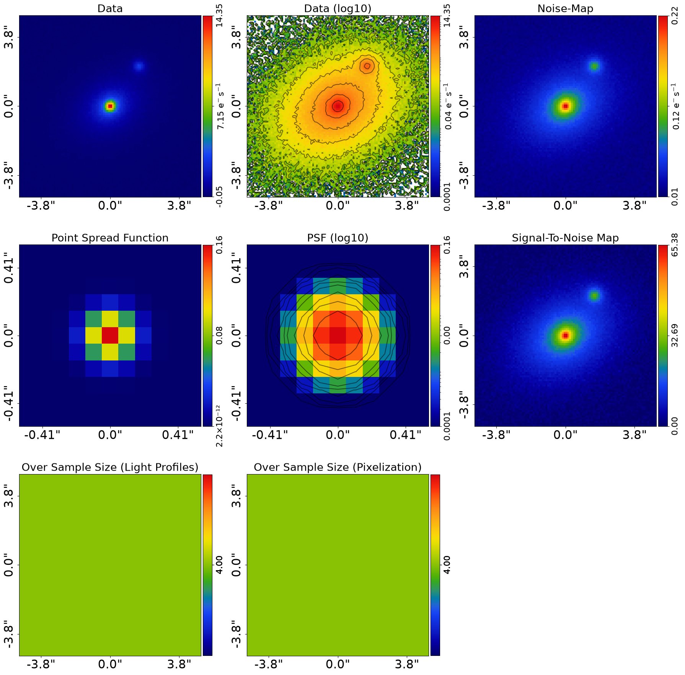
    


__Extra Galaxies Noise Scaling__

Before masking, we must deal with any extra galaxies in the data: nearby galaxies (or foreground stars, or
data-reduction artefacts) whose emission is not associated with the galaxy we are studying but blends into the
field. If their light is left in the data it will contaminate the likelihood evaluation and bias the inferred
model. It is too easy to skip straight to modeling without checking for these, so we make this step explicit.

To prevent extra galaxies from impacting the fit, we do not mask them entirely from the fit. Instead, the pixels
are kept in the fit but their data values are scaled to zero and their noise-map values increased to very large
values, so they contribute negligibly to the likelihood. This is preferable to removing the pixels entirely
(e.g. for a pixelized source reconstruction, removing pixels can produce discontinuities in the pixelization).

The `simple` dataset includes a faint extra galaxy, and a `mask_extra_galaxies.fits` covering it is shipped with
the dataset (created by the simulator). If you are modeling your own data with an extra galaxy, you must either
create such a mask using the data-preparation tools, or shrink the circular mask below so the extra galaxy lies
outside it and is removed from the fit entirely.


```python
mask_extra_galaxies = ag.Mask2D.from_fits(
    file_path=dataset_path / "mask_extra_galaxies.fits",
    pixel_scales=dataset.pixel_scales,
    invert=True,  # `True` means a pixel is scaled.
)

dataset = dataset.apply_noise_scaling(mask=mask_extra_galaxies)

aplt.subplot_imaging_dataset(dataset=dataset)
```

    2026-07-10 18:18:51,463 - autoarray.dataset.imaging.dataset - INFO - IMAGING - Data noise scaling applied, a total of 256 pixels were scaled to large noise values.


    
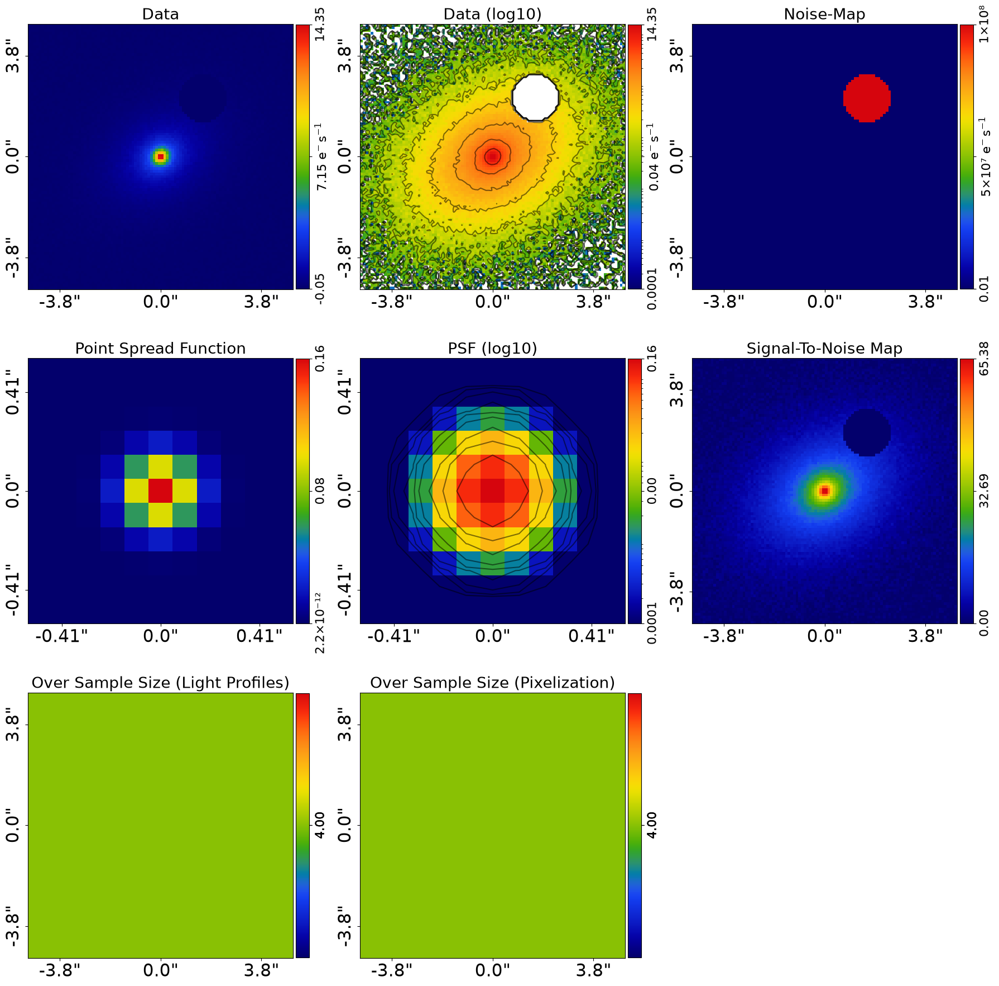
    


__Mask__

The likelihood is only evaluated using image pixels contained within a 2D mask, which we choose before performing
a likelihood evaluation.

We define a 2D circular mask with a 3.0" radius.


```python
mask = ag.Mask2D.circular(
    shape_native=dataset.shape_native, pixel_scales=dataset.pixel_scales, radius=3.0
)

masked_dataset = dataset.apply_mask(mask=mask)
```

    2026-07-10 18:18:54,839 - autoarray.dataset.imaging.dataset - INFO - IMAGING - Data masked, contains a total of 2828 image-pixels


When we plot the masked imaging, only the circular masked region is shown.


```python
aplt.subplot_imaging_dataset(dataset=masked_dataset)
```


    
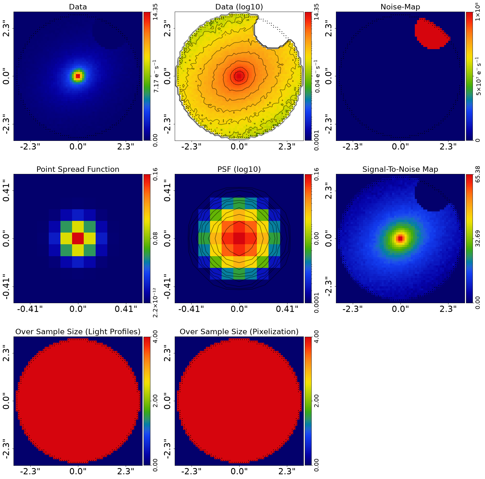
    


__Over Sampling__

Over sampling evaluates a light profile using multiple samples of its intensity per image-pixel.

For simplicity, we disable over sampling in this guide by setting `sub_size=1`. 

A full description of over sampling and how to use it is given in `autogalaxy_workspace/*/guides/over_sampling.py`.


```python
masked_dataset = masked_dataset.apply_over_sampling(over_sample_size_lp=1)
```

__Masked Image Grid__

To perform galaxy calculations we define a 2D image-plane grid of (y,x) coordinates.

These are given by `masked_dataset.grids.lp`, which we can plot and see is a uniform grid of (y,x) Cartesian 
coordinates which have had the 3.0" circular mask applied.

Each (y,x) coordinate coordinates to the centre of each image-pixel in the dataset, meaning that when this grid is
used to evaluate a light profile the intensity of the profile at the centre of each image-pixel is computed, making
it straight forward to compute the light profile's image to the image data.


```python
aplt.plot_grid(grid=masked_dataset.grids.lp, title="Grid")

print(
    f"(y,x) coordinates of first ten unmasked image-pixels {masked_dataset.grid[0:9]}"
)
```


    
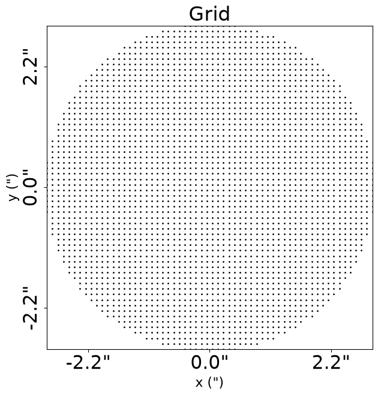
    


    (y,x) coordinates of first ten unmasked image-pixels Grid2D([[ 2.95, -0.45],
           [ 2.95, -0.35],
           [ 2.95, -0.25],
           [ 2.95, -0.15],
           [ 2.95, -0.05],
           [ 2.95,  0.05],
           [ 2.95,  0.15],
           [ 2.95,  0.25],
           [ 2.95,  0.35]])


To perform light profile calculations we convert this 2D (y,x) grid of coordinates to elliptical coordinates:

 $\eta = \sqrt{(x - x_c)^2 + (y - y_c)^2/q^2}$

Where:

 - $y$ and $x$ are the (y,x) arc-second coordinates of each unmasked image-pixel, given by `masked_dataset.grids.lp`.
 - $y_c$ and $x_c$ are the (y,x) arc-second `centre` of the light or mass profile.
 - $q$ is the axis-ratio of the elliptical light or mass profile (`axis_ratio=1.0` for spherical profiles).
 - The elliptical coordinates are rotated by a position angle, defined counter-clockwise from the positive 
 x-axis.

$q$ and $\phi$ are not used to parameterize a light profile but expresses these  as "elliptical components", 
or `ell_comps` for short:

$\epsilon_{1} =\frac{1-q}{1+q} \sin 2\phi, \,\,$
$\epsilon_{2} =\frac{1-q}{1+q} \cos 2\phi.$


```python
profile = ag.EllProfile(centre=(0.1, 0.2), ell_comps=(0.1, 0.2))
```

Transform `masked_dataset.grids.lp` to the centre of profile and rotate it using its angle.


```python
transformed_grid = profile.transformed_to_reference_frame_grid_from(
    grid=masked_dataset.grids.lp
)

aplt.plot_grid(grid=transformed_grid, title="Grid")
print(
    f"transformed coordinates of first ten unmasked image-pixels {transformed_grid[0:9]}"
)
```


    
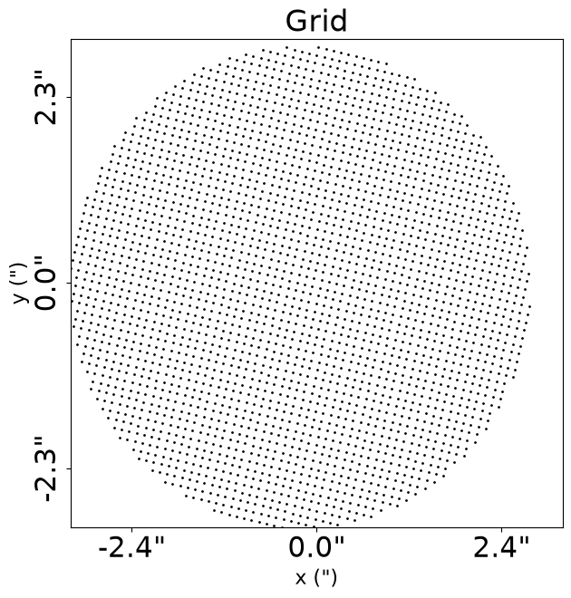
    


    transformed coordinates of first ten unmasked image-pixels Grid2D([[2.92309902, 0.02218398],
           [2.90012373, 0.11950888],
           [2.87714843, 0.21683378],
           [2.85417314, 0.31415868],
           [2.83119785, 0.41148358],
           [2.80822256, 0.50880848],
           [2.78524727, 0.60613337],
           [2.76227197, 0.70345827],
           [2.73929668, 0.80078317]])


Using these transformed (y',x') values we compute the elliptical coordinates $\eta = \sqrt{(x')^2 + (y')^2/q^2}$


```python
elliptical_radii = profile.elliptical_radii_grid_from(grid=transformed_grid)

print(
    f"elliptical coordinates of first ten unmasked image-pixels {elliptical_radii[0:9]}"
)
```

    elliptical coordinates of first ten unmasked image-pixels Array2D([4.6068993 , 4.57219863, 4.53960858, 4.5091749 , 4.48094154,
           4.45495032, 4.43124069, 4.40984947, 4.39081054])


__Light Profiles (Setup)__

To perform a likelihood evaluation we now compose our galaxy model.

We first define the light profiles which represents the galaxy's light, in this case its bulge and disk, which will be 
used to fit the galaxy light.

A light profile is defined by its intensity $I (\eta_{\rm l}) $, for example the Sersic profile:

$I_{\rm  Ser} (\eta_{\rm l}) = I \exp \bigg\{ -k \bigg[ \bigg( \frac{\eta}{R} \bigg)^{\frac{1}{n}} - 1 \bigg] \bigg\}$

Where:

 - $\eta$ are the elliptical coordinates (see above).
 - $I$ is the `intensity`, which controls the overall brightness of the Sersic profile.
 - $n$ is the ``sersic_index``, which via $k$ controls the steepness of the inner profile.
 - $R$ is the `effective_radius`, which defines the arc-second radius of a circle containing half the light.

In this example, we assume our galaxy is composed of two light profiles, an elliptical Sersic and Exponential (a Sersic
where `sersic_index=4`) which represent the bulge and disk of the galaxy. 


```python
bulge = ag.lp.Sersic(
    centre=(0.0, 0.0),
    ell_comps=ag.convert.ell_comps_from(axis_ratio=0.9, angle=45.0),
    intensity=1.0,
    effective_radius=0.6,
    sersic_index=3.0,
)

disk = ag.lp.Exponential(
    centre=(0.0, 0.0),
    ell_comps=ag.convert.ell_comps_from(axis_ratio=0.7, angle=30.0),
    intensity=0.5,
    effective_radius=1.6,
)
```

Using the masked 2D grid defined above, we can calculate and plot images of each light profile component.

(The transformation to elliptical coordinates above are built into the `image_2d_from` function and performed 
implicitly).


```python
image_2d_bulge = bulge.image_2d_from(grid=masked_dataset.grid)

aplt.plot_array(array=image_2d_bulge, title="Image")

image_2d_disk = disk.image_2d_from(grid=masked_dataset.grid)

aplt.plot_array(array=image_2d_disk, title="Image")
```


    
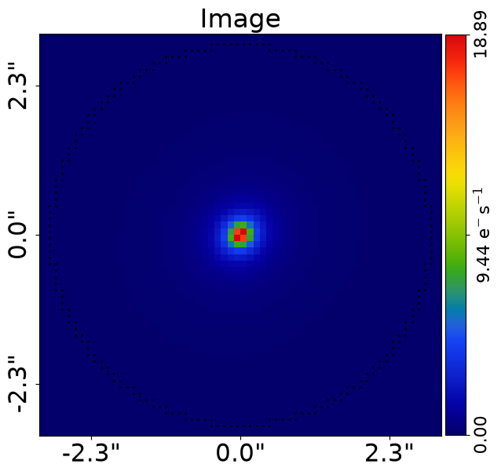
    


    
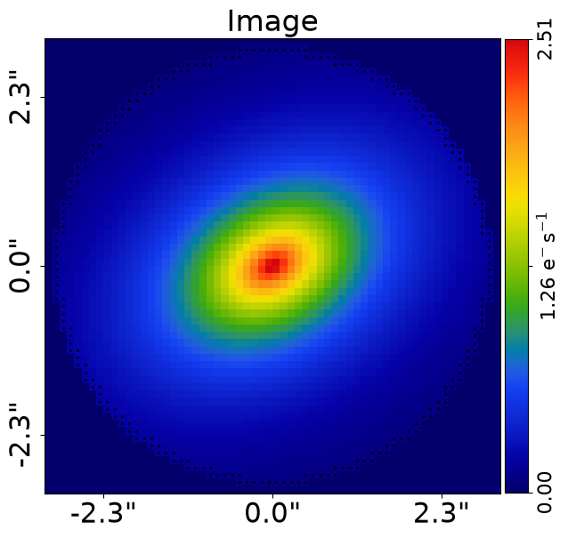
    


__Galaxy__

We now combine the light profiles into a single `Galaxy` object.

When computing quantities for the light profiles from this object, it computes each individual quantity and 
adds them together. 

For example, for the `bulge` and `disk`, when it computes their 2D images it computes each individually and then adds
them together.


```python
galaxy = ag.Galaxy(redshift=0.5, bulge=bulge, disk=disk)
```

__Galaxy Image__

Compute a 2D image of the galaxy's light as the sum of its individual light profiles (the `Sersic` 
bulge and `Exponential` disk). 

This computes the `image` of each light profile and adds them together. 


```python
galaxy_image_2d = galaxy.image_2d_from(grid=masked_dataset.grid)

aplt.plot_array(array=galaxy.image_2d_from(grid=masked_dataset.grid), title="Image")
```


    
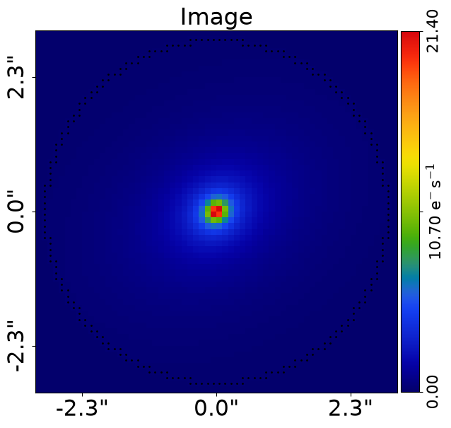
    


To convolve the galaxy's 2D image with the imaging data's PSF, we need its `blurring_image`.

This represents all flux values not within the mask, which are close enough to it that their flux blurs into the mask 
after PSF convolution.

To compute this, a `blurring_mask` and `blurring_grid` are used, corresponding to these pixels near the edge of the 
actual mask whose light blurs into the image:


```python
galaxy_blurring_image_2d = galaxy.image_2d_from(grid=masked_dataset.grids.blurring)

aplt.plot_array(
    array=galaxy.image_2d_from(grid=masked_dataset.grids.blurring), title="Image"
)
```


    
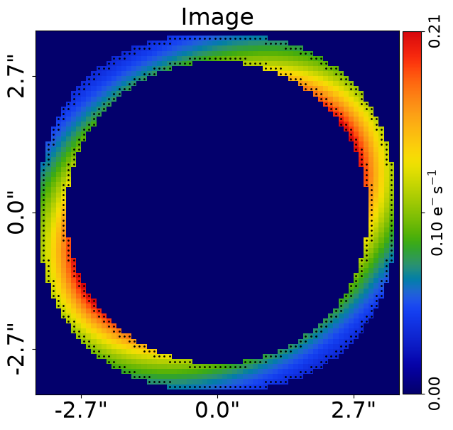
    


__Convolution__

Convolve the 2D image of the galaxy above with the PSF using a `Convolver`.


```python
convolved_image_2d = masked_dataset.psf.convolved_image_from(
    image=galaxy_image_2d, blurring_image=galaxy_blurring_image_2d
)

aplt.plot_array(array=convolved_image_2d, title="Image")
```


    
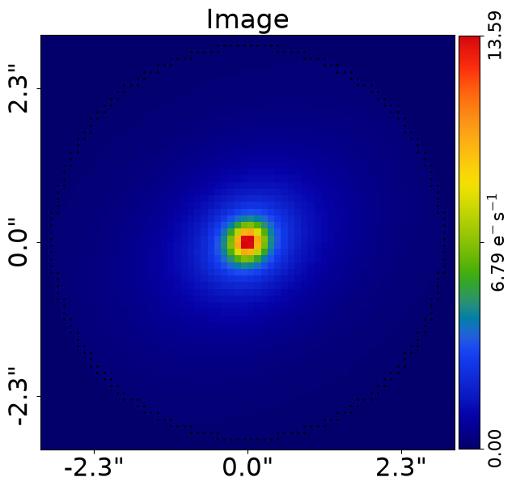
    


__Likelihood Function__

We now quantify the goodness-of-fit of our galaxy model.

We compute the `log_likelihood` of the fit, which is the value returned by the `log_likelihood_function`.

The likelihood function for parametric galaxy modeling consists of two terms:

 $-2 \mathrm{ln} \, \epsilon = \chi^2 + \sum_{\rm  j=1}^{J} { \mathrm{ln}} \left [2 \pi (\sigma_j)^2 \right]  \, .$

We now explain what each of these terms mean.

__Chi Squared__

The first term is a $\chi^2$ statistic, which is defined above in our merit function as and is computed as follows:

 - `model_data` = `convolved_image_2d`
 - `residual_map` = (`data` - `model_data`)
 - `normalized_residual_map` = (`data` - `model_data`) / `noise_map`
 - `chi_squared_map` = (`normalized_residuals`) ** 2.0 = ((`data` - `model_data`)**2.0)/(`variances`)
 - `chi_squared` = sum(`chi_squared_map`)

The chi-squared therefore quantifies if our fit to the data is accurate or not. 

High values of chi-squared indicate that there are many image pixels our model did not produce a good fit to the image 
for, corresponding to a fit with a lower likelihood.


```python
model_image = convolved_image_2d

residual_map = masked_dataset.data - model_image
normalized_residual_map = residual_map / masked_dataset.noise_map
chi_squared_map = normalized_residual_map**2.0

chi_squared = np.sum(chi_squared_map)

print(chi_squared)
```

    2771.0613040737353


The `chi_squared_map` indicates which regions of the image we did and did not fit accurately.


```python
chi_squared_map = ag.Array2D(values=chi_squared_map, mask=mask)

aplt.plot_array(array=chi_squared_map, title="Image")
```


    
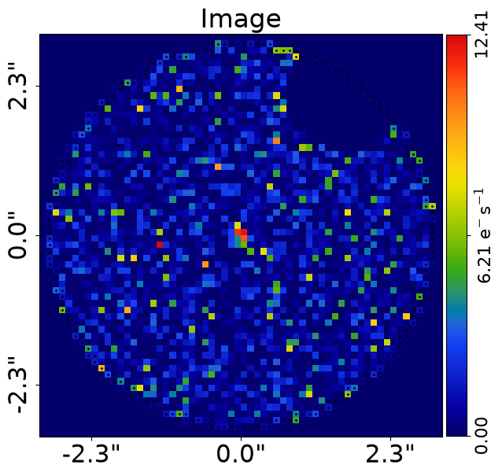
    


__Noise Normalization Term__

Our likelihood function assumes the imaging data consists of independent Gaussian noise in every image pixel.

The final term in the likelihood function is therefore a `noise_normalization` term, which consists of the sum
of the log of every noise-map value squared. 

Given the `noise_map` is fixed, this term does not change during the galaxy modeling process and has no impact on the 
model we infer.


```python
noise_normalization = float(np.sum(np.log(2 * np.pi * masked_dataset.noise_map**2.0)))
```

__Calculate The Log Likelihood__

We can now, finally, compute the `log_likelihood` of the galaxy model, by combining the two terms computed above using
the likelihood function defined above.


```python
figure_of_merit = float(-0.5 * (chi_squared + noise_normalization))

print(figure_of_merit)
```

    1269.5665187332843


__Fit__

This 6 step process to perform a likelihood function evaluation is what is performed in the `FitImaging` object.


```python
galaxies = ag.Galaxies(galaxies=[galaxy])

fit = ag.FitImaging(dataset=masked_dataset, galaxies=galaxies)
fit_figure_of_merit = fit.figure_of_merit
print(fit_figure_of_merit)

```

    1269.5665187332843


__Galaxy Modeling__

To fit a galaxy model to data, the likelihood function illustrated in this tutorial is sampled using a
non-linear search algorithm.

The default sampler is the nested sampling algorithm `nautilus` (https://github.com/johannesulf/nautilus)
multiple MCMC and optimization algorithms are supported.

__Wrap Up__

We have presented a visual step-by-step guide to the parametric likelihood function, which uses 
analytic light profiles to fit the galaxy light.

There are a number of other inputs features which slightly change the behaviour of this likelihood function, which
are described in additional notebooks found in the `guides` package:

 - `over_sampling`: Oversampling the image grid into a finer grid of sub-pixels, which are all individually
 ray-traced to the source-plane and used to evaluate the light profile more accurately.

__JAX__

The step-by-step likelihood you've just walked through can be JAX-
accelerated by wrapping the whole construction in `@jax.jit`:

```python
import jax
import jax.numpy as jnp

# Triggering pytree registration: the easiest path is to instantiate an
# AnalysisImaging at the top of the script, which runs its internal
# _register_fit_imaging_pytrees() as a side effect.
_ = ag.AnalysisImaging(dataset=dataset, use_jax=True)

@jax.jit
def my_log_likelihood(instance):
    galaxies = ag.Galaxies(galaxies=instance.galaxies)
    fit = ag.FitImaging(dataset=dataset, galaxies=galaxies)
    return fit.log_likelihood
```

To validate the JAX path matches the NumPy chi-squared, use
`Fitness._vmap` (production validation pattern — single `jax.jit(fn)(concrete)`
hides un-threaded `xp` sites that `vmap(jit(call))` exposes):

```python
from autofit.non_linear.fitness import Fitness

fitness = Fitness(
    model=model,
    analysis=ag.AnalysisImaging(dataset=dataset),
    fom_is_log_likelihood=True,
)
log_l_jax = fitness._vmap(jnp.array([instance_parameters]))[0]
```

For the canonical Analysis-driven modeling path (zero JAX code on your
side), see `start_here.py` / `modeling.py`. For JIT-ing library methods
directly without going through `FitImaging`, see
`scripts/guides/api/data_structures.py`.


```python

```
