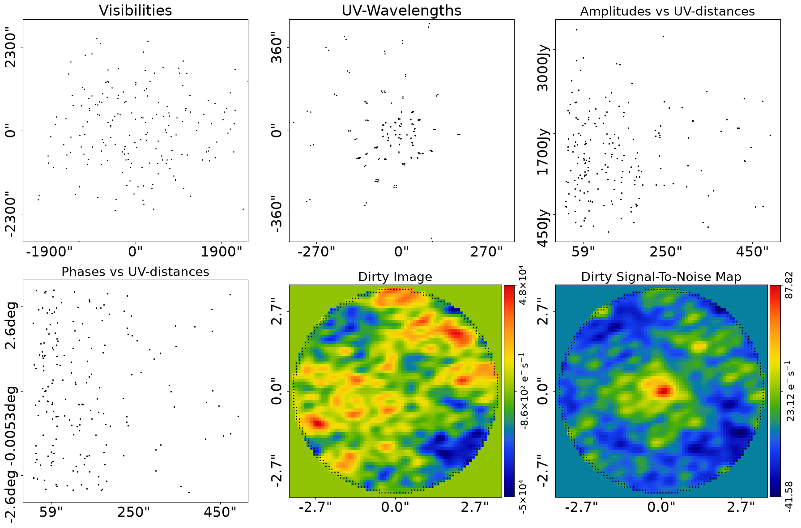
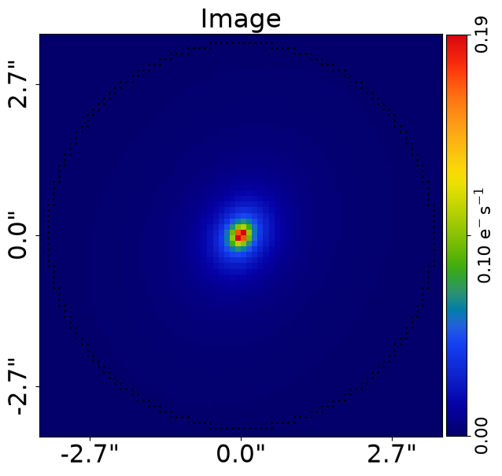
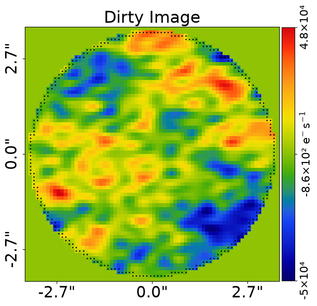
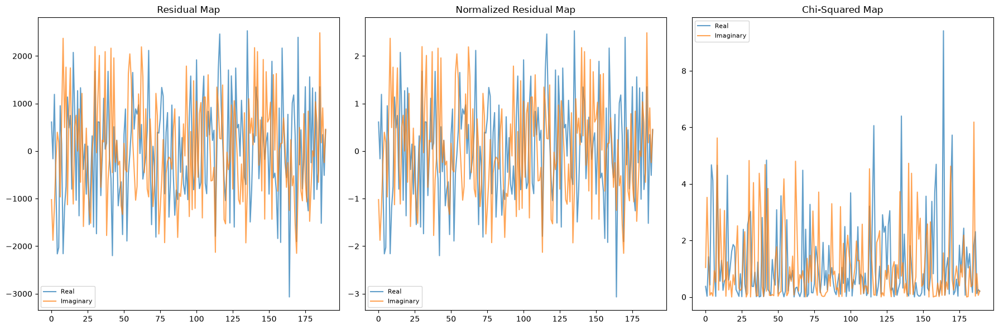

> ✏️ **This page is auto-generated from [`scripts/interferometer/fit.py`](../../scripts/interferometer/fit.py) — do not edit it directly.**
> It shows the example fully executed, with its real output images.
> Run it yourself via the [Python script](../../scripts/interferometer/fit.py) or the [Jupyter notebook](../../notebooks/interferometer/fit.ipynb).

Fits
====

This guide shows how to fit data using the `FitInterferometer` object, including visualizing and interpreting its results.

References
----------

This example uses functionality described fully in other examples in the `guides` package:

- `guides/plot`: Using Plotter objects to plot and customize figures.
- `guides/units`: The source code unit conventions (e.g. arc seconds for distances and how to convert to physical units).
- `guides/data_structures`: The bespoke data structures used to store 1D and 2d arrays.

__Contents__

- **Mask:** Defining the real-space mask for the interferometer grid.
- **Loading Data:** Loading the interferometer dataset from FITS files.
- **Dataset Auto-Simulation:** Automatically simulating data if it does not exist.
- **Fitting:** Creating a galaxy model and fitting it to the data using FitInterferometer.
- **Bad Fit:** Demonstrating how a poor galaxy model produces residuals.
- **Fit Quantities:** Inspecting model data, residual maps, and dirty image variants of the fit.
- **Figures of Merit:** Computing chi-squared, noise normalization, and log likelihood values.
- **Galaxy Quantities:** Accessing per-galaxy model visibilities and images from the fit.
- **Outputting Results:** Saving fit results to FITS files for later use.

__JAX__

`FitInterferometer` runs on either NumPy or JAX. For the standard
analysis-driven path — where `AnalysisInterferometer` auto-enables
`use_jax=True` and the search driver handles the JIT — see `start_here.py`
/ `modeling.py`. For the JIT-it-yourself path around individual library
methods, see `scripts/guides/api/data_structures.py`.


```python

from autogalaxy import jax_wrapper  # Sets JAX environment before other imports

from autogalaxy import setup_notebook; setup_notebook()

import numpy as np
from pathlib import Path
import autogalaxy as ag
import autogalaxy.plot as aplt
```

    Working Directory has been set to `autogalaxy_workspace`


__Mask__

We define the ‘real_space_mask’ which defines the grid the image is evaluated using.


```python
mask_radius = 3.5

real_space_mask = ag.Mask2D.circular(
    shape_native=(256, 256),
    pixel_scales=0.1,
    radius=mask_radius,
)
```

__Loading Data__

We we begin by loading the dataset `simple` from .fits files, which is the dataset
we will use to demonstrate fitting.

This includes the method used to Fourier transform the real-space image to the uv-plane and compare
directly to the visibilities. We use `TransformerNUFFT`, the JAX-native Non-Uniform Fast Fourier Transform
backed by `nufftax`, which scales efficiently from a few hundred visibilities to tens of millions.

This dataset was simulated using the `interferometer/simulator` example, read through that to understand how
the data this example fits was generated.


```python
dataset_name = "simple"
dataset_path = Path("dataset") / "interferometer" / dataset_name
```

__Dataset Auto-Simulation__

If the dataset does not already exist on your system, it will be created by running the corresponding
simulator script. This ensures that all example scripts can be run without manually simulating data first.


```python
if not dataset_path.exists():
    import subprocess
    import sys

    subprocess.run(
        [sys.executable, "scripts/interferometer/simulator.py"],
        check=True,
    )


dataset = ag.Interferometer.from_fits(
    data_path=dataset_path / "data.fits",
    noise_map_path=dataset_path / "noise_map.fits",
    uv_wavelengths_path=dataset_path / "uv_wavelengths.fits",
    real_space_mask=real_space_mask,
    transformer_class=ag.TransformerNUFFT,
)
```

The `Interferometer` contains a subplot which plots all the key properties of the dataset simultaneously.

This includes the observed visibility data, RMS noise map and other information.


```python
aplt.subplot_interferometer_dataset(dataset=dataset)
```


    

    


Visibility data is in uv space, making it hard to interpret by eye.

The dirty images of the interferometer dataset can plotted, which use the transformer of the interferometer
to map the visibilities, noise-map or other quantity to a real-space image.


```python

# %%
'''
__Fitting__

Following the previous overview example, we can make a galaxy from a collection of light profiles.

The combination of light profiles below is the same as those used to generate the simulated
dataset we loaded above.

It therefore produces a galaxy whose image looks exactly like the dataset.
'''
```


    '\n__Fitting__\n\nFollowing the previous overview example, we can make a galaxy from a collection of light profiles.\n\nThe combination of light profiles below is the same as those used to generate the simulated\ndataset we loaded above.\n\nIt therefore produces a galaxy whose image looks exactly like the dataset.\n'


```python
galaxy = ag.Galaxy(
    redshift=0.5,
    bulge=ag.lp.SersicCore(
        centre=(0.0, 0.0),
        ell_comps=ag.convert.ell_comps_from(axis_ratio=0.8, angle=60.0),
        intensity=0.3,
        effective_radius=1.0,
        sersic_index=2.5,
    ),
)

galaxies = ag.Galaxies(galaxies=[galaxy])
```

Because the galaxy's light profiles are the same used to make the dataset, its image is nearly the same as the
observed image.

We can plot the image of the galaxies to confirm this, noting that its images are always in real space
(not Fourier space like the interferometer dataset) and therefore they can be directly visualized.


```python
aplt.plot_array(array=galaxies.image_2d_from(grid=dataset.grid), title="Image")
```


    

    


However, the galaxy image is not what we observe in the interferometer dataset, because we observe the image as
visibilities in the uv-plane.

To compare directly to the data, we therefore need to Fourier transform the galaxy image to the uv-plane.

We do this by creating a `FitInterferometer` object, which performs this Fourier transform as part of the fitting
procedure.

The code plots the result of this, by using the `model_data` of the fit, which performs this Fourier transform
on the galaxy image above and plots the result visibilities in uv-space.


```python
fit = ag.FitInterferometer(dataset=dataset, galaxies=galaxies)

aplt.plot_array(array=fit.dirty_image, title="Dirty Image")

```


    

    


The visibilities are again hard to interpret by eye, so we can plot the dirty image of the fit's model data. This
dirty image is the Fourier transform of the fit's model data (therefore the Fourier transform of the galaxy image) and
can be compared directly to the image of the galaxies above (albeit it still has the interferometer's PSF/dirty beam
convolved with it).


```python
fit = ag.FitInterferometer(dataset=dataset, galaxies=galaxies)

aplt.plot_array(array=fit.dirty_image, title="Dirty Image")
```


    

    


The fit does a lot more than just Fourier transform the galaxy image it also creates the following:

 - The `residual_map`: The `model_data` visibilities subtracted from the observed dataset`s `data` visibilities.
 - The `normalized_residual_map`: The `residual_map `divided by the observed dataset's `noise_map`.
 - The `chi_squared_map`: The `normalized_residual_map` squared.

A subplot can be plotted which contains all of the above quantities, as well as other information contained in the
galaxies such as the image and a normalized residual map where the colorbar
goes from 1.0 sigma to -1.0 sigma, to highlight regions where the fit is poor.


```python
aplt.subplot_fit_interferometer(fit=fit)
```


    

    


The fit also provides us with a ``log_likelihood``, a single value quantifying how good the galaxies fitted the dataset.

Galaxy modeling, described in the next overview example, effectively tries to maximize this log likelihood value.


```python
print(fit.log_likelihood)
```

    -3189.915011671987


__Bad Fit__

A bad galaxy model will show features in the residual-map and chi-squared map.

We can produce such an image by creating galaxies with different light profiles. In the example below, we
change the centre of the galaxy from (0.0, 0.0) to (0.05, 0.05), which leads to residuals appearing
in the fit.


```python
galaxy = ag.Galaxy(
    redshift=0.5,
    bulge=ag.lp.Sersic(
        centre=(0.1, 0.1),
        ell_comps=ag.convert.ell_comps_from(axis_ratio=0.8, angle=60.0),
        intensity=0.3,
        effective_radius=0.1,
        sersic_index=1.0,
    ),
)

galaxies = ag.Galaxies(galaxies=[galaxy])
```

A new fit using this galaxies shows residuals, normalized residuals and chi-squared which are non-zero.


```python
fit = ag.FitInterferometer(dataset=dataset, galaxies=galaxies)

aplt.subplot_fit_interferometer(fit=fit)
```


    

    


We also note that its likelihood decreases.


```python
print(fit.log_likelihood)
```

    -3189.9531581724327


__Fit Quantities__

The maximum log likelihood fit contains many 1D and 2D arrays showing the fit.

There is a `model_data`, which is the image-plane visibilities of the galaxies.

This is the image that is fitted to the data in order to compute the log likelihood and therefore quantify the
goodness-of-fit.

If you are unclear on what `slim` means, refer to the section `Data Structure` at the top of this example.


```python
print(fit.model_data)
```

    Visibilities([ 2.57237193-1.44700161j,  2.22594695-0.60305481j,
            0.49817198+1.17511265j,  1.93229521+2.01188713j,
           -0.13668139-1.20231169j,  2.80651891+1.48112215j,
            1.5381493 +1.96063965j,  1.24120268-1.49585981j,
            1.7688063 -1.74257388j,  2.77442317+1.23889598j,
            0.60080132-1.53834285j,  3.14688826-1.04333431j,
            1.07732794+2.00267828j,  1.86707795+1.44093441j,
            1.15350495+1.70779463j,  0.41463687+1.77420507j,
            2.57295259+0.44613449j, -0.38414192+1.31740886j,
            1.5931376 -0.60757275j,  3.19697114+0.32049323j,
    ... [66 lines of output truncated] ...
            3.39033602-0.22674961j,  3.33142473+0.61753828j,
            3.42202891+0.01646203j,  3.26634366-0.78940475j,
            3.39413437+0.38694788j,  3.40110441+0.03891698j,
            3.3221626 -0.65939368j,  3.38492666-0.38120488j,
            3.42070444-0.15528384j,  3.19772671-0.81124672j,
            3.4194227 -0.13609175j,  3.35882099-0.40755773j,
            3.33352501-0.62426763j,  3.37534355+0.16968695j,
            3.24611815+0.8426337j ,  3.32469281+0.57489301j,
            3.36599722-0.49284812j,  3.29265528+0.66825058j,
            3.38562323+0.40622364j,  3.41633437+0.23504153j,
            3.17263218+0.97335107j,  3.36991272+0.18486008j,
            3.18799925-0.9690728j ,  3.41567447+0.22153166j,
            3.38528246+0.38243439j,  3.40411038+0.19632415j,
            3.40377837-0.27598494j,  3.24359468+0.85550485j,
            3.39307041-0.21909435j,  3.33808666+0.59700153j,
            3.42263736+0.01589783j,  3.27726951-0.76377056j,
            3.39662166+0.373785j  ,  3.40311752+0.0375987j ,
            3.32943909-0.63751493j,  3.38802807-0.36830744j,
            3.42140258-0.14995915j,  3.21298395-0.78591614j])


There are numerous ndarrays showing the goodness of fit:

 - `residual_map`: Residuals = (Data - Model_Data).
 - `normalized_residual_map`: Normalized_Residual = (Data - Model_Data) / Noise
 - `chi_squared_map`: Chi_Squared = ((Residuals) / (Noise)) ** 2.0 = ((Data - Model)**2.0)/(Variances)


```python
print(fit.residual_map.slim)
print(fit.normalized_residual_map.slim)
print(fit.chi_squared_map.slim)
```

    Visibilities([ 6.11123470e+02-1.02122008e+03j, -1.62970185e+02-1.87707874e+03j,
            1.19249545e+03-1.17682331e+03j, -6.51848093e+02-2.47428214e+02j,
           -2.16185220e+03+3.95610981e+02j, -2.02815947e+03+1.81379114e+02j,
            9.53452973e+02-9.64739019e+02j,  1.47084285e+02+7.25481920e+02j,
           -2.15854562e+03+2.37163964e+03j, -1.19027691e+03+4.93422147e+02j,
           -7.46818145e+02+1.76446142e+03j,  1.13692507e+03-1.12908637e+03j,
            4.85206753e+02+7.29571556e+02j,  7.48815886e+02+1.74885450e+03j,
           -7.99452872e+02-1.66136846e+02j,  2.07448352e+03-1.11375172e+03j,
            7.75491620e+02+5.02455289e+02j, -1.03515069e+03+7.52999211e+02j,
            1.27034628e+03+1.07501490e+00j, -1.36183121e+03+8.86051711e+02j,
    ... [256 lines of output truncated] ...
           3.56477976e+00+2.05701020e+00j, 3.17677613e-01+2.58202952e+00j,
           2.14917154e-01+4.35060661e-04j, 6.97978758e-01+2.65425156e+00j,
           3.38232705e+00+7.10279679e-01j, 8.19922879e-01+8.36841705e-05j,
           3.69256335e+00+2.49819919e-02j, 4.69281113e+00+2.81838627e-02j,
           4.35855856e-01+4.87405538e-01j, 6.10983253e-02+1.24036247e-02j,
           3.12373010e-01+5.81140464e-01j, 5.96628853e-01+6.00089286e-02j,
           9.41678118e+00+1.55833399e+00j, 6.75295769e-02+5.73549370e-02j,
           1.02276577e+00+5.33687946e-01j, 1.39096724e+00+2.69596992e-01j,
           1.03605759e-01+2.36550118e+00j, 3.61951642e+00+4.62583783e+00j,
           5.72621482e+00+6.09518889e-01j, 8.24410437e-02+2.45705210e-01j,
           1.98670418e-01+7.06457222e-01j, 6.30335779e-01+1.09469893e+00j,
           2.91832140e-02+6.18390524e-01j, 1.83145874e+00+3.93477418e-01j,
           8.75889897e-01+1.13885500e+00j, 1.58052069e+00+7.04153983e-01j,
           2.43357629e+00+2.18365129e+00j, 6.05412125e-02+5.48885653e-01j,
           1.76544276e+00+3.34155312e-05j, 1.02631466e+00+1.33084736e-02j,
           1.53306609e+00+1.07475194e+00j, 6.54336320e-01+3.60289547e-01j,
           1.59580319e-01+4.30764481e-01j, 1.82785760e+00+6.18749689e+00j,
           2.30950413e+00+3.03793170e-02j, 1.19625338e-01+8.25404936e-01j,
           2.61542506e-01+5.84804464e-02j, 1.99767116e-01+2.11008566e-01j])


There are `dirty` variants of the above maps, which transform the visibilities, residual-map, chi squared and other
values to to real-space images using the interferometer's transformer.

These real space images can be mapped between their `slim` and `native` representations (see the
`guides/data_structures` example for more information on these terms).


```python
print(fit.dirty_image.slim)  # Data
print(fit.dirty_model_image.slim)
print(fit.dirty_residual_map.slim)
print(fit.dirty_normalized_residual_map.slim)
print(fit.dirty_chi_squared_map.slim)
```

    Array2D([ 8575.11536879, 15153.91337975, 22094.98705923, ...,
           -6051.61869087, -3132.54818206,  -975.93924802], shape=(3852,))
    Array2D([-20.10711593, -30.00259126, -37.42291072, ..., -23.6808393 ,
           -35.58738578, -45.73729568], shape=(3852,))
    Array2D([ 8595.22248472, 15183.91597101, 22132.40996995, ...,
           -6027.93785157, -3096.96079628,  -930.20195235], shape=(3852,))


    Array2D([ 8.59522248, 15.18391597, 22.13240997, ..., -6.02793785,
           -3.0969608 , -0.93020195], shape=(3852,))


    Array2D([-13.74579999,  -7.81482336,  -2.92655218, ...,  -3.00686047,
            -4.77967345,  -1.46868053], shape=(3852,))


__Figures of Merit__

There are single valued floats which quantify the goodness of fit:

 - `chi_squared`: The sum of the `chi_squared_map`.

 - `noise_normalization`: The normalizing noise term in the likelihood function
    where [Noise_Term] = sum(log(2*pi*[Noise]**2.0)).

 - `log_likelihood`: The log likelihood value of the fit where [LogLikelihood] = -0.5*[Chi_Squared_Term + Noise_Term].

These sum other both the real and imaginary components of the visibilities to give a single value for each quantity.


```python
print(fit.chi_squared)
print(fit.noise_normalization)
print(fit.log_likelihood)
```

    431.6190190828905
    5948.287297261975
    -3189.9531581724327


__Galaxy Quantities__

The `FitInterferometer` object has specific quantities which break down each image of each galaxy:

 - `galaxy_model_visibilities_dict`: A dictionary which maps each galaxy in the galaxies to its model visibilities.

 - `galaxy_image_dict`: A dictionary which maps the model images of each galaxy.

These are not the dirty images, but instead the images of each galaxy that come from the galaxies object
(e.g. simply evaluating the galaxies image on the interferometer's real-space grid).


```python
print(fit.galaxy_model_visibilities_dict[galaxy].slim)
print(fit.galaxy_image_dict[galaxy].slim)
```

    Visibilities([ 2.57237193-1.44700161j,  2.22594695-0.60305481j,
            0.49817198+1.17511265j,  1.93229521+2.01188713j,
           -0.13668139-1.20231169j,  2.80651891+1.48112215j,
            1.5381493 +1.96063965j,  1.24120268-1.49585981j,
            1.7688063 -1.74257388j,  2.77442317+1.23889598j,
            0.60080132-1.53834285j,  3.14688826-1.04333431j,
            1.07732794+2.00267828j,  1.86707795+1.44093441j,
            1.15350495+1.70779463j,  0.41463687+1.77420507j,
            2.57295259+0.44613449j, -0.38414192+1.31740886j,
            1.5931376 -0.60757275j,  3.19697114+0.32049323j,
    ... [68 lines of output truncated] ...
            3.39413437+0.38694788j,  3.40110441+0.03891698j,
            3.3221626 -0.65939368j,  3.38492666-0.38120488j,
            3.42070444-0.15528384j,  3.19772671-0.81124672j,
            3.4194227 -0.13609175j,  3.35882099-0.40755773j,
            3.33352501-0.62426763j,  3.37534355+0.16968695j,
            3.24611815+0.8426337j ,  3.32469281+0.57489301j,
            3.36599722-0.49284812j,  3.29265528+0.66825058j,
            3.38562323+0.40622364j,  3.41633437+0.23504153j,
            3.17263218+0.97335107j,  3.36991272+0.18486008j,
            3.18799925-0.9690728j ,  3.41567447+0.22153166j,
            3.38528246+0.38243439j,  3.40411038+0.19632415j,
            3.40377837-0.27598494j,  3.24359468+0.85550485j,
            3.39307041-0.21909435j,  3.33808666+0.59700153j,
            3.42263736+0.01589783j,  3.27726951-0.76377056j,
            3.39662166+0.373785j  ,  3.40311752+0.0375987j ,
            3.32943909-0.63751493j,  3.38802807-0.36830744j,
            3.42140258-0.14995915j,  3.21298395-0.78591614j])
    Array2D([2.58529291e-25, 5.01560656e-25, 9.26001255e-25, ...,
           1.10516806e-25, 6.70265274e-26, 3.86639266e-26], shape=(3852,))


__Outputting Results__

You may wish to output certain results to .fits files for later inspection.

For example, one could output the galaxy model image to a .fits file such that
we could fit this image again with an independent pipeline.


```python
galaxy_model_image = fit.galaxy_image_dict[galaxy]
aplt.fits_array(
    array=galaxy_model_image,
    file_path=dataset_path / "galaxy_model_image.fits",
    overwrite=True,
)
```

Finish.


```python

```
