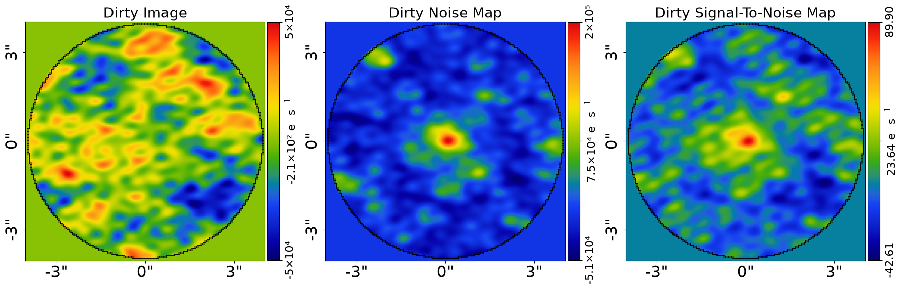
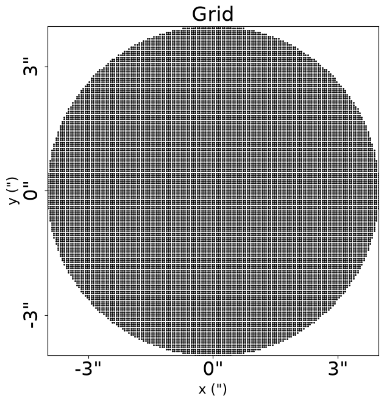
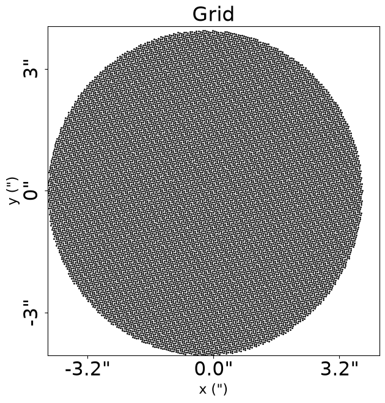
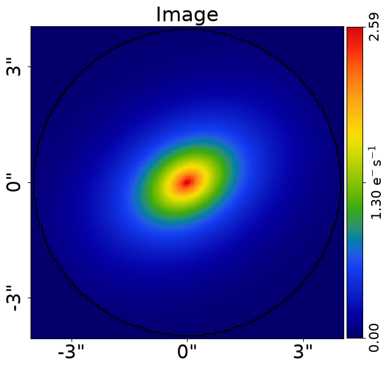
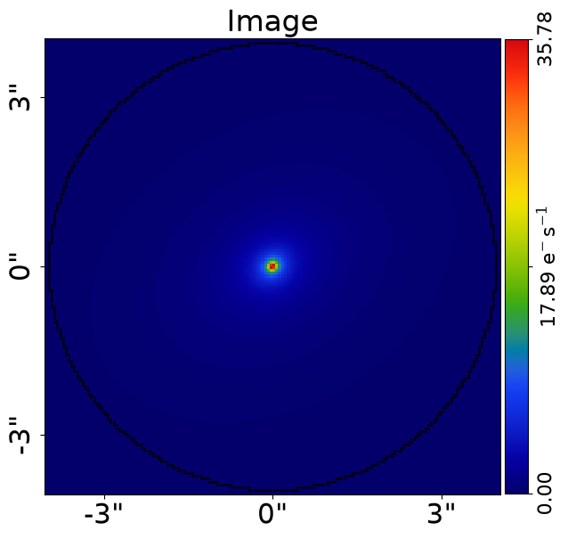
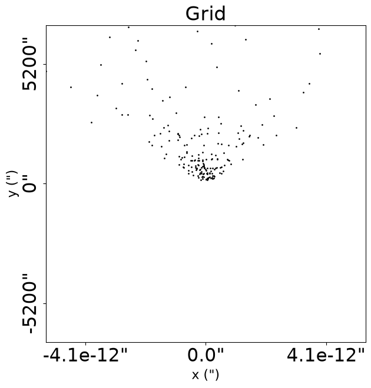
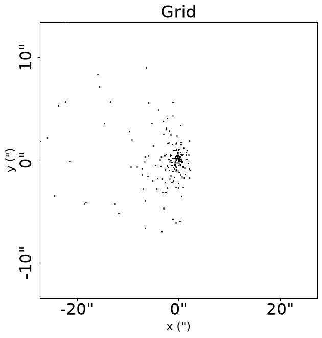
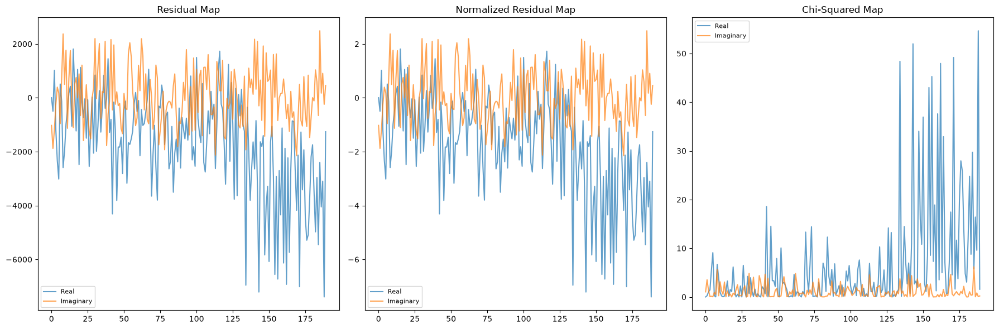

> ✏️ **This page is auto-generated from [`scripts/interferometer/likelihood_function.py`](../../scripts/interferometer/likelihood_function.py) — do not edit it directly.**
> It shows the example fully executed, with its real output images.
> Run it yourself via the [Python script](../../scripts/interferometer/likelihood_function.py) or the [Jupyter notebook](../../notebooks/interferometer/likelihood_function.ipynb).

__Log Likelihood Function: Parametric__

This script provides a step-by-step guide of the `log_likelihood_function` which is used to fit `Interferometer` data
with parametric light profiles (e.g. a Sersic bulge and Exponential disk).

This script has the following aims:

 - To provide a resource that authors can include in papers, so that readers can understand the likelihood
 function (including references to the previous literature from which it is defined) without having to
 write large quantities of text and equations.

Accompanying this script is the `contributor_guide.py` which provides URL's to every part of the source-code that
is illustrated in this guide. This gives contributors a sequential run through of what source-code functions, modules and
packages are called when the likelihood is evaluated.

__Contents__

- **Mask:** Defining the real-space mask for the interferometer grid.
- **Dataset:** Loading the interferometer dataset from FITS files.
- **Dataset Auto-Simulation:** Automatically simulating data if it does not exist.
- **Over Sampling:** Why over sampling is not needed for interferometer data.
- **Masked Image Grid:** Setting up the 2D coordinate grid for light profile evaluation.
- **Light Profiles (Setup):** Defining the Sersic and Exponential light profiles for the galaxy model.
- **Galaxy:** Combining light profiles into a Galaxy object.
- **Galaxy Image:** Computing the 2D image of the galaxy from its light profiles.
- **Fourier Transform:** Transforming the galaxy image to the uv-plane via NUFFT.
- **Likelihood Function:** Quantifying the goodness-of-fit of the galaxy model.
- **Chi Squared:** Computing the chi-squared statistic from residuals and noise.
- **Noise Normalization Term:** The noise normalization constant in the log likelihood.
- **Calculate The Log Likelihood:** Combining terms to compute the final log likelihood value.
- **Fit:** Performing the likelihood evaluation using the FitInterferometer object.
- **Galaxy Modeling:** Overview of how the likelihood function is sampled by a non-linear search.
- **Wrap Up:** Summary and pointers to additional resources.


```python

from autogalaxy import setup_notebook; setup_notebook()

import matplotlib.pyplot as plt
import numpy as np
from pathlib import Path

import autogalaxy as ag
import autogalaxy.plot as aplt
```

    Working Directory has been set to `autogalaxy_workspace`


__Mask__

We define the ‘real_space_mask’ which defines the grid the image the galaxy is evaluated using.


```python
real_space_mask = ag.Mask2D.circular(
    shape_native=(800, 800), pixel_scales=0.05, radius=4.0
)
```

__Dataset__

Load and plot the galaxy `Interferometer` dataset `simple` from .fits files, which we will fit 
with the model.

This includes the method used to Fourier transform the real-space image of the galaxy to the uv-plane and compare 
directly to the visibilities. We use a non-uniform fast Fourier transform, which is the most efficient method for 
interferometer datasets containing ~1-10 million visibilities. We will discuss how the calculation of the likelihood
function changes for different methods of Fourier transforming in this guide.


```python
dataset_name = "simple"
dataset_path = Path("dataset") / "interferometer" / dataset_name
```

__Dataset Auto-Simulation__

If the dataset does not already exist on your system, it will be created by running the corresponding
simulator script. This ensures that all example scripts can be run without manually simulating data first.


```python
if not dataset_path.exists():
    import subprocess
    import sys

    subprocess.run(
        [sys.executable, "scripts/interferometer/simulator.py"],
        check=True,
    )


dataset = ag.Interferometer.from_fits(
    data_path=dataset_path / "data.fits",
    noise_map_path=dataset_path / "noise_map.fits",
    uv_wavelengths_path=dataset_path / "uv_wavelengths.fits",
    real_space_mask=real_space_mask,
    transformer_class=ag.TransformerNUFFT,
)
```

This guide uses in-built visualization tools for plotting. 

For example, using the `Interferometer` the dataset we perform a likelihood evaluation on is plotted.

The `subplot_dataset` displays the visibilities in the uv-plane, which are the raw data of the interferometer
dataset. These are what will ultimately be directly fitted in the Fourier space.

The `subplot_dirty_images` displays the dirty images of the dataset, which are the reconstructed images of visibilities
using an inverse Fourier transform to convert these to real-space. These dirty images are not the images we fit, but
visualization of the dirty images are often used in radio interferometry to show the data in a way that is more
interpretable to the human eye.


```python
aplt.subplot_interferometer_dirty_images(dataset=dataset)
```


    

    


__Over Sampling__

If you are familiar with using imaging data, you may have seen that a numerical technique called over sampling is used, 
which evaluates light profiles on a higher resolution grid than the image data to ensure the calculation is accurate.

Interferometer does not observe galaxies in a way where over sampling is necessary, therefore all interferometer
calculations are performed without over sampling.

__Masked Image Grid__

To perform galaxy calculations we define a 2D image-plane grid of (y,x) coordinates.

The dataset is defined in real-space, and is Fourier transformed to the uv-plane for the model-fit. The grid is
therefore paired to the `real_space_mask`.

The coordinates are given by `dataset.grids.lp`, which we can plot and see is a uniform grid of (y,x) Cartesian 
coordinates which have had the 3.0" circular mask applied.

Each (y,x) coordinate coordinates to the centre of each image-pixel in the dataset, meaning that when this grid is
used to evaluate a light profile the intensity of the profile at the centre of each image-pixel is computed, making
it straight forward to compute the light profile's image to the image data.


```python
aplt.plot_grid(grid=dataset.grids.lp, title="Grid")

print(f"(y,x) coordinates of first ten unmasked image-pixels {dataset.grid[0:9]}")

```


    

    


    (y,x) coordinates of first ten unmasked image-pixels Grid2D([[ 3.975, -0.425],
           [ 3.975, -0.375],
           [ 3.975, -0.325],
           [ 3.975, -0.275],
           [ 3.975, -0.225],
           [ 3.975, -0.175],
           [ 3.975, -0.125],
           [ 3.975, -0.075],
           [ 3.975, -0.025]])


To perform light profile calculations we convert this 2D (y,x) grid of coordinates to elliptical coordinates:

 $\eta = \sqrt{(x - x_c)^2 + (y - y_c)^2/q^2}$

Where:

 - $y$ and $x$ are the (y,x) arc-second coordinates of each unmasked image-pixel, given by `dataset.grids.lp`.
 - $y_c$ and $x_c$ are the (y,x) arc-second `centre` of the light or mass profile.
 - $q$ is the axis-ratio of the elliptical light or mass profile (`axis_ratio=1.0` for spherical profiles).
 - The elliptical coordinates are rotated by a position angle, defined counter-clockwise from the positive 
 x-axis.

$q$ and $\phi$ are not used to parameterize a light profile but expresses these  as "elliptical components", 
or `ell_comps` for short:

$\epsilon_{1} =\frac{1-q}{1+q} \sin 2\phi, \,\,$
$\epsilon_{2} =\frac{1-q}{1+q} \cos 2\phi.$


```python
profile = ag.EllProfile(centre=(0.1, 0.2), ell_comps=(0.1, 0.2))
```

Transform `dataset.grids.lp` to the centre of profile and rotate it using its angle.


```python
transformed_grid = profile.transformed_to_reference_frame_grid_from(
    grid=dataset.grids.lp
)

aplt.plot_grid(grid=transformed_grid, title="Grid")
print(
    f"transformed coordinates of first ten unmasked image-pixels {transformed_grid[0:9]}"
)
```


    

    


    transformed coordinates of first ten unmasked image-pixels Grid2D([[3.91493541, 0.28201195],
           [3.90344776, 0.3306744 ],
           [3.89196012, 0.37933685],
           [3.88047247, 0.4279993 ],
           [3.86898483, 0.47666175],
           [3.85749718, 0.5253242 ],
           [3.84600953, 0.57398665],
           [3.83452189, 0.6226491 ],
           [3.82303424, 0.67131154]])


Using these transformed (y',x') values we compute the elliptical coordinates $\eta = \sqrt{(x')^2 + (y')^2/q^2}$


```python
elliptical_radii = profile.elliptical_radii_grid_from(grid=transformed_grid)

print(
    f"elliptical coordinates of first ten unmasked image-pixels {elliptical_radii[0:9]}"
)
```

    elliptical coordinates of first ten unmasked image-pixels Array2D([6.17643583, 6.16077028, 6.14550347, 6.13063839, 6.11617796,
           6.10212506, 6.08848251, 6.07525307, 6.06243946])


__Light Profiles (Setup)__

To perform a likelihood evaluation we now compose our galaxy model.

We first define the light profiles which represents the galaxy's light, in this case its bulge and disk, which will be 
used to fit the galaxy light.

A light profile is defined by its intensity $I (\eta_{\rm l}) $, for example the Sersic profile:

$I_{\rm  Ser} (\eta_{\rm l}) = I \exp \bigg\{ -k \bigg[ \bigg( \frac{\eta}{R} \bigg)^{\frac{1}{n}} - 1 \bigg] \bigg\}$

Where:

 - $\eta$ are the elliptical coordinates (see above).
 - $I$ is the `intensity`, which controls the overall brightness of the Sersic profile.
 - $n$ is the ``sersic_index``, which via $k$ controls the steepness of the inner profile.
 - $R$ is the `effective_radius`, which defines the arc-second radius of a circle containing half the light.

In this example, we assume our galaxy is composed of two light profiles, an elliptical Sersic and Exponential (a Sersic
where `sersic_index=4`) which represent the bulge and disk of the galaxy. 


```python
bulge = ag.lp.Sersic(
    centre=(0.0, 0.0),
    ell_comps=ag.convert.ell_comps_from(axis_ratio=0.9, angle=45.0),
    intensity=1.0,
    effective_radius=0.6,
    sersic_index=3.0,
)

disk = ag.lp.Exponential(
    centre=(0.0, 0.0),
    ell_comps=ag.convert.ell_comps_from(axis_ratio=0.7, angle=30.0),
    intensity=0.5,
    effective_radius=1.6,
)
```

Using the masked 2D grid defined above, we can calculate and plot images of each light profile component in real space.

(The transformation to elliptical coordinates above are built into the `image_2d_from` function and performed 
implicitly).


```python
image_2d_bulge = bulge.image_2d_from(grid=dataset.grid)

aplt.plot_array(array=bulge.image_2d_from(grid=dataset.grid), title="Image")

image_2d_disk = disk.image_2d_from(grid=dataset.grid)

aplt.plot_array(array=disk.image_2d_from(grid=dataset.grid), title="Image")
```


    

    


    

    


__Galaxy__

We now combine the light profiles into a single `Galaxy` object.

When computing quantities for the light profiles from this object, it computes each individual quantity and 
adds them together. 

For example, for the `bulge` and `disk`, when it computes their 2D images it computes each individually and then adds
them together.


```python
galaxy = ag.Galaxy(redshift=0.5, bulge=bulge, disk=disk)
```

__Galaxy Image__

Compute a 2D image of the galaxy's light as the sum of its individual light profiles (the `Sersic` 
bulge and `Exponential` disk). 

This computes the `image` of each light profile and adds them together. 


```python
galaxy_image_2d = galaxy.image_2d_from(grid=dataset.grid)

aplt.plot_array(array=galaxy.image_2d_from(grid=dataset.grid), title="Image")
```


    

    


If you are familiar with imaging data, you may have seen that a `blurring_image` of pixels surrounding the mask,
whose light is convolved into the masked, is also computed at this point.

For interferometer data, this is not necessary as the Fourier transform of the real-space image to the uv-plane 
does not require that the emission from outside the mask is accounted for.

__Fourier Transform__

Fourier Transform the 2D image of the galaxy above using the Non Uniform Fast Fourier Transform (NUFFT).


```python
visibilities = dataset.transformer.visibilities_from(
    image=galaxy_image_2d,
)
```

The Fourier Transform converts the galaxy image from real-space, which is the observed 2D image of the galaxy we 
see with our eyes, to the uv-plane, where the visibilities are measured.

The visibilities are a grid of 2D values representing the real and imaginary components of the visibilities at each
uv-plane coordinate.

If you are not familiar with interferometer data and the uv-plane, you will need to read up on interferometry to
fully understand how this likelihood function works.


```python
aplt.plot_grid(grid=visibilities.in_grid, title="Grid")

```


    

    


__Likelihood Function__

We now quantify the goodness-of-fit of our galaxy model.

We compute the `log_likelihood` of the fit, which is the value returned by the `log_likelihood_function`.

The likelihood function for parametric galaxy modeling consists of two terms:

 $-2 \mathrm{ln} \, \epsilon = \chi^2 + \sum_{\rm  j=1}^{J} { \mathrm{ln}} \left [2 \pi (\sigma_j)^2 \right]  \, .$

We now explain what each of these terms mean.

__Chi Squared__

The first term is a $\chi^2$ statistic, which is defined above in our merit function as and is computed as follows:

 - `model_data` = `visibilities`
 - `residual_map` = (`data` - `model_data`)
 - `normalized_residual_map` = (`data` - `model_data`) / `noise_map`
 - `chi_squared_map` = (`normalized_residuals`) ** 2.0 = ((`data` - `model_data`)**2.0)/(`variances`)
 - `chi_squared` = sum(`chi_squared_map`)

The chi-squared therefore quantifies if our fit to the data is accurate or not. 

High values of chi-squared indicate that there are many image pixels our model did not produce a good fit to the image 
for, corresponding to a fit with a lower likelihood.


```python
model_data = visibilities

residual_map = dataset.data - model_data
normalized_residual_map = residual_map / dataset.noise_map
chi_squared_map = normalized_residual_map**2.0

chi_squared = np.sum(chi_squared_map)

print(chi_squared)
```

    (4.840480669327681-510.7146344318428j)


The `chi_squared_map` indicates which regions of the image we did and did not fit accurately.


```python
chi_squared_map = ag.Visibilities(visibilities=chi_squared_map)

aplt.plot_grid(grid=chi_squared_map.in_grid, title="Grid")
```


    

    


__Noise Normalization Term__

Our likelihood function assumes the imaging data consists of independent Gaussian noise in every image pixel.

The final term in the likelihood function is therefore a `noise_normalization` term, which consists of the sum
of the log of every noise-map value squared. 

Given the `noise_map` is fixed, this term does not change during the galaxy modeling process and has no impact on the 
model we infer.


```python
noise_normalization = float(np.sum(np.log(2 * np.pi * dataset.noise_map**2.0)))
```

    /tmp/ipykernel_455/682768974.py:1: ComplexWarning: Casting complex values to real discards the imaginary part
      noise_normalization = float(np.sum(np.log(2 * np.pi * dataset.noise_map**2.0)))


__Calculate The Log Likelihood__

We can now, finally, compute the `log_likelihood` of the galaxy model, by combining the two terms computed above using
the likelihood function defined above.


```python
figure_of_merit = float(-0.5 * (chi_squared + noise_normalization))

print(figure_of_merit)
```

    -1555.341046803352


    /tmp/ipykernel_455/1605092328.py:1: ComplexWarning: Casting complex values to real discards the imaginary part
      figure_of_merit = float(-0.5 * (chi_squared + noise_normalization))


__Fit__

This process to perform a likelihood function evaluation performed via the `FitInterferometer` object.


```python
galaxies = ag.Galaxies(galaxies=[galaxy])

fit = ag.FitInterferometer(dataset=dataset, galaxies=galaxies)
fit_figure_of_merit = fit.figure_of_merit
print(fit_figure_of_merit)

aplt.subplot_fit_interferometer(fit=fit)

```

    -3698.2883152125696


    

    


__Galaxy Modeling__

To fit a galaxy model to data, the likelihood function illustrated in this tutorial is sampled using a
non-linear search algorithm.

The default sampler is the nested sampling algorithm `nautilus` (https://github.com/johannesulf/nautilus)
multiple MCMC and optimization algorithms are supported.

__Wrap Up__

We have presented a visual step-by-step guide to the parametric likelihood function, which uses 
analytic light profiles to fit the galaxy light.

There are a number of other inputs features which slightly change the behaviour of this likelihood function, which
are described in additional notebooks found in the `guides` package:

 - `over_sampling`: Oversampling the image grid into a finer grid of sub-pixels, which are all individually
 ray-traced to the source-plane and used to evaluate the light profile more accurately.

__JAX__

The step-by-step interferometer likelihood you've just walked through
can be JAX-accelerated by wrapping construction in `@jax.jit`:

```python
import jax
import jax.numpy as jnp

# Triggering pytree registration via Analysis init as a side effect.
_ = ag.AnalysisInterferometer(dataset=dataset, use_jax=True)

@jax.jit
def my_log_likelihood(instance):
    galaxies = ag.Galaxies(galaxies=instance.galaxies)
    fit = ag.FitInterferometer(dataset=dataset, galaxies=galaxies)
    return fit.log_likelihood
```

Use `TransformerDFT` (the default) under JAX — `TransformerNUFFT` is not
JAX-traceable. To validate the JAX log-likelihood matches the NumPy
chi-squared you derived above, use `Fitness._vmap(jnp.array([parameters]))`.

For the canonical Analysis-driven path (zero JAX code on your side),
see `start_here.py` / `modeling.py`. For JIT-ing library methods directly,
see `scripts/guides/api/data_structures.py`.


```python

```
