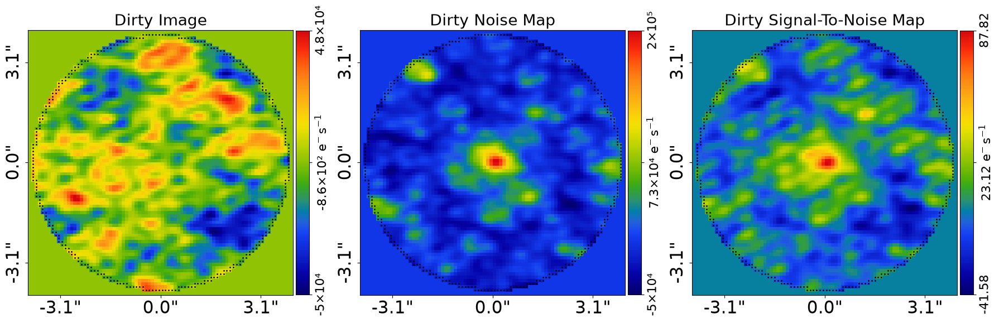
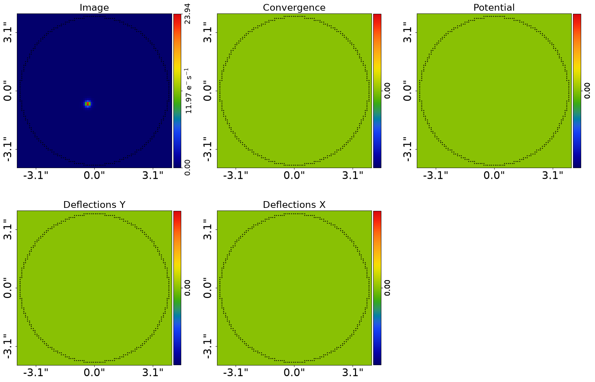
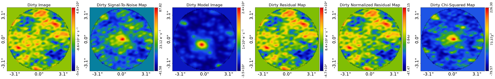

> ✏️ **This page is auto-generated from [`scripts/interferometer/modeling.py`](../../scripts/interferometer/modeling.py) — do not edit it directly.**
> It shows the example fully executed, with its real output images.
> Run it yourself via the [Python script](../../scripts/interferometer/modeling.py) or the [Jupyter notebook](../../notebooks/interferometer/modeling.ipynb).

Modeling: Start Here
====================

This script is the starting point for modeling of interferometer datasets (e.g. SMA, ALMA) and it provides an
overview of the modeling API. The same workflow scales from a few hundred visibilities to many millions,
thanks to the JAX-native `TransformerNUFFT` (backed by `nufftax`).

__Number of Visibilities__

This example fits a **low-resolution interferometric dataset** with a small number of visibilities (273). The
dataset is intentionally minimal so the example runs quickly and you can become familiar with the API and
modeling workflow.

The same workflow — light profiles + `TransformerNUFFT` (backed by `nufftax`, https://github.com/GragasLab/nufftax) —
scales to high-resolution datasets with **millions to hundreds of millions of visibilities** (e.g. ALMA), with no
change beyond the transformer choice. The NUFFT runs inside JAX's jit/vmap pipeline, so both run time and VRAM
stay manageable on a GPU at any visibility count.

Pixelized reconstructions (see `features/pixelization`) remain the right tool when the galaxy has complex,
irregular morphology that simple light profiles cannot capture. They are no longer required purely because
the dataset is large.

__Contents__

- **Number of Visibilities:** Discussion of dataset size and when to use pixelized source reconstructions.
- **Model:** Description of the galaxy model fitted in this example.
- **Mask:** Defining the real-space mask for the interferometer grid.
- **Dataset:** Loading the interferometer dataset from FITS files.
- **Dataset Auto-Simulation:** Automatically simulating data if it does not exist.
- **Over Sampling:** Why over sampling is not needed for interferometer data.
- **Model:** Composing a Sersic bulge and Exponential disk galaxy model using linear light profiles.
- **Search:** Configuring the Nautilus nested sampling non-linear search.
- **Live Visual Update:** Push the quick-update image to a live display surface.
- **Analysis:** Setting up the AnalysisInterferometer object with JAX acceleration.
- **VRAM Use:** Estimating GPU VRAM requirements for the model fit.
- **Run Times:** Estimating the computational cost of the model fit.
- **Model-Fit:** Running the non-linear search to fit the model to data.
- **Output Folder Layout:** Description of the structure of the `output` folder where results are written.
- **Result:** Inspecting the result object and maximum likelihood model.
- **Features:** Overview of advanced interferometer modeling features like pixelizations.
- **Data Preparation:** Pointers to data preparation scripts for your own data.
- **HowToGalaxy:** Pointers to the HowToGalaxy lecture series for deeper understanding.
- **Modeling Customization:** Overview of alternative non-linear searches and model customization.

__Model__

This script fits `Interferometer` dataset of a galaxy with a model where:

 - The galaxy's light is a linear parametric `Sersic` bulge and `Exponential` disk.


```python

from autogalaxy import setup_notebook; setup_notebook()

from pathlib import Path
import autofit as af
import autogalaxy as ag
import autogalaxy.plot as aplt
import numpy as np
```

    Working Directory has been set to `autogalaxy_workspace`


__Mask__

We define the ‘real_space_mask’ which defines the grid the image the galaxy is evaluated using.


```python
mask_radius = 4.0

real_space_mask = ag.Mask2D.circular(
    shape_native=(256, 256),
    pixel_scales=0.1,
    radius=mask_radius,
)
```

__Dataset__

Load and plot the galaxy `Interferometer` dataset `simple__sersic` from .fits files, which we will fit 
with the model.

This includes the method used to Fourier transform the real-space image of the galaxy to the uv-plane and compare 
directly to the visiblities. We use a non-uniform fast Fourier transform, which is the most efficient method for 
interferometer datasets containing ~1-10 million visibilities.


```python
dataset_name = "simple"
dataset_path = Path("dataset") / "interferometer" / dataset_name
```

__Dataset Auto-Simulation__

If the dataset does not already exist on your system, it will be created by running the corresponding
simulator script. This ensures that all example scripts can be run without manually simulating data first.


```python
if not dataset_path.exists():
    import subprocess
    import sys

    subprocess.run(
        [sys.executable, "scripts/interferometer/simulator.py"],
        check=True,
    )


dataset = ag.Interferometer.from_fits(
    data_path=dataset_path / "data.fits",
    noise_map_path=dataset_path / "noise_map.fits",
    uv_wavelengths_path=dataset_path / "uv_wavelengths.fits",
    real_space_mask=real_space_mask,
    transformer_class=ag.TransformerNUFFT,
)

aplt.subplot_interferometer_dirty_images(dataset=dataset)
```


    

    


__Over Sampling__

If you are familiar with using imaging data, you may have seen that a numerical technique called over sampling is used, 
which evaluates light profiles on a higher resolution grid than the image data to ensure the calculation is accurate.

Interferometer does not observe galaxies in a way where over sampling is necessary, therefore all interferometer
calculations are performed without over sampling.

__Model__

We compose our model using `Model` objects, which represent the galaxies we fit to our data. In this 
example we fit a model where:

 - The galaxy's light is a linear parametric `Sersic` bulge and `Exponential` disk, the centres of 
 which are aligned [10 parameters].
 
The number of free parameters and therefore the dimensionality of non-linear parameter space is N=10.

__Linear Light Profiles__

The model below uses a `linear light profile` for the bulge and disk, via the API `lp_linear`. This is a specific type 
of light profile that solves for the `intensity` of each profile that best fits the data via a linear inversion. 
This means it is not a free parameter, reducing the dimensionality of non-linear parameter space. 

Linear light profiles significantly improve the speed, accuracy and reliability of modeling and they are used
by default in every modeling example. A full description of linear light profiles is provided in the
`autogalaxy_workspace/*/modeling/imaging/features/linear_light_profiles.py` example.

A standard light profile can be used if you change the `lp_linear` to `lp`, but it is not recommended.

__Coordinates__

The model fitting default settings assume that the galaxy centre is near the coordinates (0.0", 0.0"). 

If for your dataset the galaxy is not centred at (0.0", 0.0"), we recommend that you either: 

 - Reduce your data so that the centre is (`autogalaxy_workspace/*/preprocess`). 
 - Manually override the model priors (`autogalaxy_workspace/*/modeling/imaging/customize/priors.py`).


```python
bulge = af.Model(ag.lp_linear.Sersic)
disk = af.Model(ag.lp_linear.Exponential)
bulge.centre = disk.centre

galaxy = af.Model(ag.Galaxy, redshift=0.5, bulge=bulge, disk=disk)

model = af.Collection(galaxies=af.Collection(galaxy=galaxy))
```

The `info` attribute shows the model in a readable format.

[The `info` below may not display optimally on your computer screen, for example the whitespace between parameter
names on the left and parameter priors on the right may lead them to appear across multiple lines. This is a
common issue in Jupyter notebooks.

The`info_whitespace_length` parameter in the file `config/generag.yaml` in the [output] section can be changed to 
increase or decrease the amount of whitespace (The Jupyter notebook kernel will need to be reset for this change to 
appear in a notebook).]


```python
print(model.info)
```

    Total Free Parameters = 9
    
    model                                                                           Collection (N=9)
        galaxies                                                                    Collection (N=9)
            galaxy                                                                  Galaxy (N=9)
                bulge                                                               Sersic (N=6)
                disk                                                                Exponential (N=5)
    
    galaxies
        galaxy
            redshift                                                                0.5
            bulge - disk
                centre
                    centre_0                                                        GaussianPrior [6], mean = 0.0, sigma = 0.3
                    centre_1                                                        GaussianPrior [7], mean = 0.0, sigma = 0.3
            bulge
                ell_comps
                    ell_comps_0                                                     TruncatedGaussianPrior [2], mean = 0.0, sigma = 0.3, lower_limit = -1.0, upper_limit = 1.0
                    ell_comps_1                                                     TruncatedGaussianPrior [3], mean = 0.0, sigma = 0.3, lower_limit = -1.0, upper_limit = 1.0
                effective_radius                                                    UniformPrior [4], lower_limit = 0.0, upper_limit = 30.0
                sersic_index                                                        UniformPrior [5], lower_limit = 0.8, upper_limit = 5.0
            disk
                ell_comps
                    ell_comps_0                                                     TruncatedGaussianPrior [8], mean = 0.0, sigma = 0.3, lower_limit = -1.0, upper_limit = 1.0
                    ell_comps_1                                                     TruncatedGaussianPrior [9], mean = 0.0, sigma = 0.3, lower_limit = -1.0, upper_limit = 1.0
                effective_radius                                                    UniformPrior [10], lower_limit = 0.0, upper_limit = 30.0


__Search__

The model is fitted to the data using a non-linear search. In this example, we use the nested sampling algorithm 
Nautilus (https://nautilus.readthedocs.io/en/latest/).

The folders: 

 - `autogalaxy_workspace/*/modeling/imaging/searches`.
 - `autogalaxy_workspace/*/modeling/imaging/customize`
  
Give overviews of the  non-linear searches **PyAutoGalaxy** supports and more details on how to customize the
model-fit, including the priors on the model. 

The `name` and `path_prefix` below specify the path where results are stored in the output folder:  

 `/autogalaxy_workspace/output/imaging/simple__sersic/mass[sie]/unique_identifier`.

__Unique Identifier__

In the path above, the `unique_identifier` appears as a collection of characters, where this identifier is generated 
based on the model, search and dataset that are used in the fit.
 
An identical combination of model, search and dataset generates the same identifier, meaning that rerunning the
script will use the existing results to resume the model-fit. In contrast, if you change the model, search or dataset,
a new unique identifier will be generated, ensuring that the model-fit results are output into a separate folder.

__Live Visual Update__

By default the quick-update image is only written to disk. Set `live_visual_update=True` to also push it to a
live display surface:

- **Python script** — a matplotlib window opens automatically and refreshes with each quick update, so you can
  watch the fit converge without leaving your terminal.
- **Jupyter / Colab notebook** — the cell that ran `search.fit(...)` shows a single self-updating image that
  refreshes in place every `iterations_per_quick_update`.

The disk write (`fit.png`) always happens regardless of this flag. Set it to `False` (the default) if you just
want the on-disk output, or if you are running in a headless environment (e.g. an HPC cluster).


```python
search = af.Nautilus(
    path_prefix=Path("interferometer", "modeling"),
    name="start_here",
    unique_tag=dataset_name,
    n_live=100,
    n_batch=50,  # GPU model fits are batched and run simultaneously, see VRAM section below.
    live_visual_update=False,  # Set True to open a live matplotlib window (script) or refresh a Jupyter cell (notebook).
)
```

__Analysis__

The `AnalysisInterferometer` object defines the `log_likelihood_function` used by the non-linear search to fit the 
model to the `Interferometer`dataset.

__JAX__

PyAutouses JAX under the hood for fast GPU/CPU acceleration. If JAX is installed with GPU
support, your fits will run much faster (around 10 minutes instead of an hour). If only a CPU is available,
JAX will still provide a speed up via multithreading, with fits taking around 20-30 minutes.

If you don’t have a GPU locally, consider Google Colab which provides free GPUs, so your modeling runs are much faster.


```python
analysis = ag.AnalysisInterferometer(dataset=dataset, use_jax=True)
```

__VRAM Use__

When running Autowith JAX on a GPU, the analysis must fit within the GPU’s available VRAM. If insufficient 
VRAM is available, the analysis will fail with an out-of-memory error, typically during JIT compilation or the 
first likelihood call.

Two factors dictate the VRAM usage of an analysis:

- The number of arrays and other data structures JAX must store in VRAM to fit the model
  to the data in the likelihood function. This is dictated by the model complexity and dataset size.

- The `batch_size` sets how many likelihood evaluations are performed simultaneously.
  Increasing the batch size increases VRAM usage but can reduce overall run time,
  while decreasing it lowers VRAM usage at the cost of slower execution.

Before running an analysis, users should check that the estimated VRAM usage for the
chosen batch size is comfortably below their GPU’s total VRAM.

The method below prints the VRAM usage estimate for the analysis and model with the specified batch size,
it takes about 20-30 seconds to run so you may want to comment it out once you are familiar with your GPU's VRAM limits.

For a MGE model with the low visibility dataset fitted in this example VRAM use is relatively low (~0.3GB) For other 
models (e.g. pixelized sources) and datasets with more visibilities it can be much higher (> 1GB going beyond 10GB).


```python
analysis.print_vram_use(model=model, batch_size=search.batch_size)
```

    2026-07-10 18:54:00,320 - autofit.non_linear.fitness - INFO - JAX: Applying vmap and jit to likelihood function -- may take a few seconds.


    2026-07-10 18:54:00,323 - autofit.non_linear.fitness - INFO - JAX: vmap and jit applied in 0.0031037330627441406 seconds.


    VRAM USE = 0.590 GB


__Run Times__

Modeling can be a computationally expensive process. When fitting complex models to high resolution datasets 
run times can be of order hours, days, weeks or even months.

Run times are dictated by two factors:

 - The log likelihood evaluation time: the time it takes for a single `instance` of the model to be fitted to 
   the dataset such that a log likelihood is returned.
 
 - The number of iterations (e.g. log likelihood evaluations) performed by the non-linear search: more complex lens
   models require more iterations to converge to a solution.
   
For this analysis, the log likelihood evaluation time is ~0.01 seconds on CPU, < 0.001 seconds on GPU, which is 
extremely fast for modeling. 

To estimate the expected overall run time of the model-fit we multiply the log likelihood evaluation time by an 
estimate of the number of iterations the non-linear search will perform. For this model, this is typically around
? iterations, meaning that this script takes ? on CPU and ? on GPU.

__Model-Fit__

We can now begin the model-fit by passing the model and analysis object to the search, which performs the 
Nautilus non-linear search in order to find which models fit the data with the highest likelihood.

**Run Time Error:** On certain operating systems (e.g. Windows, Linux) and Python versions, the code below may produce 
an error. If this occurs, see the `autolens_workspace/guides/modeling/bug_fix` example for a fix.


```python
result = search.fit(model=model, analysis=analysis)
```

    2026-07-10 18:54:07,096 - autofit.non_linear.search.abstract_search - INFO - Starting non-linear search with JAX (CPU: cpu).


    2026-07-10 18:54:07,140 - start_here - INFO - The output path of this fit is autogalaxy_workspace/output/interferometer/modeling/simple/start_here/04a10f767d1670fbc51acda8dc58239f


    2026-07-10 18:54:07,142 - start_here - INFO - Outputting pre-fit files (e.g. model.info, visualization).


    2026-07-10 18:54:09,001 - start_here - INFO - Starting new Nautilus non-linear search (no previous samples found).


    2026-07-10 18:54:09,004 - autofit.non_linear.fitness - INFO - JAX: Applying vmap and jit to likelihood function -- may take a few seconds.


    2026-07-10 18:54:09,005 - autofit.non_linear.fitness - INFO - JAX: vmap and jit applied in 0.0012831687927246094 seconds.


    2026-07-10 18:54:09,008 - autofit.non_linear.fitness - INFO - Warming up visualization (one-time JAX compilation)...


    2026-07-10 18:54:18,930 - autofit.non_linear.fitness - INFO - Visualization warm-up complete.


    2026-07-10 18:54:18,933 - start_here - INFO - Running search with JAX vectorization (parallelization handled by JAX).


    Starting the nautilus sampler...
    Please report issues at github.com/johannesulf/nautilus.
    Status    | Bounds | Ellipses | Networks | Calls    | f_live | N_eff | log Z    


    

    

    

    

    

    

    

    

    

    

    

    

    

    

    

    

    

    

    

    

    

    

    

    

    

    

    

    

    

    

    Finished  | 7      | 1        | 4        | 1250     | N/A    | 555   | -3189.85 
    2026-07-10 18:55:23,778 - start_here - INFO - Fit Running: Updating results (see output folder).


    Starting the nautilus sampler...
    Please report issues at github.com/johannesulf/nautilus.
    Status    | Bounds | Ellipses | Networks | Calls    | f_live | N_eff | log Z    
    Finished  | 7      | 1        | 4        | 1250     | N/A    | 555   | -3189.85 
    2026-07-10 18:56:44,905 - start_here - INFO - Fit Running: Updating results (see output folder).


    2026-07-10 18:56:45,132 - autofit.non_linear.samples.samples - INFO - Samples with weight less than 1e-10 removed from samples.csv.


    2026-07-10 18:56:45,205 - autofit.non_linear.search.updater - INFO - Creating latent samples by drawing 100 from the PDF.


    2026-07-10 18:57:51,146 - start_here - INFO - Removing search internal folder.


    2026-07-10 18:57:51,152 - start_here - INFO - Removing all files except for .zip file


    2026-07-10 18:57:52,197 - start_here - INFO - Search complete, returning result


__Output Folder Layout__

Now the fit is running you should checkout the `autogalaxy_workspace/output` folder. This is where results are
written to hard-disk in human-readable formats — `.json`, `.csv`, `.fits`, `.png` and plain text.

As the fit progresses, results are written on the fly using the highest likelihood model found by the
non-linear search so far. This means you can inspect the model-fit as it runs, without waiting for the
non-linear search to terminate.

Each completed fit lives at a path like::

    output/interferometer/<dataset_name>/modeling/<unique_hash>/
        files/                         <- JSON + CSV: loadable Python objects
            galaxies.json              <- max log likelihood Galaxies
            model.json                 <- fitted af.Collection model
            samples.csv                <- full Nautilus samples
            samples_summary.json       <- max log likelihood parameter values + errors
            samples_info.json          <- metadata about the samples
            search.json                <- non-linear search configuration
            settings.json              <- search settings
            covariance.csv             <- parameter covariance matrix
        image/                         <- FITS + PNG: visibility + image-plane products
            dataset.fits               <- visibilities, noise-map and uv-coverage
            fit.fits                   <- model visibilities, residuals, chi-squared
            dirty_images.fits          <- dirty images of data, model and residuals
            model_galaxy_images.fits   <- per-galaxy model images
            galaxy_images.fits         <- per-galaxy images
            dataset.png, fit.png       <- visualisations
        model.info                     <- human-readable model summary
        model.results                  <- human-readable fit summary
        search.summary                 <- search run summary
        search_internal/               <- internal files used to resume / visualise the search
        metadata                       <- run metadata

The `<unique_hash>` is a 32-character identifier derived from the model, search and dataset, so re-running the
same configuration resumes from the existing fit automatically.

__Result__

The search returns a result object, which whose `info` attribute shows the result in a readable format.

[Above, we discussed that the `info_whitespace_length` parameter in the config files could b changed to make 
the `model.info` attribute display optimally on your computer. This attribute also controls the whitespace of the
`result.info` attribute.]


```python
print(result.info)
```

    Bayesian Evidence                                                               -3189.85410900
    Maximum Log Likelihood                                                          -3188.26894881
    
    model                                                                           Collection (N=9)
        galaxies                                                                    Collection (N=9)
            galaxy                                                                  Galaxy (N=9)
                bulge                                                               Sersic (N=6)
                disk                                                                Exponential (N=5)
    
    Maximum Log Likelihood Model:
    ... [47 lines of output truncated] ...
                    ell_comps_0                                                     -0.0005 (-0.3032, 0.2900)
                    ell_comps_1                                                     -0.0063 (-0.2962, 0.2965)
                effective_radius                                                    14.5572 (4.4237, 24.8113)
                sersic_index                                                        2.9484 (1.5175, 4.4020)
            bulge - disk
                centre
                    centre_0                                                        -0.0114 (-0.2984, 0.3211)
                    centre_1                                                        -0.0555 (-0.3229, 0.2601)
            disk
                ell_comps
                    ell_comps_0                                                     -0.0037 (-0.2972, 0.2953)
                    ell_comps_1                                                     0.0126 (-0.3078, 0.2892)
                effective_radius                                                    14.5759 (4.8097, 24.2254)
    
    instances
    
    galaxies
        galaxy
            redshift                                                                0.5


The `Result` object also contains:

 - The model corresponding to the maximum log likelihood solution in parameter space.
 - The corresponding maximum log likelihood `Galaxies` and `FitInterferometer` objects.


```python
print(result.max_log_likelihood_instance)

aplt.subplot_galaxies(
    galaxies=result.max_log_likelihood_galaxies,
    grid=real_space_mask.derive_grid.unmasked,
)
aplt.subplot_fit_dirty_images(fit=result.max_log_likelihood_fit)
```

    <autofit.mapper.model.ModelInstance object at 0x7f61faade030>


    

    


    

    


The result contains the full posterior information of our non-linear search, including all parameter samples, 
log likelihood values and tools to compute the errors on the model. 

There are built in visualization tools for plotting this.

The plot is labeled with short hand parameter names (e.g. `sersic_index` is mapped to the short hand 
parameter `n`). These mappings ate specified in the `config/notation.yaml` file and can be customized by users.

The superscripts of labels correspond to the name each component was given in the model (e.g. for the `Isothermal`
mass its name `mass` defined when making the `Model` above is used).


```python

# %%
'''
This script gives a concise overview of the basic modeling API, fitting one of the simplest galaxy models possible.

Let’s now consider what features you should read about to improve your galaxy modeling, especially if you are aiming
to fit more complex models to your data.

__Features__

The examples in the `autogalaxy_workspace/*/interferometer/features` package illustrate other galaxy modeling
features.

We recommend you check out the `pixelization` feature next, which lets you reconstruct galaxies with complex,
irregular morphology that simple light profiles cannot capture:

- ``pixelization``: The galaxy’s light is reconstructed using an adaptive Rectangular mesh or Delaunay mesh.

The files `autogalaxy_workspace/*/guides/modeling/searches` and
`autogalaxy_workspace/*/guides/modeling/customize` provide guides on how to customize many other aspects of the
model-fit. Check them out to see if anything sounds useful, but for most users you can get by without using these
forms of customization!

__Data Preparation__

If you are looking to fit your own interferometer data of a galaxy, check out
the `autogalaxy_workspace/*/interferometer/data_preparation/start_here.ipynb` script for an overview of how data
should be prepared before being modeled.

__HowToGalaxy__

This `start_here.py` script, and the features examples above, do not explain many details of how galaxy modeling is
performed, for example:

- How does PyAutoGalaxy evaluate galaxy light profiles and perform image-plane calculations?
- How is a galaxy model fitted to data? What quantifies the goodness of fit (e.g. how is a log likelihood computed)?
- How does Nautilus find the highest likelihood galaxy models? What exactly is a “non-linear search”?

You do not need to be able to answer these questions in order to fit galaxy models with PyAutoGalaxy and do science.
However, having a deeper understanding of how it all works is both interesting and will benefit you as a scientist.

This deeper insight is offered by the **HowToGalaxy** Jupyter notebook lectures, which live
at https://github.com/PyAutoLabs/HowToGalaxy.

I recommend that you check them out if you are interested in more details!

__Modeling Customization__

The folders `autogalaxy_workspace/*/guides/modeling/searches` give an overview of alternative non-linear searches,
other than Nautilus, that can be used to fit galaxy models.

They also provide details on how to customize the model-fit, for example the priors.
'''
```


    '\nThis script gives a concise overview of the basic modeling API, fitting one of the simplest galaxy models possible.\n\nLet’s now consider what features you should read about to improve your galaxy modeling, especially if you are aiming\nto fit more complex models to your data.\n\n__Features__\n\nThe examples in the `autogalaxy_workspace/*/interferometer/features` package illustrate other galaxy modeling\nfeatures.\n\nWe recommend you check out the `pixelization` feature next, which lets you reconstruct galaxies with complex,\nirregular morphology that simple light profiles cannot capture:\n\n- ``pixelization``: The galaxy’s light is reconstructed using an adaptive Rectangular mesh or Delaunay mesh.\n\nThe files `autogalaxy_workspace/*/guides/modeling/searches` and\n`autogalaxy_workspace/*/guides/modeling/customize` provide guides on how to customize many other aspects of the\nmodel-fit. Check them out to see if anything sounds useful, but for most users you can get by without using these\nforms of customization!\n\n__Data Preparation__\n\nIf you are looking to fit your own interferometer data of a galaxy, check out\nthe `autogalaxy_workspace/*/interferometer/data_preparation/start_here.ipynb` script for an overview of how data\nshould be prepared before being modeled.\n\n__HowToGalaxy__\n\nThis `start_here.py` script, and the features examples above, do not explain many details of how galaxy modeling is\nperformed, for example:\n\n- How does PyAutoGalaxy evaluate galaxy light profiles and perform image-plane calculations?\n- How is a galaxy model fitted to data? What quantifies the goodness of fit (e.g. how is a log likelihood computed)?\n- How does Nautilus find the highest likelihood galaxy models? What exactly is a “non-linear search”?\n\nYou do not need to be able to answer these questions in order to fit galaxy models with PyAutoGalaxy and do science.\nHowever, having a deeper understanding of how it all works is both interesting and will benefit you as a scientist.\n\nThis deeper insight is offered by the **HowToGalaxy** Jupyter notebook lectures, which live\nat https://github.com/PyAutoLabs/HowToGalaxy.\n\nI recommend that you check them out if you are interested in more details!\n\n__Modeling Customization__\n\nThe folders `autogalaxy_workspace/*/guides/modeling/searches` give an overview of alternative non-linear searches,\nother than Nautilus, that can be used to fit galaxy models.\n\nThey also provide details on how to customize the model-fit, for example the priors.\n'


```python

```
