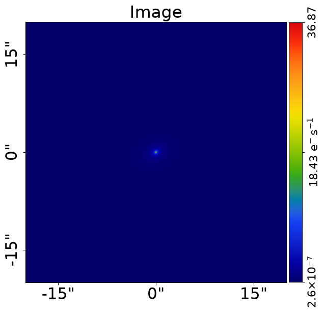
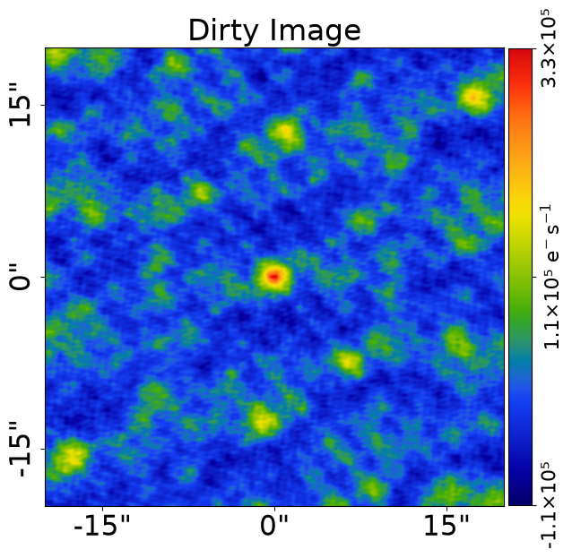
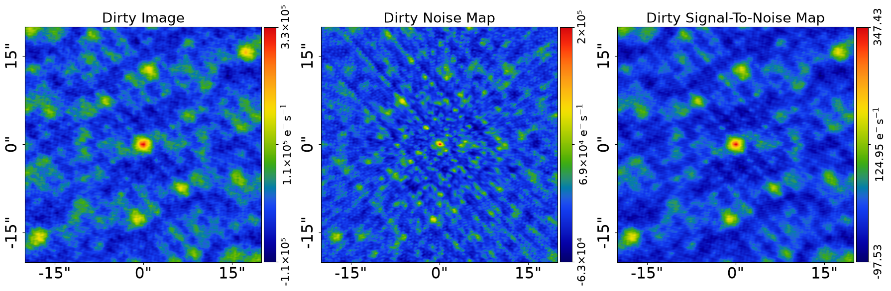

> ✏️ **This page is auto-generated from [`scripts/interferometer/simulator.py`](../../scripts/interferometer/simulator.py) — do not edit it directly.**
> It shows the example fully executed, with its real output images.
> Run it yourself via the [Python script](../../scripts/interferometer/simulator.py) or the [Jupyter notebook](../../notebooks/interferometer/simulator.ipynb).

Simulator: Sersic
=================

This script simulates `Interferometer` data of a galaxy where:

 - The galaxy's bulge is an `Sersic`.

__Contents__

- **Grid:** Defining the 2D grid for evaluating galaxy images in real space.
- **Galaxies:** Setting up the galaxy with bulge and disk light profiles for simulation.
- **Output:** Saving the simulated dataset to FITS files.
- **Visualize:** Outputting subplot and image visualizations as PNG files.
- **Plane Output:** Saving the galaxy model as a JSON file for future reference.


```python

from autoconf import setup_notebook; setup_notebook()

from pathlib import Path
import autogalaxy as ag
import autogalaxy.plot as aplt
```

    Working Directory has been set to `autogalaxy_workspace`


The `dataset_type` describes the type of data being simulated (in this case, `Interferometer` data) and `dataset_name` 
gives it a descriptive name. They define the folder the dataset is output to on your hard-disk:

 - The image will be output to `/autogalaxy_workspace/dataset/dataset_type/dataset_name/image.fits`.
 - The noise-map will be output to `/autogalaxy_workspace/dataset/dataset_type/dataset_name/noise_map.fits`.
 - The psf will be output to `/autogalaxy_workspace/dataset/dataset_type/dataset_name/psf.fits`.


```python
dataset_type = "interferometer"
dataset_name = "simple"
```

The path where the dataset will be output.

In this example, this is: `/autogalaxy_workspace/dataset/interferometer/simple`


```python
dataset_path = Path("dataset", dataset_type, dataset_name)
```

__Grid__

Define the 2d grid of (y,x) coordinates that the galaxy images are evaluated and therefore simulated on, via
the inputs:

 - `shape_native`: The (y_pixels, x_pixels) 2D shape of the grid defining the shape of the data that is simulated.
 - `pixel_scales`: The arc-second to pixel conversion factor of the grid and data.

For interferomet data, this image is evaluate in real-space and then transformed to Fourier space.

__Over Sampling__

If you are familiar with using imaging data, you may have seen that a numerical technique called
over sampling is used, which evaluates light profiles on a higher resolution grid than the image data to ensure the
calculation is accurate.

Interferometer does not observe galaxies in a way where over sampling is necessary, therefore all interferometer
calculations are performed without over sampling.


```python
grid = ag.Grid2D.uniform(shape_native=(800, 800), pixel_scales=0.05)
```

To perform the Fourier transform we need the wavelengths of the baselines, which we'll load from the fits file below.

By default we use baselines from the Square Mile Array (SMA), which produces low resolution interferometer data that
can be fitted extremely efficiently. The `autogalaxy_workspace` includes ALMA uv_wavelengths files for simulating
much high resolution datasets (which can be performed by replacing "sma.fits" below with "alma.fits").


```python
uv_wavelengths_path = Path("dataset", dataset_type, "uv_wavelengths")
uv_wavelengths = ag.ndarray_via_fits_from(
    file_path=Path(uv_wavelengths_path, "sma.fits"), hdu=0
)
```

To simulate the interferometer dataset we first create a simulator, which defines the exposure time, noise levels
and Fourier transform method used in the simulation.

We use `TransformerNUFFT` (backed by `nufftax`, https://github.com/GragasLab/nufftax), a JAX-native Non-Uniform
Fast Fourier Transform. This is the recommended transformer at any visibility count and is fast enough to
simulate ALMA-class datasets with millions of visibilities end-to-end on a GPU.


```python
simulator = ag.SimulatorInterferometer(
    uv_wavelengths=uv_wavelengths,
    exposure_time=300.0,
    noise_sigma=1000.0,
    transformer_class=ag.TransformerNUFFT,
)
```

__Galaxies__

Setup the galaxy with a bulge (elliptical Sersic) for this simulation.

For modeling, defining ellipticity in terms of the `ell_comps` improves the model-fitting procedure.

However, for simulating a galaxy you may find it more intuitive to define the elliptical geometry using the 
axis-ratio of the profile (axis_ratio = semi-major axis / semi-minor axis = b/a) and position angle, where angle is
in degrees and defined counter clockwise from the positive x-axis.

We can use the `convert` module to determine the elliptical components from the axis-ratio and angle.


```python
galaxy = ag.Galaxy(
    redshift=0.5,
    bulge=ag.lp.Sersic(
        centre=(0.0, 0.0),
        ell_comps=ag.convert.ell_comps_from(axis_ratio=0.9, angle=45.0),
        intensity=1.0,
        effective_radius=0.6,
        sersic_index=3.0,
    ),
    disk=ag.lp.Exponential(
        centre=(0.0, 0.0),
        ell_comps=ag.convert.ell_comps_from(axis_ratio=0.7, angle=30.0),
        intensity=0.5,
        effective_radius=1.6,
    ),
)
```

Use these galaxies to setup a plane, which will generate the image for the simulated interferometer dataset.


```python
galaxies = ag.Galaxies(galaxies=[galaxy])
```

Lets look at the galaxies image, this is the image we'll be simulating.


```python
aplt.plot_array(array=galaxies.image_2d_from(grid=grid), title="Image")
```


    

    


We can now pass this simulator galaxies, which creates the image plotted above and simulates it as an
interferometer dataset.


```python
dataset = simulator.via_galaxies_from(galaxies=galaxies, grid=grid)
```

Lets plot the simulated interferometer dataset before we output it to fits.


```python
aplt.plot_array(array=dataset.dirty_image, title="Dirty Image")
aplt.subplot_interferometer_dirty_images(dataset=dataset)
```


    

    


    

    


__Output__

Output the simulated dataset to the dataset path as .fits files.


```python
aplt.fits_interferometer(
    dataset=dataset,
    data_path=dataset_path / "data.fits",
    noise_map_path=dataset_path / "noise_map.fits",
    uv_wavelengths_path=dataset_path / "uv_wavelengths.fits",
    overwrite=True,
)
```

__Visualize__

Output a subplot of the simulated dataset, the image and the galaxies quantities to the dataset path as .png files.


```python
aplt.subplot_interferometer_dirty_images(
    dataset=dataset, output_path=dataset_path, output_format="png"
)
aplt.plot_array(
    array=dataset.dirty_image,
    title="Data",
    output_path=dataset_path,
    output_format="png",
)

aplt.subplot_galaxies(
    galaxies=galaxies, grid=grid, output_path=dataset_path, output_format="png"
)
```

__Plane Output__

Save the `Galaxies` in the dataset folder as a .json file, ensuring the true light profiles and galaxies
are safely stored and available to check how the dataset was simulated in the future. 

This can be loaded via the method `galaxies = ag.from_json()`.


```python
ag.output_to_json(
    obj=galaxies,
    file_path=Path(dataset_path, "galaxies.json"),
)
```

The dataset can be viewed in the folder `autogalaxy_workspace/imaging/simple`.

__JAX Variant__

For fast repeated interferometer simulations, construct the simulator
with `use_jax=True` and wrap the call in `@jax.jit`. The simulator
handles pytree registration internally.

```python
import jax
import jax.numpy as jnp

simulator_jax = ag.SimulatorInterferometer(
    uv_wavelengths=uv_wavelengths,
    exposure_time=300.0,
    noise_sigma=0.1,
    transformer_class=ag.TransformerDFT,  # NUFFT (pynufft) is not JAX-traceable
    use_jax=True,
)

@jax.jit
def simulate(galaxies):
    galaxy_obj = ag.Galaxies(galaxies=galaxies)
    image = galaxy_obj.image_2d_from(grid=real_space_grid, xp=jnp)
    return simulator_jax.via_image_from(image=image)

dataset_jax = simulate(galaxies)   # Interferometer with jax.Array visibilities
```

Two notes:

- Use `TransformerDFT` (the default) under JAX. `TransformerNUFFT`
  (pynufft) is faster on large UV sets but is not JAX-traceable; the
  `nufftax` replacement is a research path (see
  `autolens_workspace_test/scripts/interferometer/nufft.py`).
- Eager `simulator_jax.via_image_from(image)` already runs on JAX without
  the `@jax.jit` wrap; the JIT only matters for repeated calls.

See `scripts/guides/api/data_structures.py` for the broader "JIT-it-
yourself" pattern.


```python

```
