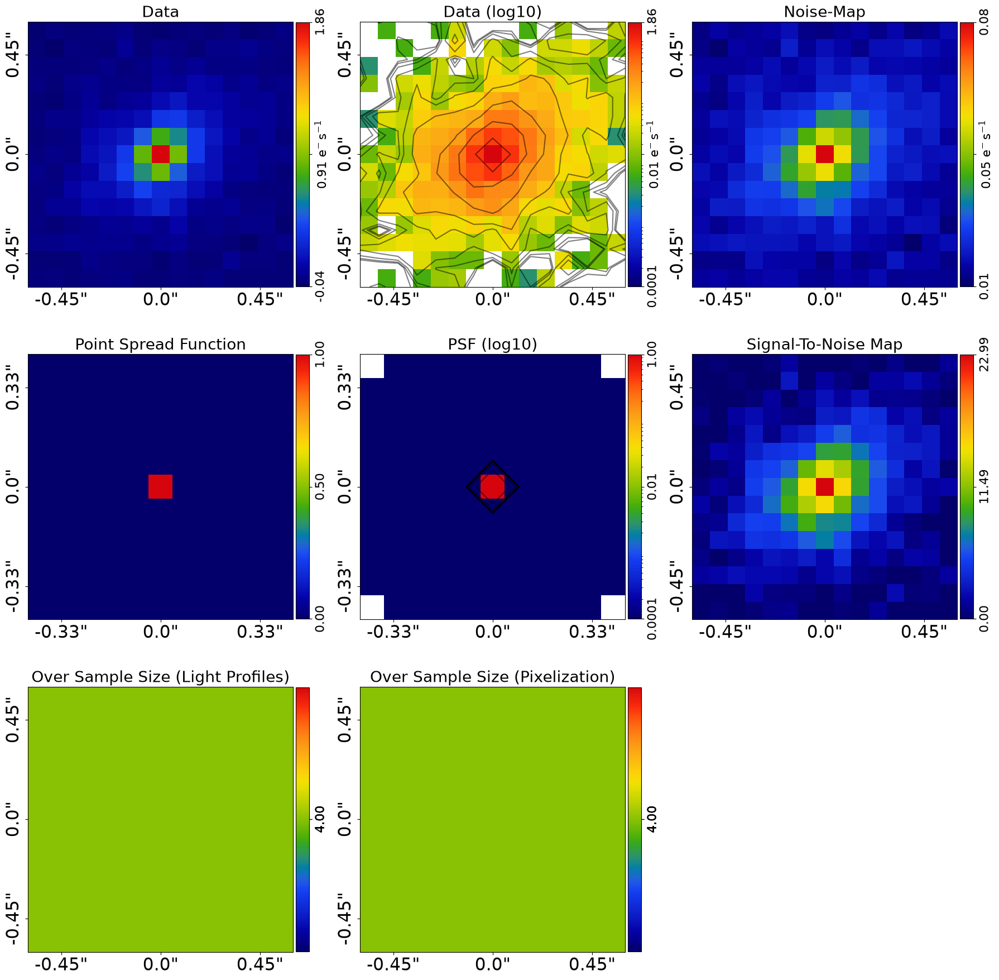
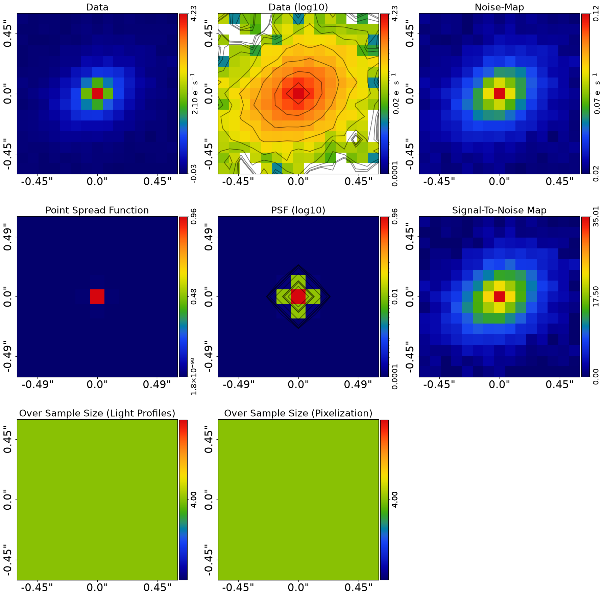
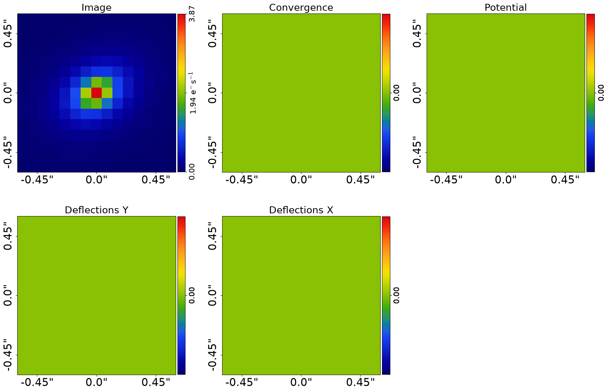
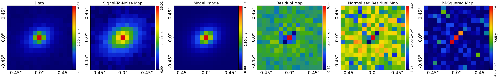
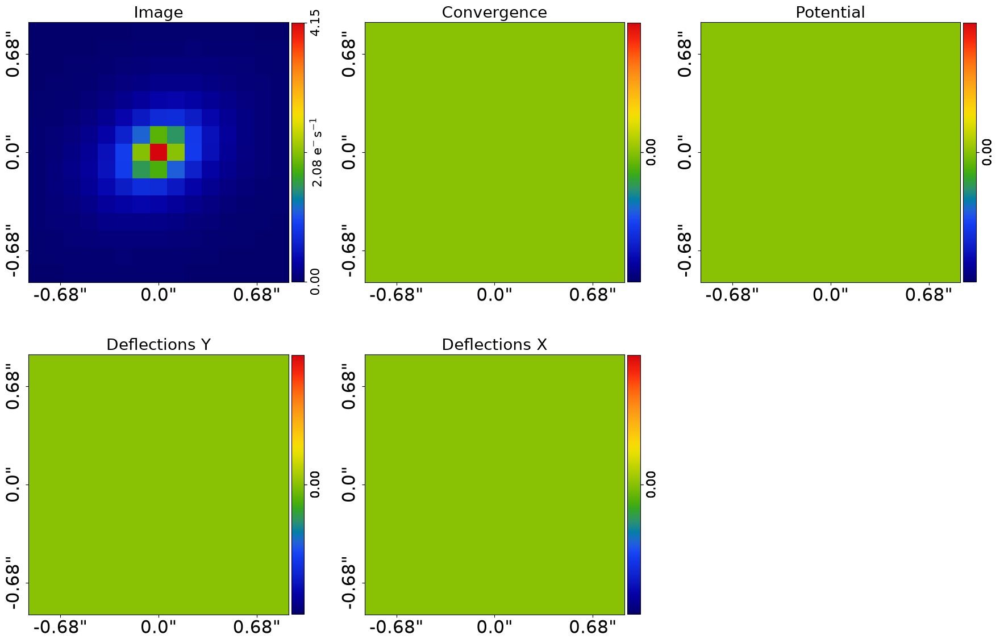
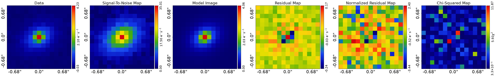

> ✏️ **This page is auto-generated from [`scripts/multi/modeling.py`](../../scripts/multi/modeling.py) — do not edit it directly.**
> It shows the example fully executed, with its real output images.
> Run it yourself via the [Python script](../../scripts/multi/modeling.py) or the [Jupyter notebook](../../notebooks/multi/modeling.ipynb).

Modeling: Multi Modeling
========================

This script fits multiple multi-wavelength `Imaging` datasets of a galaxy with a model where:

 - The galaxy's light is a linear parametric `Sersic` bulge and `Exponential` disk.

Two images are fitted, corresponding to a greener ('g' band) and redder image (`r` band).

This is an advanced script and assumes previous knowledge of the core **PyAutoGalaxy** API for galaxy modeling. Thus,
certain parts of code are not documented to ensure the script is concise.

__Contents__

- **Colors:** Defining the multi-wavelength color bands.
- **Pixel Scales:** Setting per-wavelength pixel scales.
- **Dataset:** Loading and plotting each multi-wavelength dataset.
- **Dataset Auto-Simulation:** Automatically simulating data if it does not exist.
- **Mask:** Applying a circular mask to each dataset.
- **Over Sampling:** Applying adaptive over-sampling for accurate light profile evaluation.
- **Model:** Composing a Sersic bulge and Exponential disk model with linear light profiles.
- **Analysis List:** Creating analysis objects for each dataset with JAX acceleration.
- **Analysis Factor:** Wrapping each analysis in a factor graph with per-dataset model customization.
- **Factor Graph:** Combining all analysis factors into a global factor graph model.
- **Search:** Configuring the Nautilus nested sampling non-linear search.
- **Live Visual Update:** Push the quick-update image to a live display surface.
- **VRAM Use:** Estimating GPU VRAM requirements for multi-dataset fitting.
- **Model-Fit:** Running the non-linear search to fit the model to all datasets simultaneously.
- **Result:** Inspecting the per-wavelength results of the multi-dataset model fit.
- **Wrap Up:** Summary and pointers to further resources.


```python

from autoconf import setup_notebook; setup_notebook()

from pathlib import Path
import autofit as af
import autogalaxy as ag
import autogalaxy.plot as aplt
```

    Working Directory has been set to `autogalaxy_workspace`


__Colors__

The colors of the multi-wavelength image, which in this case are green (g-band) and red (r-band).

The strings are used for load each dataset.


```python
waveband_list = ["g", "r"]
```

__Pixel Scales__

Every multi-wavelength dataset can have its own unique pixel-scale.


```python
pixel_scales_list = [0.08, 0.12]
```

__Dataset__

Load and plot each multi-wavelength galaxy dataset, using a list of their waveband colors.

Note how the disk appears brighter in the g-band image, whereas the bulge is clearer in the r-band image.
Multi-wavelength image can therefore better decompose the structure of galaxies.


```python
dataset_type = "multi"
dataset_label = "imaging"
dataset_name = "simple"

dataset_path = Path("dataset") / dataset_type / dataset_label / dataset_name
```

__Dataset Auto-Simulation__

If the dataset does not already exist on your system, it will be created by running the corresponding
simulator script. This ensures that all example scripts can be run without manually simulating data first.


```python
if not dataset_path.exists():
    import subprocess
    import sys

    subprocess.run(
        [sys.executable, "scripts/multi/simulator.py"],
        check=True,
    )


dataset_list = [
    ag.Imaging.from_fits(
        data_path=Path(dataset_path) / f"{waveband}_data.fits",
        psf_path=Path(dataset_path) / f"{waveband}_psf.fits",
        noise_map_path=Path(dataset_path) / f"{waveband}_noise_map.fits",
        pixel_scales=pixel_scales,
    )
    for waveband, pixel_scales in zip(waveband_list, pixel_scales_list)
]

for dataset in dataset_list:
    aplt.subplot_imaging_dataset(dataset=dataset)
```


    

    


    

    


__Mask__

The model-fit requires a 2D mask defining the regions of the image we fit the galaxy model to the data, which we define
and use to set up the `Imaging` object that the galaxy model fits.

For multi-wavelength galaxy modeling, we use the same mask for every dataset whenever possible. This is not
absolutely necessary, but provides a more reliable analysis.


```python
mask_list = [
    ag.Mask2D.circular(
        shape_native=dataset.shape_native, pixel_scales=dataset.pixel_scales, radius=3.0
    )
    for dataset in dataset_list
]

dataset_list = [
    dataset.apply_mask(mask=mask) for imaging, mask in zip(dataset_list, mask_list)
]

for dataset in dataset_list:
    aplt.subplot_imaging_dataset(dataset=dataset)
```

    2026-07-10 19:04:28,370 - autoarray.dataset.imaging.dataset - INFO - IMAGING - Data masked, contains a total of 225 image-pixels


    2026-07-10 19:04:28,376 - autoarray.dataset.imaging.dataset - INFO - IMAGING - Data masked, contains a total of 225 image-pixels


    

    


    

    


__Over Sampling__

Over sampling is a numerical technique where the images of light profiles and galaxies are evaluated 
on a higher resolution grid than the image data to ensure the calculation is accurate. 

For a new user, the details of over-sampling are not important, therefore just be aware that below we make it so that 
all calculations use an adaptive over sampling scheme which ensures high accuracy and precision.

Once you are more experienced, you should read up on over-sampling in more detail via 
the `autogalaxy_workspace/*/guides/over_sampling.ipynb` notebook.


```python
for dataset in dataset_list:
    over_sample_size = ag.util.over_sample.over_sample_size_via_radial_bins_from(
        grid=dataset.grid,
        sub_size_list=[8, 4, 1],
        radial_list=[0.3, 0.6],
        centre_list=[(0.0, 0.0)],
    )

    dataset = dataset.apply_over_sampling(over_sample_size_lp=over_sample_size)
```

__Model__

We compose our galaxy model using `Model` objects, which represent the galaxies we fit to our data. In this 
example we fit a galaxy model where:

 - The galaxy's bulge is a linear parametric `Sersic` bulge [6 parameters]. 

 - The galaxy's disk is a linear parametric `Exponential` disk [6 parameters].

The number of free parameters and therefore the dimensionality of non-linear parameter space is N=15.

__Model Extension__

Galaxies change appearance across wavelength, for example their size.

Models applied to combined analyses can be extended to include free parameters specific to each dataset. In this example,
we want the galaxy's effective radii to vary across the g and r-band datasets, which will be illustrated below.

__Linear Light Profiles__

As an advanced user you should be familiar wiht linear light profiles, see elsewhere in the workspace for informaiton
if not.

For multi wavelength dataset modeling, the `lp_linear` API is extremely powerful as the `intensity` varies across
the datasets, meaning that making it linear reduces the dimensionality of parameter space significantly.


```python
bulge = af.Model(ag.lp_linear.Sersic)
disk = af.Model(ag.lp_linear.Exponential)

galaxy = af.Model(ag.Galaxy, redshift=0.5, bulge=bulge, disk=disk)

model = af.Collection(galaxies=af.Collection(galaxy=galaxy))
```

__Analysis List__

Set up two instances of the `Analysis` class object, one for each dataset.

__JAX__

PyAutoLens uses JAX under the hood for fast GPU/CPU acceleration. If JAX is installed with GPU
support, your fits will run much faster (around 10 minutes instead of an hour). If only a CPU is available,
JAX will still provide a speed up via multithreading, with fits taking around 20-30 minutes.

If you don’t have a GPU locally, consider Google Colab which provides free GPUs, so your modeling runs are much faster.


```python
analysis_list = [
    ag.AnalysisImaging(dataset=dataset, use_jax=True) for dataset in dataset_list
]
```

__Analysis Factor__

Each analysis object is wrapped in an `AnalysisFactor`, which pairs it with the model and prepares it for use in a 
factor graph. This step allows us to flexibly define how each dataset relates to the model.

The term "Factor" comes from factor graphs, a type of probabilistic graphical model. In this context, each factor 
represents the connection between one dataset and the shared model.

The API for extending the model across datasets is shown below, by overwriting the `effective_radius`
variables of the model passed to each `AnalysisFactor` object with new priors, making each dataset have its own
`effective_radius` free parameter.

NOTE: Other aspects of galaxies may vary across wavelength, none of which are included in this example. The API below 
can easily be extended to include these additional parameters, and the `features` package explains other tools for 
extending the model across datasets.


```python
analysis_factor_list = []

for analysis in analysis_list:
    model_analysis = model.copy()
    model_analysis.galaxies.galaxy.bulge.effective_radius = af.UniformPrior(
        lower_limit=0.0, upper_limit=10.0
    )

    analysis_factor = af.AnalysisFactor(prior_model=model_analysis, analysis=analysis)

    analysis_factor_list.append(analysis_factor)
```

__Factor Graph__

All `AnalysisFactor` objects are combined into a `FactorGraphModel`, which represents a global model fit to 
multiple datasets using a graphical model structure.

The key outcomes of this setup are:

 - The individual log likelihoods from each `Analysis` object are summed to form the total log likelihood 
   evaluated during the model-fitting process.

 - Results from all datasets are output to a unified directory, with subdirectories for visualizations 
   from each analysis object, as defined by their `visualize` methods.

This is a basic use of **PyAutoFit**'s graphical modeling capabilities, which support advanced hierarchical 
and probabilistic modeling for large, multi-dataset analyses.


```python
factor_graph = af.FactorGraphModel(*analysis_factor_list, use_jax=True)
```

To inspect this new model, with extra parameters for each dataset created, we 
print `factor_graph.global_prior_model.info`.


```python
factor_graph = af.FactorGraphModel(*analysis_factor_list, use_jax=True)

print(factor_graph.global_prior_model.info)
```

    Total Free Parameters = 12
    
    model                                                                           GlobalPriorModel (N=12)
        0 - 1                                                                       Collection (N=11)
            galaxies                                                                Collection (N=11)
                galaxy                                                              Galaxy (N=11)
                    bulge                                                           Sersic (N=6)
                    disk                                                            Exponential (N=5)
    
    0 - 1
        galaxies
            galaxy
                redshift                                                            0.5
                bulge
                    centre
                        centre_0                                                    GaussianPrior [0], mean = 0.0, sigma = 0.3
                        centre_1                                                    GaussianPrior [1], mean = 0.0, sigma = 0.3
                    ell_comps
                        ell_comps_0                                                 TruncatedGaussianPrior [2], mean = 0.0, sigma = 0.3, lower_limit = -1.0, upper_limit = 1.0
                        ell_comps_1                                                 TruncatedGaussianPrior [3], mean = 0.0, sigma = 0.3, lower_limit = -1.0, upper_limit = 1.0
                    sersic_index                                                    UniformPrior [5], lower_limit = 0.8, upper_limit = 5.0
                disk
                    centre
                        centre_0                                                    GaussianPrior [6], mean = 0.0, sigma = 0.3
                        centre_1                                                    GaussianPrior [7], mean = 0.0, sigma = 0.3
                    ell_comps
                        ell_comps_0                                                 TruncatedGaussianPrior [8], mean = 0.0, sigma = 0.3, lower_limit = -1.0, upper_limit = 1.0
                        ell_comps_1                                                 TruncatedGaussianPrior [9], mean = 0.0, sigma = 0.3, lower_limit = -1.0, upper_limit = 1.0
                    effective_radius                                                UniformPrior [10], lower_limit = 0.0, upper_limit = 30.0
    0
        galaxies
            galaxy
                bulge
                    effective_radius                                                UniformPrior [11], lower_limit = 0.0, upper_limit = 10.0
    1
        galaxies
            galaxy
                bulge
                    effective_radius                                                UniformPrior [12], lower_limit = 0.0, upper_limit = 10.0


__Search__

__Live Visual Update__

By default the quick-update image is only written to disk. Set `live_visual_update=True` to also push it to a
live display surface:

- **Python script** — a matplotlib window opens automatically and refreshes with each quick update, so you can
  watch the fit converge without leaving your terminal.
- **Jupyter / Colab notebook** — the cell that ran `search.fit(...)` shows a single self-updating image that
  refreshes in place every `iterations_per_quick_update`.

The disk write (`fit.png`) always happens regardless of this flag. Set it to `False` (the default) if you just
want the on-disk output, or if you are running in a headless environment (e.g. an HPC cluster).


```python
search = af.Nautilus(
    path_prefix=Path("multi") / "features",
    name="start_here",
    unique_tag=dataset_name,
    n_live=100,
    n_batch=50,  # GPU lens model fits are batched and run simultaneously, see VRAM section below.
    live_visual_update=False,  # Set True to open a live matplotlib window (script) or refresh a Jupyter cell (notebook).
)
```

__VRAM Use__

The `modeling` examples of individual dataset types explain how VRAM is used during GPU-based fitting and how to 
print the estimated VRAM required by a model.

When multiple datasets are fitted simultaneously, as in this example, VRAM usage increases with each
dataset, as their data structures must all be stored in VRAM.

Given VRAM use is an important consideration, we print out the estimated VRAM required for this
model-fit and advise you do this for your own pixelization model-fits.

The method below prints the VRAM usage estimate for the analysis and model with the specified batch size,
it takes about 20-30 seconds to run so you may want to comment it out once you are familiar with your GPU's VRAM limits.


```python
factor_graph.print_vram_use(
    model=factor_graph.global_prior_model, batch_size=search.batch_size
)
```

    2026-07-10 19:04:35,511 - autofit.non_linear.fitness - INFO - JAX: Applying vmap and jit to likelihood function -- may take a few seconds.


    2026-07-10 19:04:35,512 - autofit.non_linear.fitness - INFO - JAX: vmap and jit applied in 0.0019192695617675781 seconds.


    VRAM USE = 0.015 GB


__Model-Fit__

To fit multiple datasets, we pass the `FactorGraphModel` to a non-linear search.

Unlike single-dataset fitting, we now pass the `factor_graph.global_prior_model` as the model and 
the `factor_graph` itself as the analysis object.

This structure enables simultaneous fitting of multiple datasets in a consistent and scalable way.

**Run Time Error:** On certain operating systems (e.g. Windows, Linux) and Python versions, the code below may produce 
an error. If this occurs, see the `autolens_workspace/guides/modeling/bug_fix` example for a fix.


```python
result_list = search.fit(model=factor_graph.global_prior_model, analysis=factor_graph)
```

    2026-07-10 19:04:40,733 - autofit.non_linear.search.abstract_search - INFO - Starting non-linear search with JAX (CPU: cpu).


    2026-07-10 19:04:40,763 - start_here - INFO - The output path of this fit is autogalaxy_workspace/output/multi/features/simple/start_here/87b0c7f6eaa6eff74addd280578e4089


    2026-07-10 19:04:40,765 - start_here - INFO - Outputting pre-fit files (e.g. model.info, visualization).


    2026-07-10 19:04:47,527 - start_here - INFO - Starting new Nautilus non-linear search (no previous samples found).


    2026-07-10 19:04:47,528 - autofit.non_linear.fitness - INFO - JAX: Applying vmap and jit to likelihood function -- may take a few seconds.


    2026-07-10 19:04:47,531 - autofit.non_linear.fitness - INFO - JAX: vmap and jit applied in 0.0024499893188476562 seconds.


    2026-07-10 19:04:47,533 - autofit.non_linear.fitness - INFO - Warming up visualization (one-time JAX compilation)...


    2026-07-10 19:04:47,539 - autofit.non_linear.fitness - WARNING - Visualization warm-up failed (non-fatal); first quick update may be slow.


    2026-07-10 19:04:47,541 - start_here - INFO - Running search with JAX vectorization (parallelization handled by JAX).


    Starting the nautilus sampler...
    Please report issues at github.com/johannesulf/nautilus.
    Status    | Bounds | Ellipses | Networks | Calls    | f_live | N_eff | log Z    


    

    

    

    

    

    

    

    

    

    

    

    

    

    

    

    

    

    

    

    

    

    

    

    

    

    

    

    

    

    

    

    

    

    

    

    

    

    

    

    

    

    

    

    

    

    

    

    

    

    

    

    

    

    

    

    

    

    

    

    

    

    

    

    

    

    

    

    

    

    

    

    

    

    

    

    

    

    

    

    

    

    

    

    

    

    

    

    

    

    

    

    

    

    

    

    

    

    

    

    

    

    

    

    

    

    

    

    

    

    

    

    

    

    

    

    

    

    

    

    

    

    

    

    

    

    

    

    

    

    

    

    

    

    

    

    

    

    

    

    

    

    

    

    

    

    Finished  | 47     | 1        | 4        | 7950     | N/A    | 1056  | +860.97  
    2026-07-10 19:10:30,781 - start_here - INFO - Fit Running: Updating results (see output folder).


    2026-07-10 19:11:08,983 - autofit.non_linear.plot.plot_util - INFO - Unable to produce corner_anesthetic visual: posterior estimate not yet sufficient. Should succeed in a later update.


    Starting the nautilus sampler...
    Please report issues at github.com/johannesulf/nautilus.
    Status    | Bounds | Ellipses | Networks | Calls    | f_live | N_eff | log Z    
    Finished  | 47     | 1        | 4        | 7950     | N/A    | 1056  | +860.97  
    2026-07-10 19:11:12,083 - start_here - INFO - Fit Running: Updating results (see output folder).


    2026-07-10 19:11:21,031 - autofit.non_linear.samples.samples - INFO - Samples with weight less than 1e-10 removed from samples.csv.


    2026-07-10 19:11:21,423 - autofit.non_linear.search.updater - INFO - Creating latent samples by drawing 100 from the PDF.


    2026-07-10 19:11:48,757 - autofit.non_linear.plot.plot_util - INFO - Unable to produce corner_anesthetic visual: posterior estimate not yet sufficient. Should succeed in a later update.


    2026-07-10 19:11:53,229 - start_here - INFO - Removing search internal folder.


    2026-07-10 19:11:53,238 - start_here - INFO - Removing all files except for .zip file


    2026-07-10 19:11:54,857 - start_here - INFO - Search complete, returning result


    <Figure size 4800x4800 with 0 Axes>


    <Figure size 4800x4800 with 0 Axes>


__Result__

The result object returned by this model-fit is a list of `Result` objects, because we used a factor graph.
Each result corresponds to each analysis, and therefore corresponds to the model-fit at that wavelength.

For example, close inspection of the `max_log_likelihood_instance` of the two results shows that all parameters,
except the `effective_radius` of the source galaxy's `bulge`, are identical.


```python
print(result_list[0].max_log_likelihood_instance)
print(result_list[1].max_log_likelihood_instance)
```

    <autofit.mapper.model.ModelInstance object at 0x7f72046a3e60>
    <autofit.mapper.model.ModelInstance object at 0x7f71e8f06930>


Plotting each result's galaxies shows that the galaxy appears different, owning to its different intensities.


```python
for result in result_list:
    aplt.subplot_galaxies(
        galaxies=result.max_log_likelihood_galaxies, grid=result.grids.lp
    )
    aplt.subplot_fit_imaging(fit=result.max_log_likelihood_fit)
```


    

    


    

    


    

    


    

    


The `Samples` object still has the dimensions of the overall non-linear search (in this case N=16). 

Therefore, the samples is identical in every result object.


```python

# %%
'''
__Wrap Up__

This simple example introduces the API for fitting multiple datasets with a shared model.

It should already be quite intuitive how this API can be adapted to fit more complex models, or fit different
datasets with different models. For example, an `AnalysisImaging` and `AnalysisInterferometer` can be combined, into
a single factor graph model, to simultaneously fit a imaging and interferometric data.

The `advanced/multi/modeling` package has more examples of how to fit multiple datasets with different models,
including relational models that vary parameters across datasets as a function of wavelength.
'''
```


    '\n__Wrap Up__\n\nThis simple example introduces the API for fitting multiple datasets with a shared model.\n\nIt should already be quite intuitive how this API can be adapted to fit more complex models, or fit different\ndatasets with different models. For example, an `AnalysisImaging` and `AnalysisInterferometer` can be combined, into\na single factor graph model, to simultaneously fit a imaging and interferometric data.\n\nThe `advanced/multi/modeling` package has more examples of how to fit multiple datasets with different models,\nincluding relational models that vary parameters across datasets as a function of wavelength.\n'


```python

```
