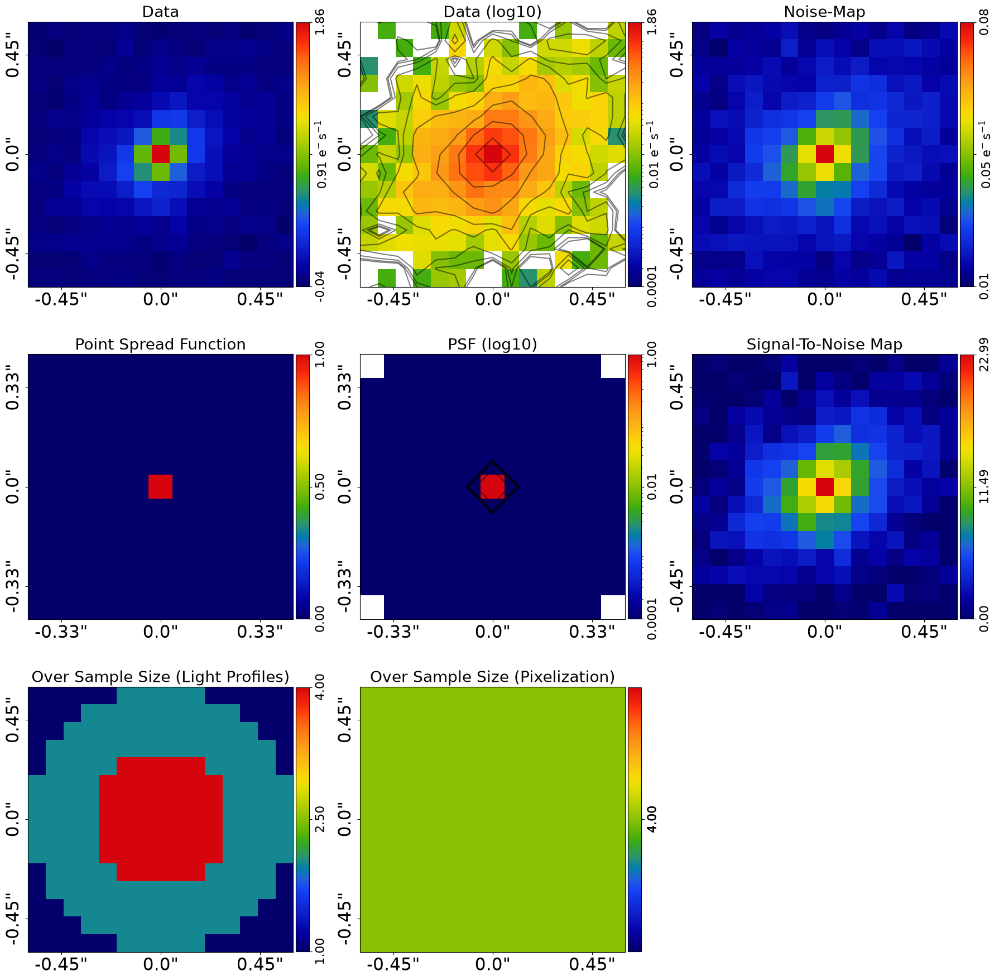
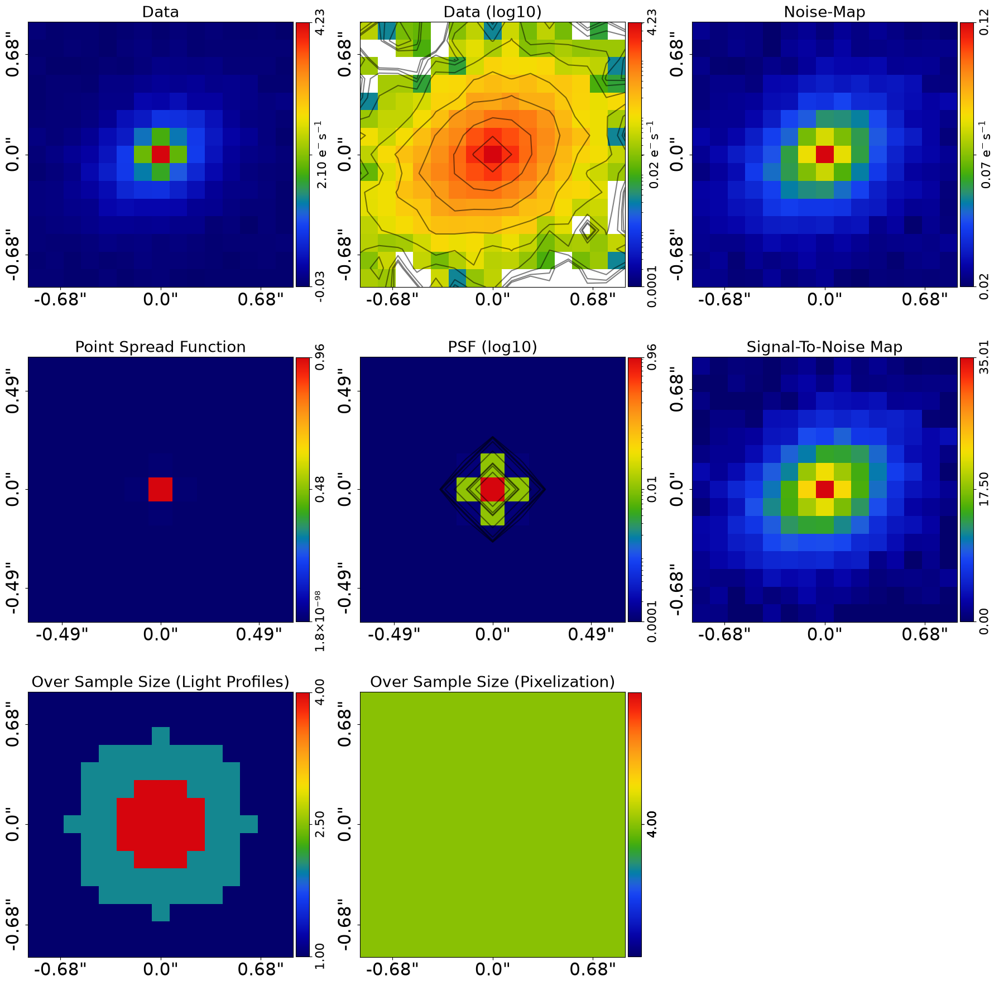
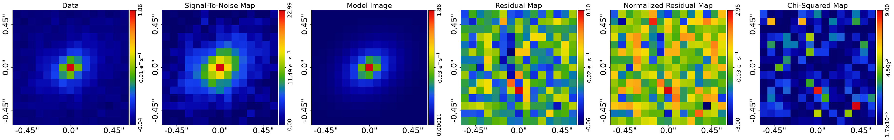
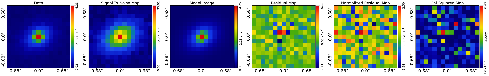

> ✏️ **This page is auto-generated from [`scripts/multi/start_here.py`](../../scripts/multi/start_here.py) — do not edit it directly.**
> It shows the example fully executed, with its real output images.
> Run it yourself via the [Python script](../../scripts/multi/start_here.py) or the [Jupyter notebook](../../notebooks/multi/start_here.ipynb).

Start Here: Multi Wavelength
============================

Galaxies are often observed with CCD imaging, for example using HST, JWST,
or ground-based telescopes.

The examples `start_here_imaging.ipynb` illustrate how to perform galaxy modeling of CCD imaging
of single galaxies; it is recommended you read that example before reading this one.

This script shows you how to model multiple images of a galaxy, taken at different wavelengths,
with as little setup as possible. In about 15 minutes you’ll be able to point the code at your own
FITS files and fit your first galaxy.

Multi-wavelength galaxy modeling is an advanced feature and it is recommended you become more familiar with
**PyAutoGalaxy** and galaxy modeling before using it for your own science. Nevertheless, this script
should make it quick and easy to at least have a go doing multi-wavelength modeling of your own data.

We focus on a *galaxy-scale* target (a single galaxy). If you have multiple galaxies,
see the `start_here_group.ipynb` and `start_here_cluster.ipynb` examples.

__JAX__

PyAutoGalaxy runs multi-wavelength galaxy fits on JAX by default. The
per-band `ag.AnalysisImaging(dataset=dataset, use_jax=True)` instances
below auto-enable JAX, and the `af.FactorGraphModel(*analysis_factor_list,
use_jax=True)` further down stitches them into the joint multi-band
likelihood with JAX-aware broadcasting. If you installed
`autogalaxy[jax]`, expect 1-10 minutes per band on GPU vs hours on CPU.

For the broader JAX principles see the top-level
`autogalaxy_workspace/start_here.py` `__JAX__` section. Per-band
`SimulatorImaging(use_jax=True)` usage is shown in
`scripts/imaging/simulator.py` `__JAX Variant__`.

__Contents__

- **JAX:** Overview of JAX GPU/CPU acceleration for fast model fitting.
- **Google Colab Setup:** Setting up the environment for Google Colab.
- **Imports:** Standard imports used across workspace examples.
- **Dataset:** Loading multi-wavelength imaging data from FITS files.
- **Dataset Auto-Simulation:** Automatically simulating data if it does not exist.
- **Masking:** Defining a circular mask and applying adaptive over-sampling.
- **Model:** Composing a Multi Gaussian Expansion galaxy model for multi-wavelength data.
- **Analysis:** Creating analysis objects for each wavelength dataset with JAX acceleration.
- **Model Fit:** Fitting the model to data using Nautilus nested sampling with a factor graph.
- **Live Visual Update:** Push the quick-update image to a live display surface.
- **Result:** Inspecting the results of the multi-wavelength model fit.
- **Model Your Own Galaxy:** Tips for applying this workflow to your own multi-wavelength data.
- **Simulator:** Pointers to the multi-wavelength simulation API.
- **Wrap Up:** Summary and pointers to further resources.

__Google Colab Setup__

The introduction `start_here` examples are available on Google Colab, which allows you to run them in a web browser
without manual local PyAutoGalaxy installation.

The code below sets up your environment if you are using Google Colab, including installing autogalaxy and downloading
files required to run the notebook. If you are running this script not in Colab (e.g. locally on your own computer),
running the code will still check correctly that your environment is set up and ready to go.


```python

import subprocess
import sys

try:
    import google.colab

    subprocess.check_call(
        [sys.executable, "-m", "pip", "install", "autonerves", "--no-deps"]
    )
except ImportError:
    pass

from autonerves import setup_colab

# NOTE: This call is AutoLens-specific. Update to the PyAutoGalaxy equivalent in your codebase.
setup_colab.for_autogalaxy(
    raise_error_if_not_gpu=False  # Switch to False for CPU Google Colab
)

```

    
                You are not running in a Google Colab environment so cannot use the setup_colab() function.
    
                You should therefore have PyAutoGalaxy installed locally in your environment already (e.g. via pip or
                conda) and can run the rest of your script normally.
    
                You may now continue running your script or Notebook.
                


__Imports__

Lets first import autogalaxy, its plotting module and the other libraries we'll need.

You'll see these imports in the majority of workspace examples.


```python
from autogalaxy import jax_wrapper  # Sets JAX environment before other imports

from autogalaxy import setup_notebook; setup_notebook()

import numpy as np
from pathlib import Path

import autofit as af
import autogalaxy as ag
import autogalaxy.plot as aplt
```

    Working Directory has been set to `autogalaxy_workspace`


__Dataset__

We begin by loading the dataset. Three ingredients are needed for galaxy modeling:

1. The image itself (CCD counts).
2. A noise-map (per-pixel RMS noise).
3. The PSF (Point Spread Function).

Here we use multi-wavelength James Webb Space Telescope imaging of a galaxy. Replace
these FITS paths with your own to immediately try modeling your data.

The `pixel_scales` value converts pixel units into arcseconds. It is critical you set this
correctly for your data.

**Multi-wavelength Specific**: Note how each waveband and its corresponding pixel scale are put into a list and dictionary,
which we use to load all wavelength images in a list of imaging datasets.


```python
waveband_list = ["g", "r"]
pixel_scale_dict = {"g": 0.08, "r": 0.12}

dataset_type = "multi"
dataset_label = "imaging"
dataset_name = "simple"

dataset_path = Path("dataset") / dataset_type / dataset_label / dataset_name
```

__Dataset Auto-Simulation__

If the dataset does not already exist on your system, it will be created by running the corresponding
simulator script. This ensures that all example scripts can be run without manually simulating data first.


```python
if ag.util.dataset.should_simulate(str(dataset_path)):
    import subprocess
    import sys

    subprocess.run(
        [sys.executable, "scripts/multi/simulator.py"],
        check=True,
    )


dataset_list = []

for dataset_waveband in waveband_list:

    dataset_waveband_path = dataset_path

    pixel_scale = pixel_scale_dict[dataset_waveband]

    dataset = ag.Imaging.from_fits(
        data_path=dataset_waveband_path / f"{dataset_waveband}_data.fits",
        psf_path=dataset_waveband_path / f"{dataset_waveband}_psf.fits",
        noise_map_path=dataset_waveband_path / f"{dataset_waveband}_noise_map.fits",
        pixel_scales=pixel_scale,
    )

    aplt.subplot_imaging_dataset(dataset=dataset)

    dataset_list.append(dataset)
```


    

    


    

    


__Masking__

Galaxy modeling does not need to fit the entire image, only the region containing the galaxy light.
We therefore define a circular mask around the galaxy.

- Make sure the mask fully encloses the galaxy emission.
- Avoid masking too much empty sky, as this slows fitting without adding information.

We’ll also oversample the central pixels, which improves modeling accuracy without adding
unnecessary cost far from the galaxy.

**Multi-wavelength Specific**: The mask is applied to each wavelength of data.


```python
mask_radius = 2.5

dataset_masked_list = []

for dataset in dataset_list:

    mask = ag.Mask2D.circular(
        shape_native=dataset.shape_native,
        pixel_scales=dataset.pixel_scales,
        radius=mask_radius,
    )

    dataset = dataset.apply_mask(mask=mask)

    # Over sampling is important for accurate galaxy modeling, but details are omitted
    # for simplicity here, so don't worry about what this code is doing yet!

    over_sample_size = ag.util.over_sample.over_sample_size_via_radial_bins_from(
        grid=dataset.grid,
        sub_size_list=[4, 2, 1],
        radial_list=[0.3, 0.6],
        centre_list=[(0.0, 0.0)],
    )

    dataset = dataset.apply_over_sampling(over_sample_size_lp=over_sample_size)

    aplt.subplot_imaging_dataset(dataset=dataset)

    dataset_masked_list.append(dataset)
```

    2026-07-10 18:58:28,733 - autoarray.dataset.imaging.dataset - INFO - IMAGING - Data masked, contains a total of 225 image-pixels


    

    


    2026-07-10 18:58:31,441 - autoarray.dataset.imaging.dataset - INFO - IMAGING - Data masked, contains a total of 225 image-pixels


    

    


__Model__

To perform galaxy modeling we must define a model describing the light profiles of the galaxy.

A brilliant galaxy model to start with is one which uses a Multi Gaussian Expansion (MGE)
to model the galaxy light.

Full details of why this model is so good are provided in the main workspace docs,
but in a nutshell it provides an excellent balance of being fast to fit, flexible
enough to capture complex galaxy morphologies and providing accurate fits to the vast
majority of galaxies.

The MGE model composition API is quite long and technical, so we simply load the MGE
model below via a utility function `mge_model_from` which hides the API to make the code
in this introduction example ready to read. We then use the PyAutoGalaxy Model API to
compose the galaxy model.

**Multi-wavelength Specific**: The main model composition does not change for
multi wavelength, however it is worth emphasizing that the MGE will infer a unique
solution for each wavelength whereby the Gaussians have different intensities, meaning
that effects like colour gradients will be captured accurately.

Multi wavelength data may also have small offsets between each band, often smaller
than a pixel and thus below standard astrometric precision. We therefore include
a `dataset_model` composition which models these offsets as free parameters during
the galaxy modeling. Slightly further down in the script we will tell autogalaxy
to make a difference between each dataset.


```python
bulge = ag.model_util.mge_model_from(
    mask_radius=mask_radius, total_gaussians=20, centre_prior_is_uniform=True
)

galaxy = af.Model(ag.Galaxy, redshift=0.5, bulge=bulge)

# Dataset Model
dataset_model = af.Model(ag.DatasetModel)

# Overall Model
model = af.Collection(
    dataset_model=dataset_model, galaxies=af.Collection(galaxy=galaxy)
)
```

We can print the model to show the parameters that the model is composed of, which shows many of the MGE's fixed
parameter values the API above hid the composition of.


```python
print(model.info)
```

    Total Free Parameters = 4
    
    model                                                                           Collection (N=4)
        dataset_model                                                               DatasetModel (N=0)
        galaxies                                                                    Collection (N=4)
            galaxy                                                                  Galaxy (N=4)
                bulge                                                               Basis (N=4)
                    profile_list                                                    Collection (N=4)
                        0 - 19                                                      Gaussian (N=4)
    
    ... [39 lines of output truncated] ...
                        sigma                                                       0.020639789690294032
                    11
                        sigma                                                       0.03517027745951032
                    12
                        sigma                                                       0.05993028200091701
                    13
                        sigma                                                       0.10212142070372625
                    14
                        sigma                                                       0.17401527605673328
                    15
                        sigma                                                       0.2965226697046549
                    16
                        sigma                                                       0.5052757185530644
                    17
                        sigma                                                       0.8609916807156944
                    18
                        sigma                                                       1.4671329870837333
                    19
                        sigma                                                       2.5


__Analysis__

In other examples, a single `Analysis` object is passed the dataset and used to perform galaxy modeling.

When there are multiple datasets, a list of analysis objects is created, once for each dataset.

__JAX__

`AnalysisImaging(use_jax=True)` runs per-band; `FactorGraphModel(use_jax=True)`
below stitches them into the joint multi-band likelihood. The non-linear
search driver wraps the joint likelihood in `jax.vmap(jax.jit(...))` —
batches of parameter vectors evaluate in parallel across all bands on a
single GPU call. Force NumPy with `use_jax=False` (or `PYAUTO_DISABLE_JAX=1`)
on either constructor when debugging.


```python
analysis_list = [
    ag.AnalysisImaging(
        dataset=dataset,
        use_jax=True,  # JAX will use GPUs for acceleration if available, else JAX will use multithreaded CPUs.
    )
    for dataset in dataset_masked_list
]
```

Each analysis object is wrapped in an `AnalysisFactor`, which pairs it with the model and prepares it for use in a
factor graph. This step allows us to flexibly define how each dataset relates to the model.

Whilst not illustrated here, note that the API below is extremely customizable and allows us to
make the model vary on a per-dataset basis. We use this below to make it so the dataset offset of the second,
third and fourth datasets are included.


```python
analysis_factor_list = []

for i, analysis in enumerate(analysis_list):
    model_analysis = model.copy()

    if i > 0:
        model_analysis.dataset_model.grid_offset.grid_offset_0 = af.UniformPrior(
            lower_limit=-1.0, upper_limit=1.0
        )
        model_analysis.dataset_model.grid_offset.grid_offset_1 = af.UniformPrior(
            lower_limit=-1.0, upper_limit=1.0
        )

    # NOTE: Keeping as-is: factor uses `model` not `model_analysis`, matching the original script.
    analysis_factor = af.AnalysisFactor(prior_model=model, analysis=analysis)

    analysis_factor_list.append(analysis_factor)

# Required to set up a fit with multiple datasets.
factor_graph = af.FactorGraphModel(*analysis_factor_list, use_jax=True)
```

__Model Fit__

We now fit the data with the galaxy model using the non-linear fitting method and nested sampling algorithm Nautilus.

This uses the factor graph defined above.

**Run Time Error:** On certain operating systems (e.g. Windows, Linux) and Python versions, the code below may produce
an error. If this occurs, see the `autogalaxy_workspace/guides/modeling/bug_fix` example for a fix.

__Live Visual Update__

By default the quick-update image is only written to disk. Set `live_visual_update=True` to also push it to a
live display surface:

- **Python script** — a matplotlib window opens automatically and refreshes with each quick update, so you can
  watch the fit converge without leaving your terminal.
- **Jupyter / Colab notebook** — the cell that ran `search.fit(...)` shows a single self-updating image that
  refreshes in place every `iterations_per_quick_update`.

The disk write (`fit.png`) always happens regardless of this flag. Set it to `False` (the default) if you just
want the on-disk output, or if you are running in a headless environment (e.g. an HPC cluster).


```python
search = af.Nautilus(
    path_prefix=Path(
        "multi_wavelength"
    ),  # The path where results and output are stored.
    name="start_here",  # The name of the fit and folder results are output to.
    unique_tag=dataset_name,  # A unique tag which also defines the folder.
    n_live=150,  # The number of Nautilus "live" points, increase for more complex models.
    n_batch=50,  # GPU fits are batched and run simultaneously, see VRAM section below.
    iterations_per_quick_update=10000,  # Every N iterations the max likelihood model is visualized and output.
    live_visual_update=False,  # Set True to open a live matplotlib window (script) or refresh a Jupyter cell (notebook).
)

print(
    """
    The non-linear search has begun running.

    This Jupyter notebook cell will progress once the search has completed - this could take a few minutes!

    On-the-fly updates every iterations_per_quick_update are printed to the notebook.
    """
)

result_list = search.fit(model=factor_graph.global_prior_model, analysis=factor_graph)

print("The search has finished run - you may now continue the notebook.")
```

    
        The non-linear search has begun running.
    
        This Jupyter notebook cell will progress once the search has completed - this could take a few minutes!
    
        On-the-fly updates every iterations_per_quick_update are printed to the notebook.
        
    2026-07-10 18:58:41,111 - autofit.non_linear.search.abstract_search - INFO - Starting non-linear search with JAX (CPU: cpu).


    2026-07-10 18:58:41,151 - start_here - INFO - The output path of this fit is autogalaxy_workspace/output/multi_wavelength/simple/start_here/aae299407b361de4c8051428cca15200


    2026-07-10 18:58:41,153 - start_here - INFO - Outputting pre-fit files (e.g. model.info, visualization).


    2026-07-10 18:58:56,095 - start_here - INFO - Starting new Nautilus non-linear search (no previous samples found).


    2026-07-10 18:58:56,099 - autofit.non_linear.fitness - INFO - JAX: Applying vmap and jit to likelihood function -- may take a few seconds.


    2026-07-10 18:58:56,101 - autofit.non_linear.fitness - INFO - JAX: vmap and jit applied in 0.0014145374298095703 seconds.


    2026-07-10 18:58:56,103 - autofit.non_linear.fitness - INFO - Warming up visualization (one-time JAX compilation)...


    2026-07-10 18:58:56,127 - autofit.non_linear.fitness - WARNING - Visualization warm-up failed (non-fatal); first quick update may be slow.


    2026-07-10 18:58:56,130 - start_here - INFO - Running search with JAX vectorization (parallelization handled by JAX).


    Starting the nautilus sampler...
    Please report issues at github.com/johannesulf/nautilus.
    Status    | Bounds | Ellipses | Networks | Calls    | f_live | N_eff | log Z    


    

    

    

    

    

    

    

    

    

    

    

    

    

    

    

    

    

    

    

    

    

    

    

    

    

    

    

    

    

    

    

    

    

    

    

    

    

    

    

    

    

    

    

    

    

    

    

    

    

    

    

    

    

    

    

    

    

    

    

    

    

    

    

    

    

    

    

    

    

    

    

    

    

    

    

    

    

    

    

    

    

    

    

    

    

    

    

    

    

    

    

    

    

    

    

    

    

    

    

    

    

    

    

    

    

    

    

    

    

    

    Finished  | 24     | 1        | 4        | 4850     | N/A    | 1103  | +994.47  
    2026-07-10 19:00:40,786 - start_here - INFO - Fit Running: Updating results (see output folder).


    Starting the nautilus sampler...
    Please report issues at github.com/johannesulf/nautilus.
    Status    | Bounds | Ellipses | Networks | Calls    | f_live | N_eff | log Z    
    Finished  | 24     | 1        | 4        | 4850     | N/A    | 1103  | +994.47  
    2026-07-10 19:01:51,331 - start_here - INFO - Fit Running: Updating results (see output folder).


    2026-07-10 19:01:53,294 - autofit.non_linear.samples.samples - INFO - Samples with weight less than 1e-10 removed from samples.csv.


    2026-07-10 19:01:53,541 - autofit.non_linear.search.updater - INFO - Creating latent samples by drawing 100 from the PDF.


    2026-07-10 19:02:46,163 - start_here - INFO - Removing search internal folder.


    2026-07-10 19:02:46,194 - start_here - INFO - Removing all files except for .zip file


    2026-07-10 19:02:48,049 - start_here - INFO - Search complete, returning result


    The search has finished run - you may now continue the notebook.


__Result__

The result object returned by this model-fit is a list of `Result` objects, because we used a factor graph.
Each result corresponds to each analysis, and therefore corresponds to the model-fit at that wavelength.


```python
print(result_list[0].max_log_likelihood_instance)
print(result_list[1].max_log_likelihood_instance)
```

    <autofit.mapper.model.ModelInstance object at 0x7f03cfcd08f0>
    <autofit.mapper.model.ModelInstance object at 0x7f03cf42ec60>


The result also contains the maximum likelihood galaxy model which can be used to plot the best-fit information
and fit to the data.


```python
for result in result_list:

    aplt.subplot_fit_imaging(fit=result.max_log_likelihood_fit)
```


    

    


    

    


__Model Your Own Galaxy__

If you have your own imaging data, you are now ready to model it yourself by adapting the code above
and simply inputting the path to your own .fits files into the `Imaging.from_fits()` function.

A few things to note, with full details on data preparation provided in the main workspace documentation:

- Supply your own CCD image, PSF, and RMS noise-map.
- Ensure the galaxy is roughly centered in the image.
- Double-check `pixel_scales` for your telescope/detector.
- Adjust the mask radius to include all relevant light.
- Remove extra light from galaxies and other objects using an extra galaxies mask.
- Start with the default model — it works very well for pretty much all galaxies!

__Simulator__

In the example `start_here_imaging.ipynb`, we showed how to simulate CCD imaging of a galaxy.

We do not give a full description of the simulation API for multi wavelength imaging here,
but it is fully described in the main workspace documentation.

__Wrap Up__

This script has shown how to model CCD imaging data of galaxies across multiple wavelengths.

Details of the **PyAutoGalaxy** API and how galaxy modeling and simulations actually work were omitted for simplicity,
but everything you need to know is described throughout the main workspace documentation. You should check it out,
but maybe you want to try and model your own galaxy first!

The following locations of the workspace are good places to check out next:

- `autogalaxy_workspace/*/multi/features`: A full description of the multi wavelength and multi image fitting.


```python

```
